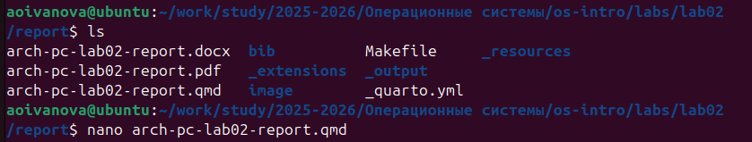
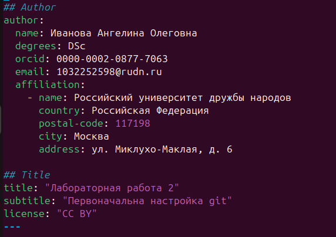
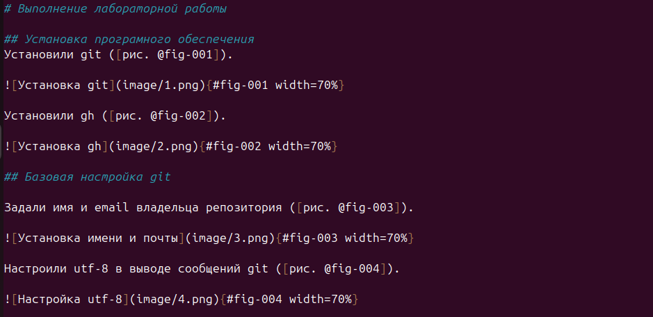
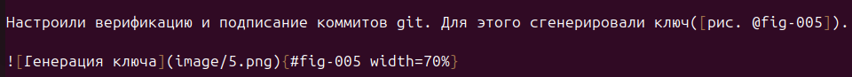
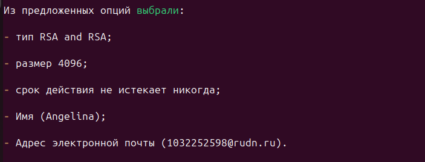
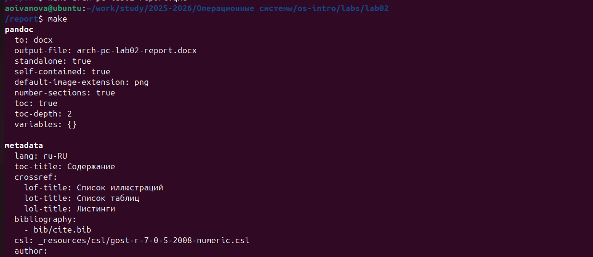
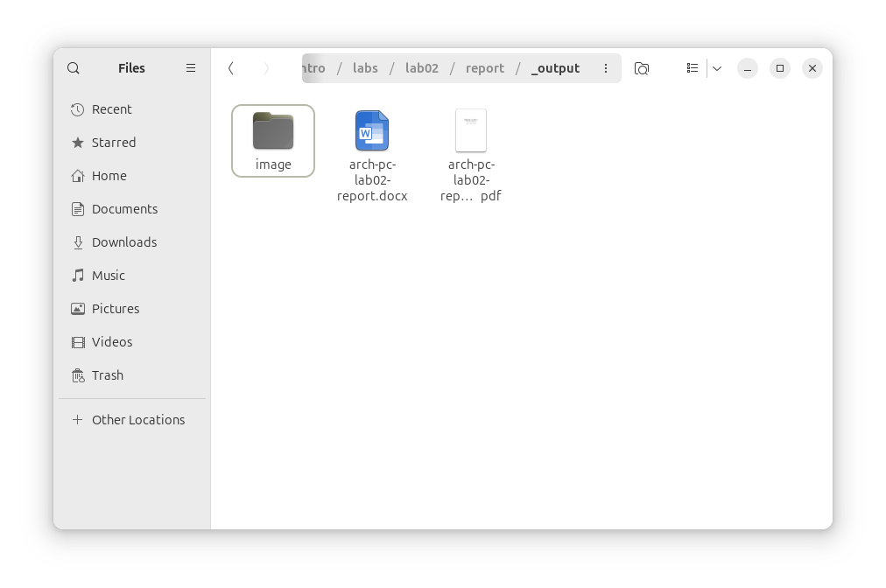

---
## Author
author:
  name: Иванова Ангелина Олеговна
  degrees: DSc
  orcid: 0000-0002-0877-7063
  email: 1032252598@rudn.ru
  affiliation:
    - name: Российский университет дружбы народов
      country: Российская Федерация
      postal-code: 117198
      city: Москва
      address: ул. Миклухо-Маклая, д. 6
## Title
title: Презентация по лабораторной работе 3
subtitle: Markdown
license: CC BY
date: today
date-format: "YYYY-MM-DD" # Example: 2025-09-06
---

# Вводная часть

## Цель работы

Научиться оформлять отчёты с помощью легковесного языка разметки Markdown

## Задание

1. Сделать отчёт по предыдущей лабораторной работе в формате Markdown.

2. В качестве отчёта предоставить отчёты в 3 форматах: pdf, docx и md

# Выполнение лабораторной работы

## Переход в рабочий каталог

{#fig-001 width=70%}

## Открытие файла

{#fig-002 width=70%}

## Оформление

{#fig-003 width=50%}

## Оформление

{#fig-004 width=70%}

## Оформление

{#fig-005 width=70%}

## Оформление

{#fig-006 width=70%}

## Оформление

{#fig-007 width=75%}

## Компиляция

{#fig-008 width=70%}

## Компиляция

{#fig-009 width=55%}

# Результаты

## Выводы

Научились оформлять отчёты с помощью легковесного языка разметки Markdown, а компилировать их в разные форматы.

## Список литературы

1. Лаборатораня работа №2 [Электронный ресурс] URL: https://esystem.rudn.ru/mod/page/view.php?id=1098933
