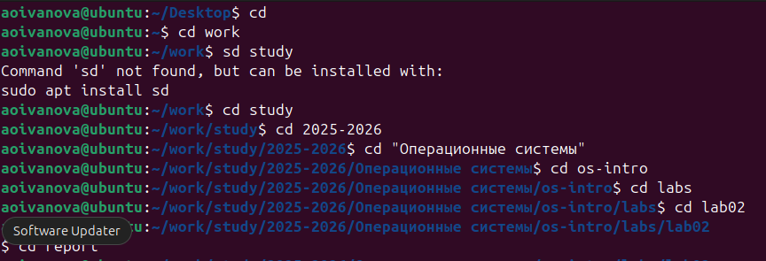
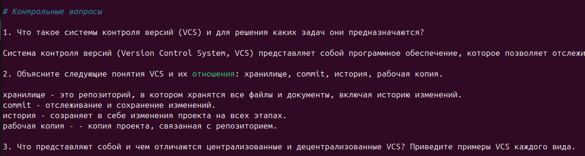

---
## Author
author:
  name: Иванова Ангелина Олеговна
  degrees: DSc
  orcid: 0000-0002-0877-7063
  email: 1032252598@rudn.ru
  affiliation:
    - name: Российский университет дружбы народов
      country: Российская Федерация
      postal-code: 117198
      city: Москва
      address: ул. Миклухо-Маклая, д. 6

## Title
title: "Отчет по лабораторной работе 3"
subtitle: "Markdown"
license: "CC BY"
---

# Цель работы

Научиться оформлять отчёты с помощью легковесного языка разметки Markdown

# Задание

1. Сделать отчёт по предыдущей лабораторной работе в формате Markdown.

2. В качестве отчёта предоставить отчёты в 3 форматах: pdf, docx и md

# Выполнение лабораторной работы

В открытой виртуальной машине перешли в наш рабочий каталог ([рис. @fig-001]).

{#fig-001 width=70%}

Посмотрели содержание каталога report и открыли в нём файл "arch-pc-lab02-report.qmd" ([рис. @fig-002]).

{#fig-002 width=70%}

Заполнили отчёт, опираясь на текст нашей лабораторной работы. 

При заполнении изменили данные автора и заголовка ([рис. @fig-003]).

{#fig-003 width=70%}

Для задания структуры отчету использовали заголовки и подзаголовки с помощью "#" ([рис. @fig-004]).

{#fig-004 width=70%}

Для вствки рисунка использовали структуру, представленную на скриншоте ([рис. @fig-005]).

{#fig-005 width=70%}

Также использовали ненумерные списки, созданные с помщью "-", и нумерные, созданные с помощью цифр ([рис. @fig-006]),([рис. @fig-007]).

{#fig-006 width=70%}

{#fig-007 width=70%}

После заполнения отчёта, сохранили его и вернулись в терминал. Чтобы скомпелировать из файла Markdown файлы .pdf и .docx, использовали команду make ([рис. @fig-008]).

{#fig-008 width=70%}

Нужные нам файлы создались в папке _output ([рис. @fig-009]).

{#fig-009 width=70%}

# Выводы

Научились оформлять отчёты с помощью легковесного языка разметки Markdown, а компилировать их в разные форматы.

# Список литературы

1. Лаборатораня работа №2 [Электронный ресурс] URL: https://esystem.rudn.ru/mod/page/view.php?id=1098933

::: {#refs}
:::
