---
## Author
author:
  name: Иванова Ангелина Олеговна
  degrees: DSc
  orcid: 0000-0002-0877-7063
  email: 1032252598@rudn.ru
  affiliation:
    - name: Российский университет дружбы народов
      country: Российская Федерация
      postal-code: 117198
      city: Москва
      address: ул. Миклухо-Маклая, д. 6

## Title
title: "Лабораторная работа 4"
subtitle: "Продвинутое использование git"
license: "CC BY"
---

# Цель работы

Получение навыков правильной работы с репозиториями git.

# Задание

- Выполнить работу для тестового репозитория.

- Преобразовать рабочий репозиторий в репозиторий с git-flow и conventional commits.

# Выполнение лабораторной работы

## Установка программного обеспечения

Установили git-flow ([рис. @fig-001]), ([рис. @fig-002]).  

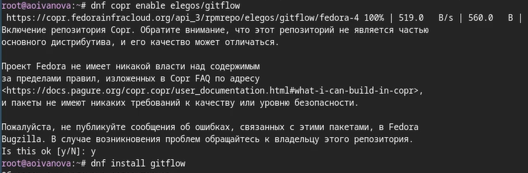{#fig-001 width=70%}

{#fig-002 width=70%}

Установили Node.js ([рис. @fig-003]), ([рис. @fig-004]).  

{#fig-003 width=70%}

{#fig-004 width=70%}

Настроили Node.js. Для работы с Node.js добавили каталог с исполняемыми файлами, устанавливаемыми yarn, в переменную PATH. Для этого запустили $pnpm setup$ и выполняем $source ~/.bashr$ ([рис. @fig-005]).

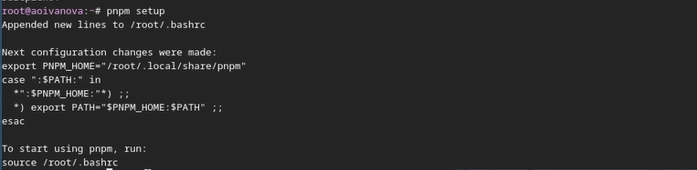{#fig-005 width=70%}

Устанавливаем пакет commitizen. Данная программа используется для помощи в форматировании коммитов (рис. [рис. @fig-006]).

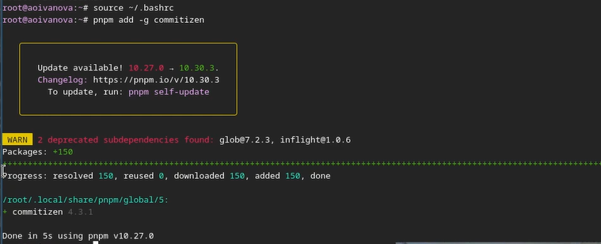{#fig-006 width=70%}

Устанавливаем пакет standard-changelog. Данная программа используется для помощи в создании логов (рис. [рис. @fig-007]).

{#fig-007 width=70%}

## Практический сценарий использования git

Создаём репозиторий на GitHub. Называем его git-extended ([рис. @fig-008]).

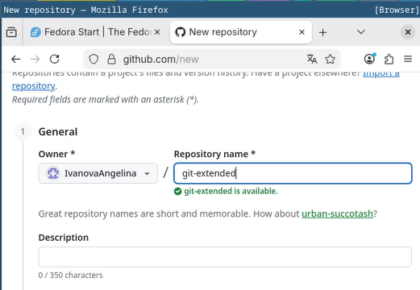{#fig-008 width=70%}

Далее клонируем созданный репозиторий ([рис. @fig-009]).

{#fig-009 width=70%}

Создаём файл "Test.txt", чтобы активировать репозиторий, делаем первый коммит и выкладываем на github ([рис. @fig-010]).

{#fig-010 width=70%}

Выполняем конфигурацию для пакетов Node.js, с помощью команды *pnpm init* ([рис. @fig-011]).

{#fig-011 width=70%}

Далее заполняем несколько параметров пакета:
- название пакета
- лицензия пакета (предлагается выбирать лицензию CC-BY-4.0)
- формат коммитов. Для этого добавляем в файл package.json команду для формирования коммитов: *"config":*  ([рис. @fig-012]).

{#fig-012 width=70%}

После добавляем новые файлы, выполняем коммит и отправляем на github ([рис. @fig-013]).

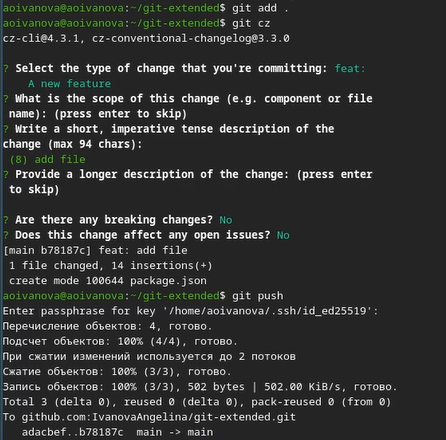{#fig-013 width=70%}

Далее инициализируем git-flow введя ([рис. @fig-014]).

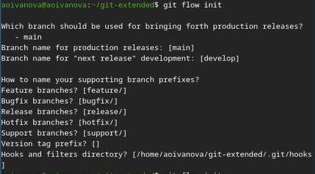{#fig-014 width=70%}

Потом проверяем, что мы находимся на ветке develop ([рис. @fig-015]).

{#fig-015 width=70%}

Загружаем весь репозиторий в хранилище командой *git push --all* ([рис. @fig-016]).

{#fig-016 width=70%}

Далее устанавливаем внешнюю ветку как вышестоящую для ветки develop ([рис. @fig-017]).

{#fig-017 width=70%}

Создаём релиз с версией 1.0.0 ([рис. @fig-018]).

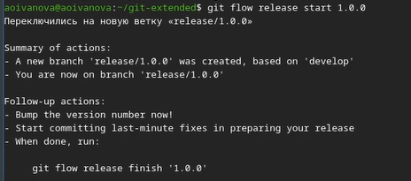{#fig-018 width=70%}

После создаём журнал изменений. Потом добавили журнал изменений в индекс ([рис. @fig-019]).

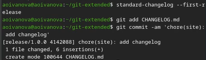{#fig-019 width=70%}

Заливаем релизную ветку в основную ветку ([рис. @fig-020]).

{#fig-020 width=70%}

Далее отправляем данные на github с помощью $git push --all$ и $git push --tags$ ([рис. @fig-021]).

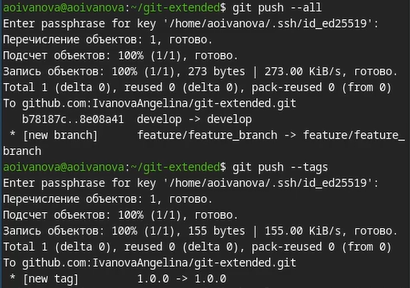{#fig-021 width=70%}

Создаём релиз на github ([рис. @fig-022]).

{#fig-022 width=70%}

Далее создаём ветку для новой функциональности введя ([рис. @fig-023]).

{#fig-023 width=70%}

После оъединяем ветку feature_branch c develop ([рис. @fig-024]).

{#fig-024 width=70%}

Создаём релиз с версией 1.2.3 ([рис. @fig-025]).

{#fig-025 width=70%}

Далее редактируем файл package.json: изменяем версию на 1.2.3 ([рис. @fig-026]).

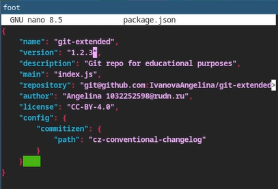{#fig-026 width=70%}

Снова создаём журнал изменений и добавляем его в индекс ([рис. @fig-027]).

{#fig-027 width=70%}

Снова заливаем релизную ветку в основную ([рис. @fig-028]).

{#fig-028 width=70%}

Отправляем данные на github ([рис. @fig-029]).

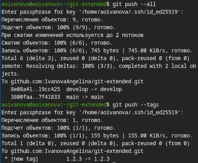{#fig-029 width=70%}

И последним шагом создаём релиз на github с комментарием из журнала изменений ([рис. @fig-030]).

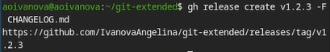{#fig-030 width=70%}

# Выводы

В ходе выполнения лабораторной рбаоты мы получили навыки правильной работы с репозиториями git, а также научились создавать релизы.

# Список литературы

1. Лаборатораня работа №4 [Электронный ресурс] URL: https://esystem.rudn.ru/mod/page/view.php?id=1098937#org5411099
2. Список лицензий [Электронный ресурс] URL: https://spdx.org/licenses/

::: {#refs}
:::
