---
## Author
author:
  name: Иванова Ангелина Олеговна
  degrees: DSc
  orcid: 0000-0002-0877-7063
  email: 1032252598@rudn.ru
  affiliation:
    - name: Российский университет дружбы народов
      country: Российская Федерация
      postal-code: 117198
      city: Москва
      address: ул. Миклухо-Маклая, д. 6
## Title
title: Лабораторная работа 5
subtitle: Настройка рабочей среды
license: CC BY
date: today
date-format: "YYYY-MM-DD" # Example: 2025-09-06
---

# Вводная часть

## Цель работы

Настроить рабочую среду для более приятной работы в ней

## Задание

- Установить и настроить менеджер паролей pass

- Установить и настроить необхое ПО для работы с конфигурационными файлами

# Выполнение лабораторной работы

## Менеджер паролей pass

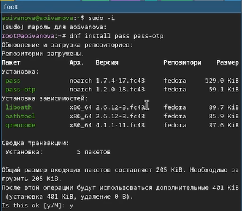{#fig-001 width=50%}

## Менеджер паролей pass

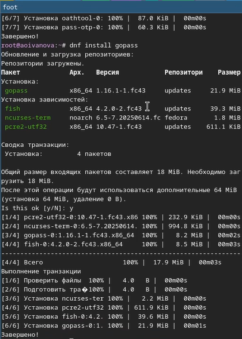{#fig-002 width=30%}

## Менеджер паролей pass

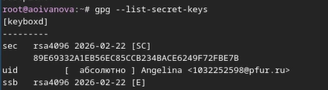{#fig-003 width=70%}

## Менеджер паролей pass

{#fig-004 width=70%}

## Менеджер паролей pass

{#fig-005 width=70%}

## Менеджер паролей pass

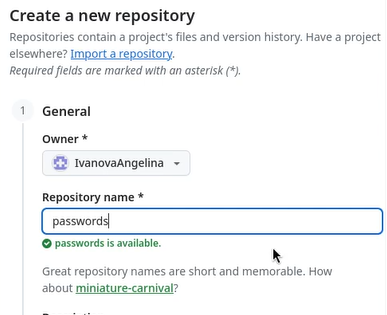{#fig-006 width=45%}

## Менеджер паролей pass

{#fig-007 width=70%}

## Менеджер паролей pass

{#fig:008 width=70%}

## Менеджер паролей pass

{#fig-009 width=70%}

## Менеджер паролей pass

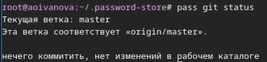{#fig-010 width=70%}

## Менеджер паролей pass

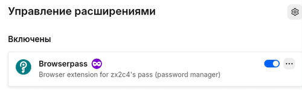{#fig-011 width=70%}

## Менеджер паролей pass

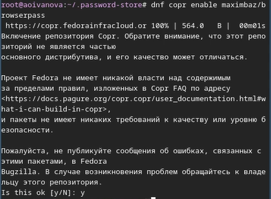{#fig-012 width=45%}

## Менеджер паролей pass

{#fig-013 width=45%}

## Менеджер паролей pass

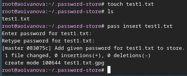{#fig-014 width=70%}

## Менеджер паролей pass

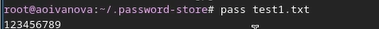{#fig-015 width=70%}

## Менеджер паролей pass

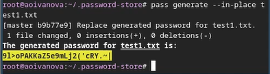{#fig-016 width=70%}

## Управление файлами конфигурации

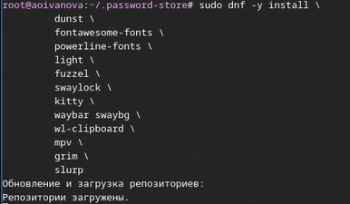{#fig-017 width=70%}

## Управление файлами конфигурации

{#fig-018 width=45%}

## Управление файлами конфигурации

{#fig-019 width=70%}

## Управление файлами конфигурации

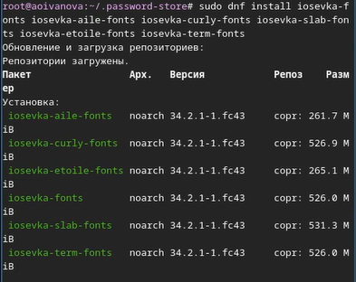{#fig-020 width=45%}

## Управление файлами конфигурации

{#fig-021 width=70%}

## Управление файлами конфигурации

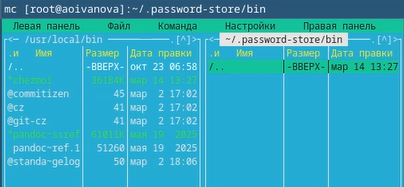{#fig-022 width=70%}

## Управление файлами конфигурации

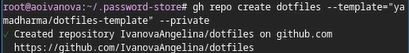{#fig-22_2 width=70%}

## Управление файлами конфигурации

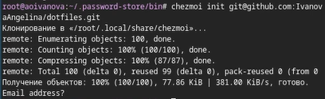{#fig-023 width=70%}

## Управление файлами конфигурации

{#fig-024 width=70%}

## Управление файлами конфигурации

{#fig-025 width=70%}

## Управление файлами конфигурации

{#fig-026 width=70%}

## Управление файлами конфигурации

{#fig-027 width=70%}

## Управление файлами конфигурации

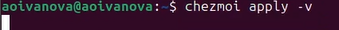{#fig-028 width=70%}

## Управление файлами конфигурации

{#fig-029 width=70%}

## Управление файлами конфигурации

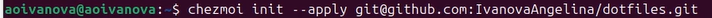{#fig-030 width=70%}

## Управление файлами конфигурации

{#fig031 width=80%}

## Управление файлами конфигурации

{#fig-032 width=70%}

# Результаты

## Выводы

В ходе выполнения лабораторной рбаоты мы настроили рабочую среду и получили навыки работы с менеджером паролей pass и с chezmoi

## Список литературы

1. Лаборатораня работа №5 [Электронный ресурс] URL: https://esystem.rudn.ru/mod/page/view.php?id=1098939#org2695679
2. Плагин для Firefox[Электронный ресурс] URL: https://addons.mozilla.org/en-US/firefox/addon/browserpass-ce/.
