---
## Author
author:
  name: Иванова Ангелина Олеговна
  degrees: DSc
  orcid: 0000-0002-0877-7063
  email: 1032252598@rudn.ru
  affiliation:
    - name: Российский университет дружбы народов
      country: Российская Федерация
      postal-code: 117198
      city: Москва
      address: ул. Миклухо-Маклая, д. 6

## Title
title: "Лабораторная работа 5"
subtitle: "Настройка рабочей среды"
license: "CC BY"
---

# Цель работы

Настроить рабочую среду для более приятной работы в ней

# Задание

- Установить и настроить менеджер паролей pass

- Установить и настроить необхое ПО для работы с конфигурационными файлами

# Выполнение лабораторной работы

## Менеджер паролей pass

Установим необходимое ПО ([рис. @fig-001]), ([рис. @fig-002]).

{#fig-001 width=70%}

{#fig-002 width=70%}

Перейдем к настройке менеджера. Для начала просмотрели список ключей ([рис. @fig-003]).

{#fig-003 width=70%}

Далее инициализируем хранилище командой *pass init 1032252598@pfur.ru* ([рис. @fig-004]).

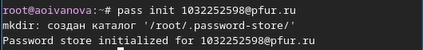{#fig-004 width=70%}

Создаём структуру git ([рис. @fig-005]).

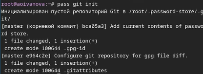{#fig-005 width=70%}

Далее создаём репозиторий passwords и задаём адрес репозитория на хостинге ([рис. @fig-006]), ([рис. @fig-007]).

{#fig-006 width=70%}

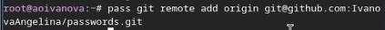{#fig-007 width=70%}

Потом выполняем синхронизацию ([рис. @fig-008]).

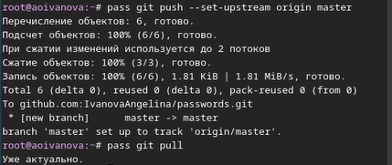{#fig:008 width=70%}

Далее вручную коммитим и выкладываем изменения ([рис. @fig-009]).

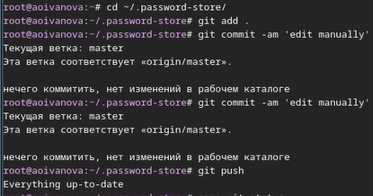{#fig-009 width=70%}

Проверяем статус синхронизации командой *pass git status* ([рис. @fig-010]).

{#fig-010 width=70%}

Пeрейдем к настройке интерфейса с браузером. Переходим на сайт с плагином для Firefox и добавляем этот плагин ([рис. @fig-011]).

{#fig-011 width=70%}

Далее подключаем репозиторий и скачиваем  browserpass ([рис. @fig-012]), ([рис. @fig-013]).

{#fig-012 width=70%}

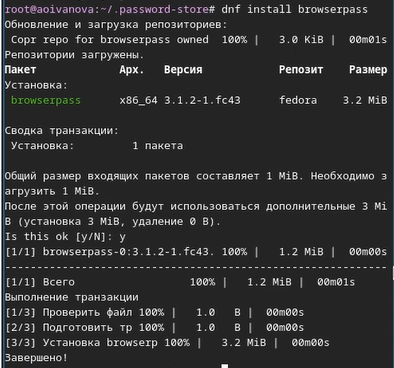{#fig-013 width=70%}

Создаём новый файл и добавляем пароль ([рис. @fig-014]).

{#fig-014 width=70%}

Отобразить пароль для указанного файла можно командой *pass [FILENAME]* ([рис. @fig-015]).

{#fig-015 width=70%}

Далее можно заменить существующий пароль командой *pass generate --in-place FILENAME*. Сгенерируется новый рандомный пароль ([рис. @fig-016]).

{#fig-016 width=70%}

## Управление файлами конфигурации

Утанавливаем дополнительное программное обеспечение ([рис. @fig-017]).

{#fig-017 width=70%}

Далее устанавливаем шрифты. Сначала подключаем репозиторий, потом ищем нужное название и устанавливаем нужные шрифты ([рис. @fig-018]), ([рис. @fig-019]), ([рис. @fig-020]).

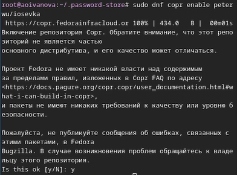{#fig-018 width=70%}

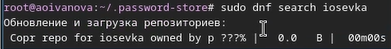{#fig-019 width=70%}

{#fig-020 width=70%}

Устанавливаем chezmoi с помощью команды *sh -c "$(wget -qO- chezmoi.io/get)"* ([рис. @fig-021]).

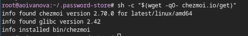{#fig-021 width=70%}

Переносим бинарный файл chezmoi в папку ~/usr/lacal/bin ([рис. @fig-022]).

{#fig-022 width=70%}

Создаём свой репозиторий для конфигурационных файлов на основе шаблона ([рис. @fig-022_2]).

{#fig-22_2 width=70%}

Инициализируем chezmoi с нашим репозиторием dotfiles ([рис. @fig-023]).

{#fig-023 width=70%}

Проверяем какие изменение внёс chezmoi в домашний каталог, введя *chezmoi diff* ([рис. @fig-024]).

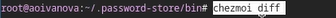{#fig-024 width=70%}

Так нас устраивает большое количество внесённых изменений мы запускаем команду *chezmoi apply -v* ([рис. @fig-025]).

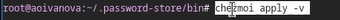{#fig-025 width=70%}

Можно использовать chezmoi на нескольких машинах. В качестве второй виртуальной машины я выбрала ubuntu. На второй машине инициализируем chezmoi с нашим репозиторием dotfiles ([рис. @fig-026]).

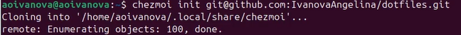{#fig-026 width=70%}

Снова проверяем какие изменения внесёт chezmoi командой *chezmoi diff*, и поскольку изменения устраивают нас вводим команду *chezmoi apply -v* ([рис. @fig-027]), ([рис. @fig-028]).

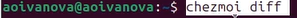{#fig-027 width=70%}

{#fig-028 width=70%}

Выполняем команду *chezmoi update -v*  - получаем и применяем последние изменения из нашего репозитория 

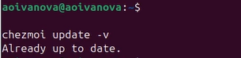{#fig-029 width=70%}

Настраиваем новую машину с помощью одной команды ([рис. @fig-030]).

{#fig-030 width=70%}

Извлекаем изменения из репозитория и применяем их одной командой *chezmoi update*, после выполняем *chezmoi git pull -- --autostash --rebase && chezmoi diff* и, так как мы довольны изменениями, то применяем их введя команду *chezmoi apply* ([рис. @fig-031]).

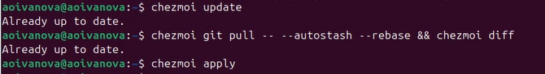{#fig031 width=70%}

Включем функцию автоматического фиксирования и отправки изменений в репозиторий добавив в файл  конфигурации ~/.config/chezmoi/chezmoi.toml следующее: 
- [git]
    autoCommit = true
    autoPush = true ([рис. @fig-032]).
    
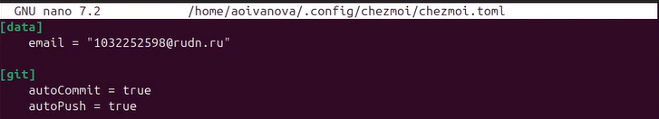{#fig-032 width=70%}
    
# Выводы

В ходе выполнения лабораторной рбаоты мы настроили рабочую среду и получили навыки работы с менеджером паролей pass и с chezmoi

# Список литературы

1. Лаборатораня работа №5 [Электронный ресурс] URL: https://esystem.rudn.ru/mod/page/view.php?id=1098939#org2695679
2. Плагин для Firefox[Электронный ресурс] URL: https://addons.mozilla.org/en-US/firefox/addon/browserpass-ce/.
