---
## Author
author:
  name: Иванова Ангелина Олеговна
  degrees: DSc
  orcid: 0000-0002-0877-7063
  email: 1032252598@rudn.ru
  affiliation:
    - name: Российский университет дружбы народов
      country: Российская Федерация
      postal-code: 117198
      city: Москва
      address: ул. Миклухо-Маклая, д. 6
## Title
title: Лабораторная работа 6
subtitle: Основы интерфейса взаимодействия пользователя с системой Unix на уровне командной строки
license: CC BY
date: today
date-format: "YYYY-MM-DD" # Example: 2025-09-06
---

# Вводная часть

## Цель работы

Целью данной лабораторной работы является приобретение практических навыков взаимодействия пользователя с системой посредством командной строки.

## Задание

1. Узнать имя домашнего каталога

2. Научиться смотреть содержимое каталогов

3. Научиться создавать и удалять каталоги

4. Научиться работать с командой man

5. Научиться работать с командой history

# Выполнение лабораторной работы

## Домашняя директория

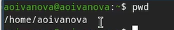{#fig-001 width=70%}

## Содержимое каталогов

{#fig-002 width=70%}

## Содержимое каталогов

{#fig-003 width=70%}

## Содержимое каталогов

{#fig-004 width=70%}

## Содержимое каталогов

{#fig-005 width=70%}

## Содержимое каталогов

{#fig-006 width=70%}

## Содержимое каталогов

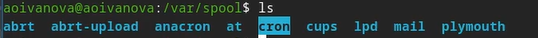{#fig-007 width=70%}

## Содержимое каталогов

{#fig-008 width=70%}

## Создание и удаление каталогов

{#fig-009 width=70%}

## Создание и удаление каталогов

{#fig-010 width=70%}

## Создание и удаление каталогов

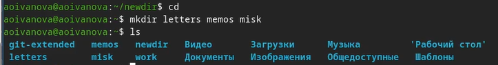{#fig-011 width=70%}

## Создание и удаление каталогов

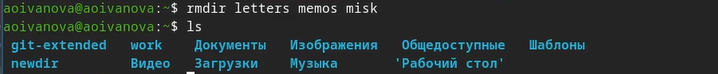{#fig-012 width=70%}

## Создание и удаление каталогов

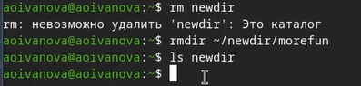{#fig-013 width=70%}

## Команда man

{#fig-014 width=70%}

## Команда man

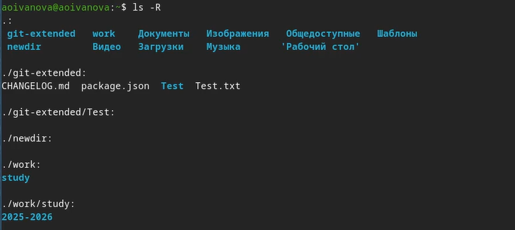{#fig-017 width=70%}

## Команда man

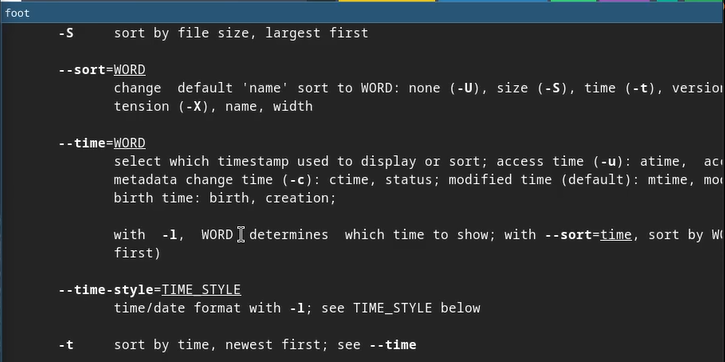{#fig-015 width=70%}

## Команда man

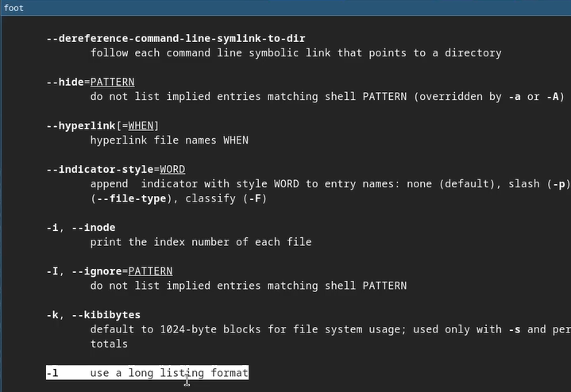{#fig-016 width=50%}

## Команда man

{#fig-018 width=70%}

## Команда man

{#fig-019 width=50%}

## Команда man

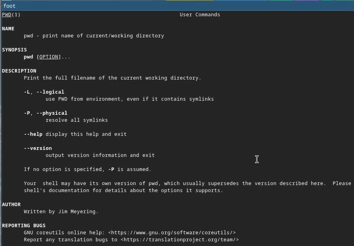{#fig-020 width=50%}

## Команда man

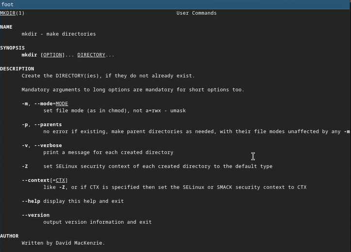{#fig-021 width=50%}

## Команда man

{#fig-022 width=50%}

## Команда man

{#fig-023 width=50%}

## Команда history

{#fig-24 width=50%}

## Команда history

{#fig:027 width=70%}

## Команда history

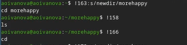{#fig:028 width=70%}

# Результаты

## Выводы

В ходе выполнения лабораторной рбаоты мы приобрели практические навыки взаимодействия пользователя с системой посредством командной строки.

## Список литературы

1. Лаборатораня работа №6 [Электронный ресурс] URL: https://esystem.rudn.ru/mod/resource/view.php?id=1358463
