---
## Author
author:
  name: Иванова Ангелина Олеговна
  degrees: DSc
  orcid: 0000-0002-0877-7063
  email: 1032252598@rudn.ru
  affiliation:
    - name: Российский университет дружбы народов
      country: Российская Федерация
      postal-code: 117198
      city: Москва
      address: ул. Миклухо-Маклая, д. 6

## Title
title: "Лабораторная работа 6"
subtitle: "Основы интерфейса взаимодействия пользователя с системой Unix на уровне командной строки"
license: "CC BY"
---

# Цель работы

Целью данной лабораторной работы является приобретение практических навыков взаимодействия пользователя с системой посредством командной строки.

# Задание

1. Узнать имя домашнего каталога

2. Научиться смотреть содержимое каталогов

3. Научиться создавать и удалять каталоги

4. Научиться работать с командой man

5. Научиться работать с командой history

# Выполнение лабораторной работы
 
## Домашняя директория

Определили полное имя нашего домашнего каталога с помощью команды *pwd*. Далее относительно этого каталога будут выполняться последующие упражнения ([рис. @fig-001]).

{#fig-001 width=70%}

## Содержимое каталогов

Перешли в каталог /tmp ([рис. @fig-002]).

{#fig-002 width=70%}

Выводим содержимое каталога /tmp с помощью команды *ls* ([рис. @fig-003]).

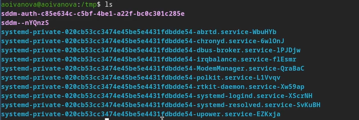{#fig-003 width=70%}

Далее мы используем команду ls с различными опциями. Это *ls -l*(отображает подробный список файлов и папок с дополнительной информацией, такой как права доступа к файлу, владелец, группа, размер файла, время последнего изменения и имя файла.) ,*ls -a*(ыводит все файлы и папки, включая скрытые файлы, которые начинаются с точки) и *ls - alF*(Комбинация опций -l, -a, -F) ([рис. @fig-004]), ([рис. @fig-005]), ([рис. @fig-006]).

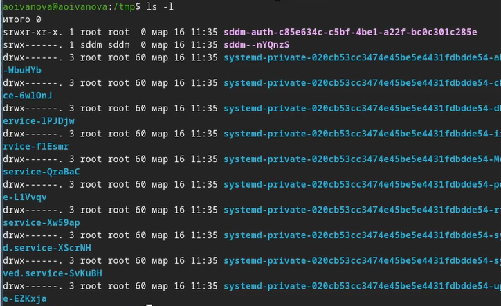{#fig-004 width=70%}

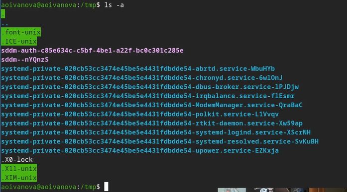{#fig-005 width=70%}

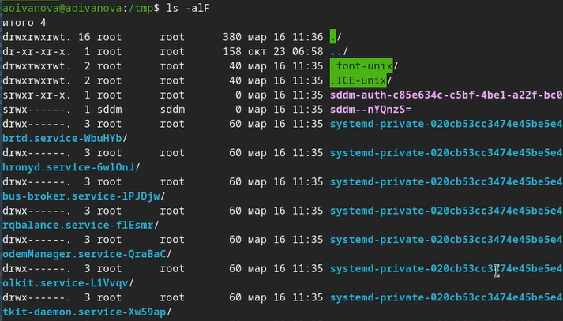{#fig-006 width=70%}

Переходим в каталог /var/spool и с помощью команды *ls* определяем есть ли там подкаталог с именем cron. Подкаталог cron существует ([рис. @fig-007]).

{#fig-007 width=70%}

Переходим в домашний каталог и с помощью команды *ls -l* выводим содержимое каталога и узнаём  кто является владельцем файлов и подкаталогов ([рис. @fig-008]).

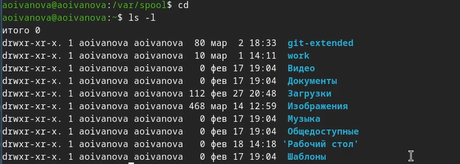{#fig-008 width=70%}

## Создание и удаление каталогов

В домашнем каталоге создаём каталог с именем newdir ([рис. @fig-009]).

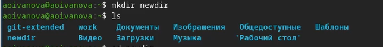{#fig-009 width=70%}

 В каталоге ~/newdir создаём новый каталог с именем morefun ([рис. @fig-010]).

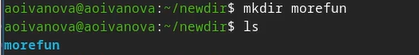{#fig-010 width=70%}

Далее в домашнем каталоге создаём одной командой *mkdir* три новых каталога с именами letters, memos, misk ([рис. @fig-011]).

{#fig-011 width=70%}

Затем удаляем их одной командой *rmdir -p* ([рис. @fig-012]).

{#fig-012 width=70%}

Далее пробуем удалить ранее созданный каталог ~/newdir командой *rm*. Но у нас не получится это сделать, так как *rm* удаляет файлы, а не каталоги. После удаляем каталог ~/newdir/morefun из домашнего каталога и проверяем, был ли каталог удалён ([рис. @fig-013]).

{#fig-013 width=70%}

## Команда man

- Далее с помощью команды *man* определяем, какую опцию команды ls нужно использовать для просмотра содержимого не только указанного каталога, но и подкаталогов, входящих в него (это -R) ([рис. @fig-014]), ([рис. @fig-017]).
- После с помощью команды man определяем набор опций команды ls, позволяющий отсортировать по времени последнего изменения выводимый список содержимого каталога с развёрнутым описанием файлов (это -lt) ([рис. @fig-015]), ([рис. @fig-016]), ([рис. @fig-018]).

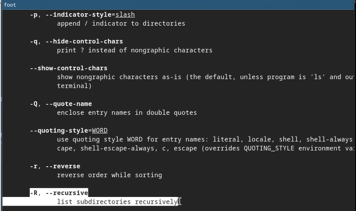{#fig-014 width=70%}

{#fig-017 width=70%}

{#fig-015 width=70%}

{#fig-016 width=70%}

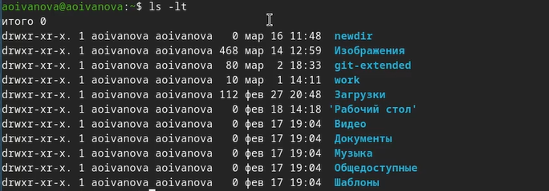{#fig-018 width=70%}

Далее используем команду *man* для просмотра описания следующих команд: cd, pwd, mkdir,
rmdir, rm. Просматриваем основные опции этих команд ([рис. @fig-019]), ([рис. @fig-020]), ([рис. @fig-021]), ([рис. @fig-022]), ([рис. @fig-023]).

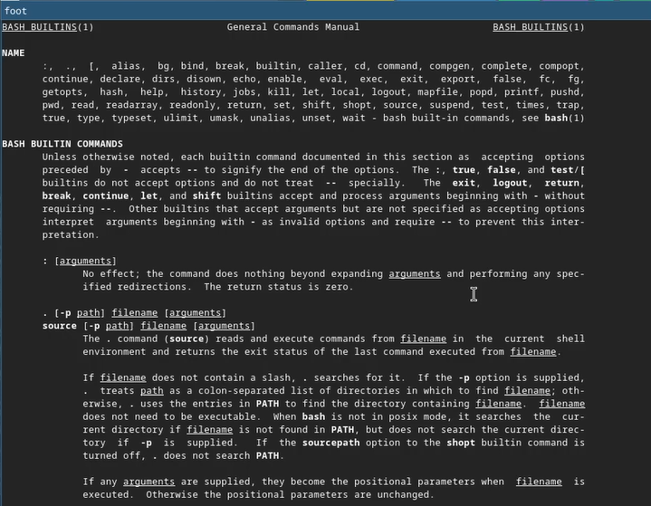{#fig-019 width=70%}

{#fig-020 width=70%}

{#fig-021 width=70%}

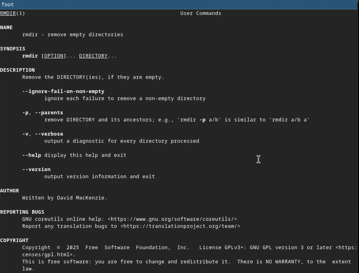{#fig-022 width=70%}

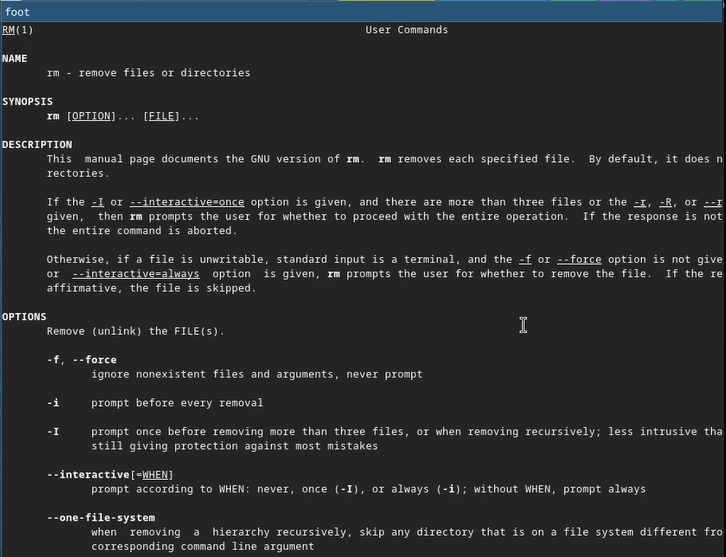{#fig-023 width=70%}

## Команда history

С помощью команды *history* просматриваем историю наших команд ([рис. @fig-024]).

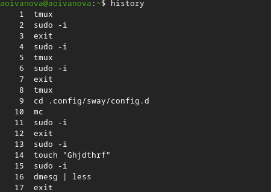{#fig-24 width=70%}

Далее выполняем модификацию и исполнение нескольких команд из буфера команд введя при этом *!номер_команды:s/что_меняем/на_что_меняем* ([рис. @fig-025]), ([рис. @fig-026]).

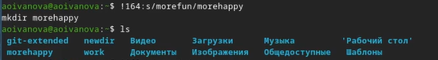{#fig:027 width=70%}

{#fig:028 width=70%}

# Ответы на контрольные вопросы

1. Что такое командная строка?

Командная строка - это текстовая система, которая передает команды компьютеру и возвращает результаты пользователю. В операционной системе типа Linux взаимодействие пользователя с системой обычно осуществляется с помощью командной строки посредством построчного ввода команд.

2. При помощи какой команды можно определить абсолютный путь текущего каталога?
Приведите пример.

Для определения абсолютного пути к текущему каталогу используется команда pwd. Например: если я введу pwd в своем домашнем каталоге то получу /home/eavernikovskaya

3. При помощи какой команды и каких опций можно определить только тип файлов
и их имена в текущем каталоге? Приведите примеры.

С помощью команды ls можно определить имена файлов, при помощи опции -F уже мы сможем определить тип файлов, если нам необходимы скрытые файлы, добавим опцию -a. Пример есть в лабораторной работе

4. Каким образом отобразить информацию о скрытых файлах? Приведите примеры.

С помощью команды ls можно определить имена файлов, если нам необходимы скрытые файлы, добавим опцию -a. Пример есть в лабораторной работе.

5. При помощи каких команд можно удалить файл и каталог? Можно ли это сделать
одной и той же командой? Приведите примеры.

rmdir по умолчанию удаляет пустые каталоги, не удаляет файлы. rm удаляет файлы, без дополнительных опций (-d, -r) не будет удалять каталоги. Удалить в одной строчке одной командой можно файл и каталог. Если файл находится в каталоге, используем рекурсивное удаление, если файл и каталог не связаны подобным образом, то добавим опцию -d, введя имена через пробел после утилиты.

6. Каким образом можно вывести информацию о последних выполненных пользователем командах? работы?

Вывести информацию о последних выполненных пользователем команд можно с помощью history. Пример приведет в лабораторной работе.

7. Как воспользоваться историей команд для их модифицированного выполнения? При-
ведите примеры.

Используем синтаксиси !номеркоманды в выводе history:s/что заменяем/на что заменяем. Примеры приведены в лабораторной работе.

8. Приведите примеры запуска нескольких команд в одной строке.

Предположим, я нахожусь не в домашнем каталоге. Если я введу “cd ; ls”, то окажусь в домашнем каталоге и получу вывод файлов внутри него

9. Дайте определение и приведите примера символов экранирования.

Символ экранирования - (обратный слеш) добавление перед спецсимволом обратный слеш, чтобы использовать специальный символ как обычный. Также позволяет читать системе название директорий с пробелом. Пример:
cd work/Операционные системы/

10. Охарактеризуйте вывод информации на экран после выполнения команды ls с опцией l.

Опция -l позволит увидеть дополнительную информацию о файлах в каталоге: время создания, владельца, права доступа

11. Что такое относительный путь к файлу? Приведите примеры использования относи-
тельного и абсолютного пути при выполнении какой-либо команды.

Относительный путь к файлу начинается из той директории, где вы находитесь (она сама не прописывается в пути), он прописывается относительно данной директории. Абсолютный путь начинается с корневого каталога.

12. Как получить информацию об интересующей вас команде?

Использовать man или –help

13. Какая клавиша или комбинация клавиш служит для автоматического дополнения
вводимых команд?

Клавиша Tab.

# Выводы

В ходе выполнения лабораторной рбаоты мы приобрели практические навыки взаимодействия пользователя с системой посредством командной строки.

# Список литературы

1. Лаборатораня работа №6 [Электронный ресурс] URL: https://esystem.rudn.ru/mod/resource/view.php?id=1358463
