---
## Author
author:
  name: Иванова Ангелина Олеговна
  degrees: DSc
  orcid: 0000-0002-0877-7063
  email: 1032252598@rudn.ru
  affiliation:
    - name: Российский университет дружбы народов
      country: Российская Федерация
      postal-code: 117198
      city: Москва
      address: ул. Миклухо-Маклая, д. 6
## Title
title: Лабораторная работа 7
subtitle: Анализ файловой системы Linux. Команды для работы с файлами и каталогами
license: CC BY
date: today
date-format: "YYYY-MM-DD" # Example: 2025-09-06
---

# Вводная часть

## Цель работы

Целью данной лабораторной работы является ознакомление с файловой системой Linux, её структурой, именами и содержанием каталогов, а также приобретение практических навыков по применению команд для работы с файлами и каталогами, по управлению процессами (и работами), по проверке использования диска и обслуживанию файловой системы

## Задание

- Научится работать с файловой системой с помощью командной строки

- Изучить команды для отлаживания файловой системы

# Выполнение лабораторной работы

## Выполнение 1 пункта

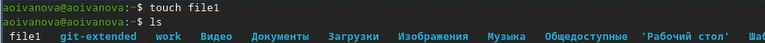{#fig-001 width=70%}

## Выполнение 1 пункта

{#fig-002 width=70%}

## Выполнение 1 пункта

{#fig-003 width=30%}

## Выполнение 1 пункта

{#fig-004 width=70%}

## Выполнение 1 пункта

{#fig-005 width=70%}

## Выполнение 1 пункта

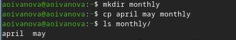{#fig-006 width=70%}

## Выполнение 1 пункта

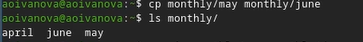{#fig-007 width=70%}

## Выполнение 1 пункта

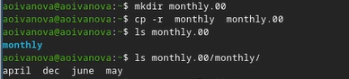{#fig-008 width=70%}

## Выполнение 1 пункта

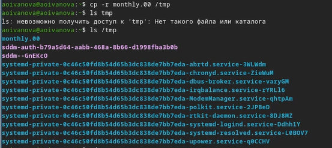{#fig-009 width=70%}

## Выполнение 1 пункта

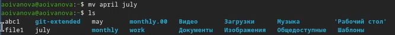{#fig-010 width=70%}

## Выполнение 1 пункта

{#fig-011 width=70%}

## Выполнение 1 пункта

{#fig-012 width=70%}

## Выполнение 1 пункта

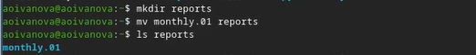{#fig-013 width=70%}

## Выполнение 1 пункта

{#fig-014 width=70%}

## Выполнение 1 пункта

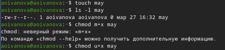{#fig-015 width=70%}

## Выполнение 1 пункта

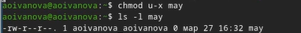{#fig-016 width=70%}

## Выполнение 1 пункта

{#fig-017 width=70%}

## Выполнение 1 пункта

{#fig-018 width=70%}

## Выполнение 2 пункта

{#fig-019 width=70%}

## Выполнение 2 пункта

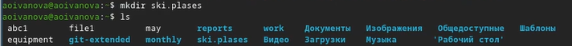{#fig-020 width=70%}

## Выполнение 2 пункта

{#fig-021 width=70%}

## Выполнение 2 пункта

{#fig-022 width=70%}

## Выполнение 2 пункта

{#fig-023 width=70%}

## Выполнение 2 пункта

{#fig-024 width=70%}

## Выполнение 2 пункта

{#fig-025 width=70%}

## Выполнение 2 пункта

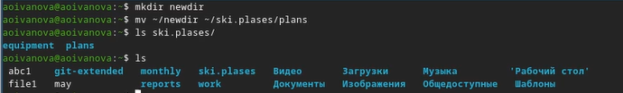{#fig-026 width=70%}

## Выполнение 3 пункта

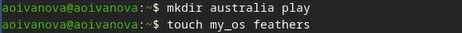{#fig-027 width=70%}

## Выполнение 3 пункта

{#fig-028 width=70%}

## Выполнение 3 пункта

{#fig-029 width=70%}

## Выполнение 3 пункта

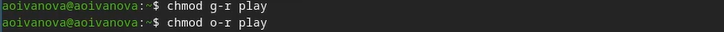{#fig-030 width=70%}

## Выполнение 3 пункта

{#fig-031 width=70%}

## Выполнение 4 пункта

{#fig-032 width=55%}

## Выполнение 4 пункта

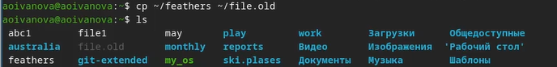{#fig-033 width=70%}

## Выполнение 4 пункта

{#fig-034 width=70%}

## Выполнение 4 пункта

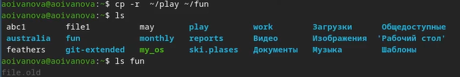{#fig-035 width=70%}

## Выполнение 4 пункта

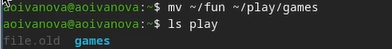{#fig-036 width=70%}

## Выполнение 4 пункта

{#fig-037 width=70%}

## Выполнение 4 пункта

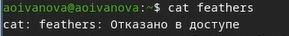{#fig-038 width=70%}

## Выполнение 4 пункта

{#fig-039 width=70%}

## Выполнение 4 пункта

{#fig-040 width=70%}

## Выполнение 4 пункта

{#fig-041 width=70%}

## Выполнение 4 пункта

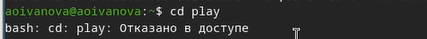{#fig-042 width=70%}

## Выполнение 4 пункта

{#fig-043 width=70%}

## Выполнение 5 пункта

1. mount: Используется для монтирования файловых систем в определенные точки монтирования в операционной системе Linux.
2. fsck: Проверяет и исправляет целостность файловой системы, обнаруживая и исправляя ошибки на диске.
3. mkfs: Создает новую файловую систему на указанном устройстве.
4. kill: Используется для отправки сигналов процессам в Linux, что может привести к завершению процесса.

# Результаты

## Выводы

В ходе выполнения лабораторной работы мы ознакомились с файловой системой Linux, её структурой, именами и содержанием каталогов. А также приобрели практические навыки по применению команд для работы
с файлами и каталогами, по управлению процессами (и работами), по проверке использования диска и обслуживанию файловой системы.
