---
## Author
author:
  name: Иванова Ангелина Олеговна
  degrees: DSc
  orcid: 0000-0002-0877-7063
  email: 1032252598@rudn.ru
  affiliation:
    - name: Российский университет дружбы народов
      country: Российская Федерация
      postal-code: 117198
      city: Москва
      address: ул. Миклухо-Маклая, д. 6

## Title
title: "Лабораторная работа 7"
subtitle: "Анализ файловой системы Linux. Команды для работы с файлами и каталогами"
license: "CC BY"
---

# Цель работы

Целью данной лабораторной работы является ознакомление с файловой системой Linux, её структурой, именами и содержанием каталогов, а также приобретение практических навыков по применению команд для работы с файлами и каталогами, по управлению процессами (и работами), по проверке использования диска и обслуживанию файловой системы

# Задание

- Научится работать с файловой системой с помощью командной строки

- Изучить команды для отлаживания файловой системы

# Выполнение лабораторной работы

## Выполнение 1 пункта

Выполнили все примеры, приведённые в первой части описания лабораторной работы. Конкретно выполненые нами действия указаны в подписях к рисункам ([рис. @fig-001]), ([рис. @fig-002]), ([рис. @fig-003]), ([рис. @fig-004]), ([рис. @fig-005]), ([рис. @fig-006]), ([рис. @fig-007]), ([рис. @fig-008]), ([рис. @fig-009]), ([рис. @fig-010]), ([рис. @fig-011]), ([рис. @fig-012]), ([рис. @fig-013]), ([рис. @fig-014]), ([рис. @fig-015]), ([рис. @fig-016]), ([рис. @fig-017]), ([рис. @fig-018]).

{#fig-001 width=70%}

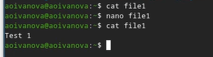{#fig-002 width=70%}

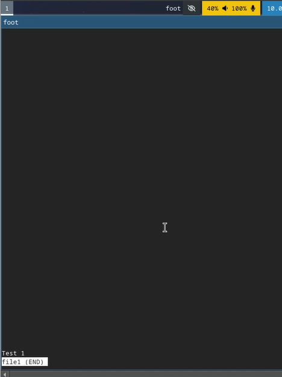{#fig-003 width=70%}

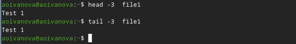{#fig-004 width=70%}

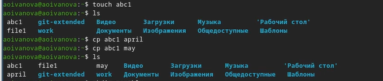{#fig-005 width=70%}

{#fig-006 width=70%}

{#fig-007 width=70%}

{#fig-008 width=70%}

{#fig-009 width=70%}

{#fig-010 width=70%}

{#fig-011 width=70%}

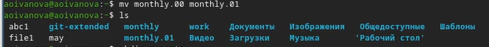{#fig-012 width=70%}

{#fig-013 width=70%}

{#fig-014 width=70%}

{#fig-015 width=70%}

{#fig-016 width=70%}

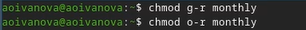{#fig-017 width=70%}

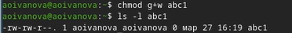{#fig-018 width=70%}

## Выполнение 2 пункта

Скопировали файл /usr/include/sys/io.h в домашний каталог и назовали его equipment ([рис. @fig-019]).

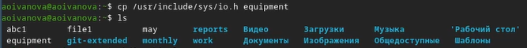{#fig-019 width=70%}

В домашнем каталоге создали директорию ~/ski.plases ([рис. @fig-020]).

{#fig-020 width=70%}

Переместили файл equipment в каталог ~/ski.plases ([рис. @fig-021]).

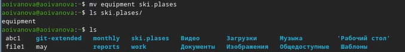{#fig-021 width=70%}

Переименовали файл ~/ski.plases/equipment в ~/ski.plases/equiplist ([рис. @fig-022]).

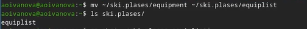{#fig-022 width=70%}

Скопировали файл abc1 в каталог ~/ski.plases, назовали его equiplist2 ([рис. @fig-023]).

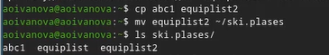{#fig-023 width=70%}

Создали каталог с именем equipment в каталоге ~/ski.plases ([рис. @fig-024]).

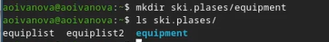{#fig-024 width=70%}

Переместили файлы ~/ski.plases/equiplist и equiplist2 в каталог ~/ski.plases/equipment ([рис. @fig-025]).

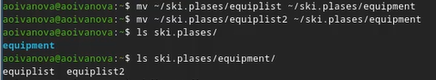{#fig-025 width=70%}

Создали и переместили каталог ~/newdir в каталог ~/ski.plases и назвали его plans ([рис. @fig-026]).

{#fig-026 width=70%}

## Выполнение 3 пункта

Создали файлы и директории и наделили из необходимыми правами, чтобы они соответствовали следующему описанию:

1. drwxr--r-- ... australia

2. drwx--x--x ... play

3. -r-xr--r-- ... my_os

4. -rw-rw-r-- ... feathers

([рис. @fig-027]), ([рис. @fig-028]), ([рис. @fig-029]), ([рис. @fig-030]), ([рис. @fig-031]).

{#fig-027 width=70%}

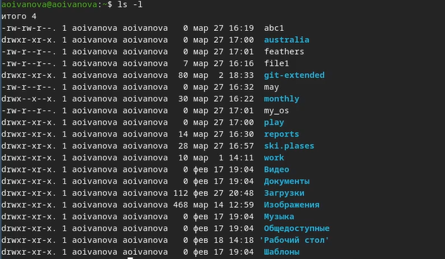{#fig-028 width=70%}

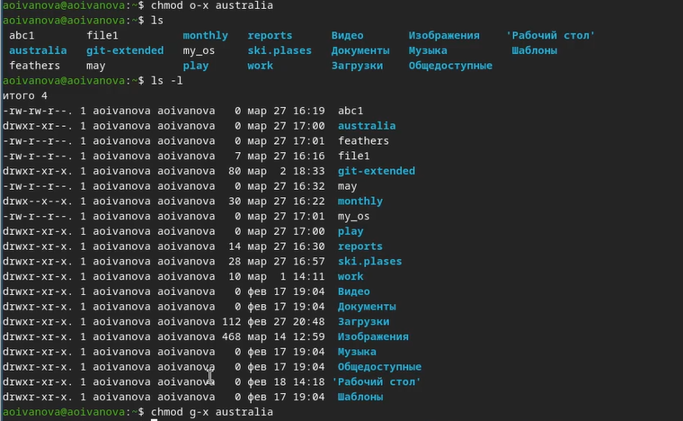{#fig-029 width=70%}

{#fig-030 width=70%}

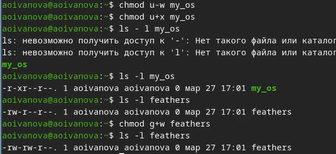{#fig-031 width=70%}

## Выполнение 4 пункта

Просмотрели содержимое файла /etc/passwd ([рис. @fig-032]).

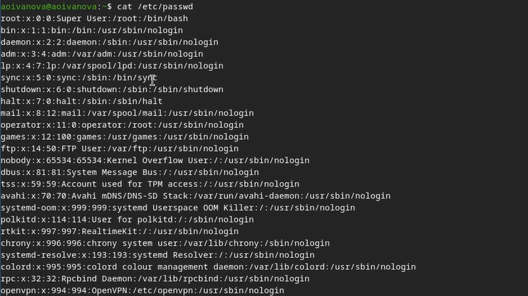{#fig-032 width=70%}

Скопировали файл ~/feathers в файл ~/file.old ([рис. @fig-033]).

{#fig-033 width=70%}

Переместили файл ~/file.old в каталог ~/play ([рис. @fig-034]).

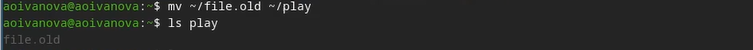{#fig-034 width=70%}

Скопировали каталог ~/play в каталог ~/fun ([рис. @fig-035]).

{#fig-035 width=70%}

Переместили каталог ~/fun в каталог ~/play и назовите его games ([рис. @fig-036]).

{#fig-036 width=70%}

Лишили владельца файла ~/feathers права на чтение ([рис. @fig-037]).

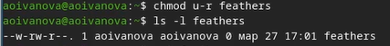{#fig-037 width=70%}

Попытались просмотреть файл ~/feathers командой cat. Было отказанно в доступе, так нет необходимых прав ([рис. @fig-038]).

{#fig-038 width=70%}

При попытке скопировать файл ~/feathers, аналогично было отказанно, так нет необходимых прав ([рис. @fig-039]).

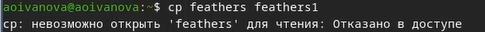{#fig-039 width=70%}

Дали владельцу файла ~/feathers право на чтение ([рис. @fig-040]).

{#fig-040 width=70%}

Лишили владельца каталога ~/play права на выполнение ([рис. @fig-041]).

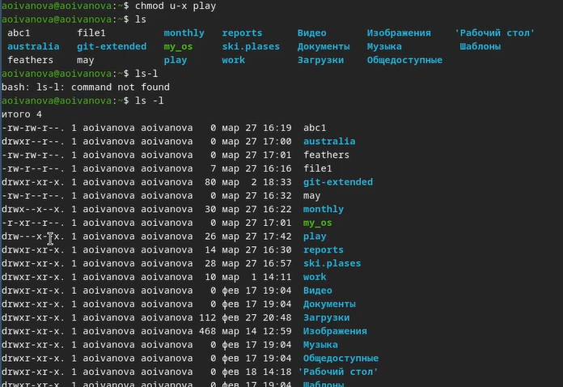{#fig-041 width=70%}

Попробовали перейти в каталог ~/play. Аналогично было отказанно в доступе, так нет необходимых прав ([рис. @fig-042]).

{#fig-042 width=70%}

Дали владельцу каталога ~/play право на выполнение ([рис. @fig-043]).

{#fig-043 width=70%}

## Выполнение 5 пункта

Прочитали man по командам mount, fsck, mkfs, kill.

1. mount: Используется для монтирования файловых систем в определенные точки монтирования в операционной системе Linux.
2. fsck: Проверяет и исправляет целостность файловой системы, обнаруживая и исправляя ошибки на диске.
3. mkfs: Создает новую файловую систему на указанном устройстве.
4. kill: Используется для отправки сигналов процессам в Linux, что может привести к завершению процесса.

## Ответы на контрольные вопросы

1. Дайте характеристику каждой файловой системе, существующей на жёстком диске компьютера, на котором вы выполняли лабораторную работу.

- Ext2, Ext3, Ext4 или Extended Filesystem - это стандартная файловая система для Linux. Она была разработана еще для Minix. Она самая стабильная из всех существующих, кодовая база изменяется очень редко и эта файловая система содержит больше всего функций. Версия ext2 была разработана уже именно для Linux и получила много улучшений. В 2001 году вышла ext3, которая добавила еще больше стабильности благодаря использованию журналирования. В 2006 была выпущена версия ext4, которая используется во всех дистрибутивах Linux до сегодняшнего дня. В ней было внесено много улучшений, в том числе увеличен максимальный размер раздела до одного экзабайта.

- Btrfs или B-Tree File System - это совершенно новая файловая система, которая сосредоточена на отказоустойчивости, легкости администрирования и восстановления данных. Файловая система объединяет в себе очень много новых интересных возможностей, таких как размещение на нескольких разделах, поддержка подтомов, изменение размера не лету, создание мгновенных снимков, а также высокая производительность. Но многими пользователями файловая система Btrfs считается нестабильной. Тем не менее, она уже используется как файловая система по умолчанию в OpenSUSE и SUSE Linux.

2. Приведите общую структуру файловой системы и дайте характеристику каждой директории первого уровня этой структуры.

- / — root каталог. Содержит в себе всю иерархию системы;
- /bin — здесь находятся двоичные исполняемые файлы. Основные общие команды, хранящиеся отдельно от других программ в системе (прим.: pwd, ls, cat, ps);
- /boot — тут расположены файлы, используемые для загрузки системы (образ initrd, ядро vmlinuz);
- /dev — в данной директории располагаются файлы устройств (драйверов). С помощью этих файлов можно взаимодействовать с устройствами. К примеру, если это жесткий диск, можно подключить его к файловой системе. В файл принтера же можно написать напрямую и отправить задание на печать;
- /etc— в этой директории находятся файлы конфигураций программ. Эти файлы позволяют настраивать системы, сервисы, скрипты системных демонов;
- /home — каталог, аналогичный каталогу Users в Windows. Содержит домашние каталоги учетных записей пользователей (кроме root). При создании нового пользователя здесь создается одноименный каталог с аналогичным именем и хранит личные файлы этого пользователя;
- /lib — содержит системные библиотеки, с которыми работают программы и модули ядра;
- /lost+found — содержит файлы, восстановленные после сбоя работы системы. Система проведет проверку после сбоя и найденные файлы можно будет посмотреть в данном каталоге;
- /media — точка монтирования внешних носителей. Например, когда вы вставляете диск в дисковод, он будет автоматически смонтирован в директорию /media/cdrom;
- /mnt — точка временного монтирования. Файловые системы подключаемых устройств обычно монтируются в этот каталог для временного использования;
- /opt — тут расположены дополнительные (необязательные) приложения. Такие программы обычно не подчиняются принятой иерархии и хранят свои файлы в одном подкаталоге (бинарные, библиотеки, конфигурации);
- /proc — содержит файлы, хранящие информацию о запущенных процессах и о состоянии ядра ОС;
- /root — директория, которая содержит файлы и личные настройки суперпользователя;
- /run — содержит файлы состояния приложений. Например, PID-файлы или UNIX-сокеты;
- /sbin — аналогично /bin содержит бинарные файлы. Утилиты нужны для настройки и администрирования системы суперпользователем;
- /srv — содержит файлы сервисов, предоставляемых сервером (прим. FTP или Apache HTTP);
- /sys — содержит данные непосредственно о системе. Тут можно узнать информацию о ядре, драйверах и устройствах;
- /tmp — содержит временные файлы. Данные файлы доступны всем пользователям на чтение и запись. Стоит отметить, что данный каталог очищается при перезагрузке;
- /usr — содержит пользовательские приложения и утилиты второго уровня, используемые пользователями, а
не системой. Содержимое доступно только для чтения (кроме root). Каталог имеет вторичную иерархию и похож на корневой;
- /var — содержит переменные файлы. Имеет подкаталоги, отвечающие за отдельные переменные. Например, логи будут храниться в /var/log, кэш в /var/cache, очереди заданий в /var/spool/ и так далее.

3. Какая операция должна быть выполнена, чтобы содержимое некоторой файловой системы было доступно операционной системе?

Монтирование тома.

4. Назовите основные причины нарушения целостности файловой системы. Как устранить повреждения файловой системы?

Отсутствие синхронизации между образом файловой системы в памяти и ее данными на диске в случае
аварийного останова может привести к появлению следующих ошибок:

- Один блок адресуется несколькими mode (принадлежит нескольким файлам).
- Блок помечен как свободный, но в то же время занят (на него ссылается onode).
- Блок помечен как занятый, но в то же время свободен (ни один inode на него не ссылается).
- Неправильное число ссылок в inode (недостаток или избыток ссылающихся записей в каталогах).
- Несовпадение между размером файла и суммарным размером адресуемых inode блоков. 
- Недопустимые адресуемые блоки (например, расположенные за пределами файловой системы).
- “Потерянные” файлы (правильные inode, на которые не ссылаются записи каталогов).
- Недопустимые или неразмещенные номера inode в записях каталогов.

5. Как создаётся файловая система?

Команда mkfs - позволяет создать файловую систему Linux.

6. Дайте характеристику командам для просмотра текстовых файлов.

- Cat - выводит содержимое файла на стандартное устройство вывода. 
- Выполнение команды head выведет первые 10 строк текстового файла.
- Выполнение команды tail выведет последние 10 строк текстового файла.
- Команда tac - это тоже самое, что и cat, только отображает строки в обратном порядке.
- Для того, чтобы просмотреть огромный текстовый файл применяются команды для постраничного просмотра. Такие как more и less.

7. Приведите основные возможности команды cp в Linux.

Cp – копирует или перемещает директорию, файлы.

8. Приведите основные возможности команды mv в Linux.

Mv - переименовывает или перемещает файл или директорию

9. Что такое права доступа? Как они могут быть изменены?

Права доступа к файлу или каталогу можно изменить, воспользовавшись командой chmod. Сделать это может владелец файла (или каталога) или пользователь с правами администратора.

# Выводы

В ходе выполнения лабораторной работы мы ознакомились с файловой системой Linux, её структурой, именами и содержанием каталогов. А также приобрели практические навыки по применению команд для работы
с файлами и каталогами, по управлению процессами (и работами), по проверке использования диска и обслуживанию файловой системы.

