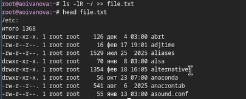
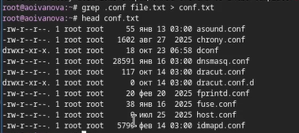
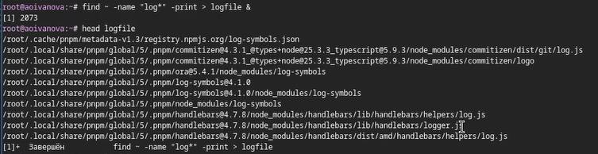
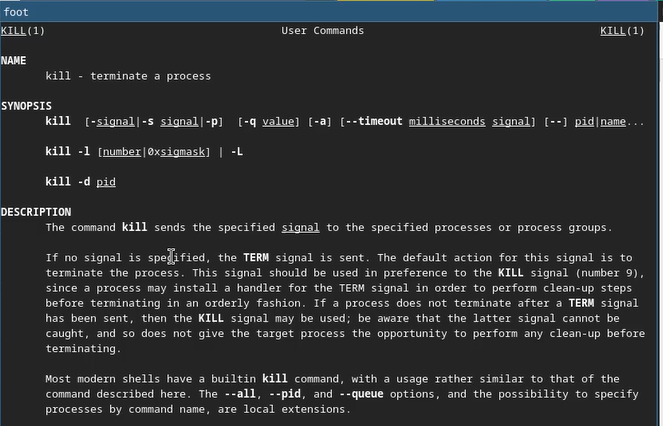
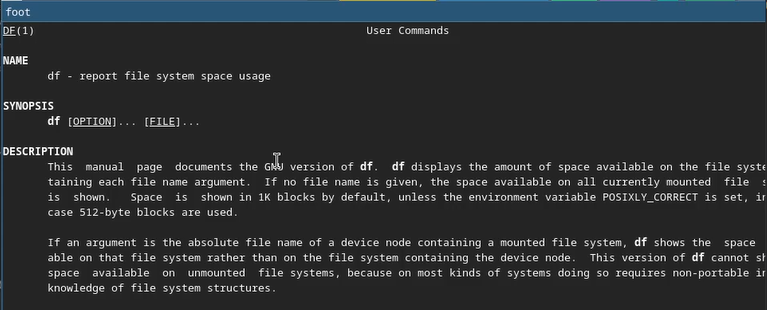

---
## Author
author:
  name: Иванова Ангелина Олеговна
  degrees: DSc
  orcid: 0000-0002-0877-7063
  email: 1032252598@rudn.ru
  affiliation:
    - name: Российский университет дружбы народов
      country: Российская Федерация
      postal-code: 117198
      city: Москва
      address: ул. Миклухо-Маклая, д. 6
## Title
title: Лабораторная работа 8
subtitle: Поиск файлов. Перенаправление ввода-вывода. Просмотр запущенных процессов
license: CC BY
date: today
date-format: "YYYY-MM-DD" # Example: 2025-09-06
---

# Вводная часть

## Цель работы

Целью данной лабораторной работы является ознакомление с инструментами поиска файлов и фильтрации текстовых данных, а также приобретение практических навыков: по управлению процессами (и заданиями), по проверке использования диска и обслуживанию файловых систем

## Задание

- Научиться находить и фильтровать файлы

- Научится записывать необходимую информацию в файлы

- Научится работать с процессами

# Выполнение лабораторной работы

## Выполнение лабораторной работы

{#fig-001 width=70%}

## Выполнение лабораторной работы

{#fig-002 width=70%}

## Выполнение лабораторной работы

{#fig-003 width=70%}

## Выполнение лабораторной работы

{#fig-004 width=70%}

## Выполнение лабораторной работы

{#fig-005 width=70%}

## Выполнение лабораторной работы

{#fig-006 width=70%}

## Выполнение лабораторной работы

{#fig-007 width=70%}

## Выполнение лабораторной работы

{#fig-008 width=70%}

## Выполнение лабораторной работы

{#fig-009 width=70%}

## Выполнение лабораторной работы

{#fig-010 width=70%}

## Выполнение лабораторной работы

{#fig-011 width=70%}

## Выполнение лабораторной работы

{#fig-012 width=70%}

## Выполнение лабораторной работы

{#fig-013 width=70%}

## Выполнение лабораторной работы

{#fig-014 width=70%}

## Выполнение лабораторной работы

{#fig-015 width=70%}

## Выполнение лабораторной работы

{#fig-016 width=70%}

## Выполнение лабораторной работы

{#fig-017 width=70%}

## Выполнение лабораторной работы

{#fig-018 width=70%}

## Выполнение лабораторной работы

{#fig-019 width=70%}

## Выполнение лабораторной работы

{#fig-020 width=70%}

# Результаты

## Выводы

В ходе выполнения лабораторной работы мы ознакомились с инструментами поиска файлов и фильтрации текстовых данных. А иакже приобрели практические навыки: по управлению процессами (и заданиями), по проверке использования диска и обслуживанию файловых систем.
