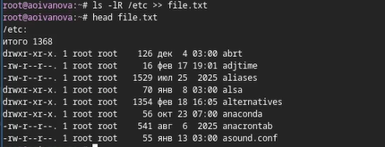
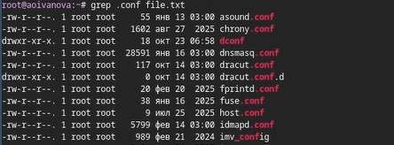
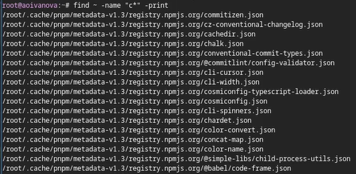
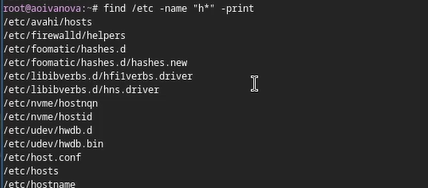
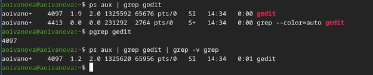
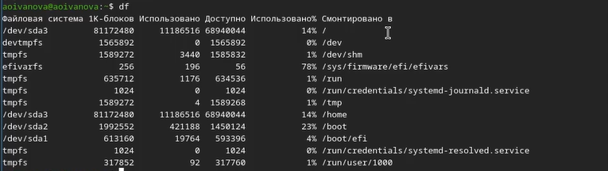
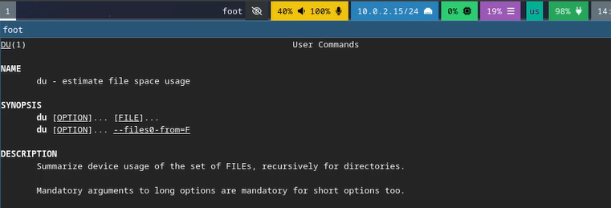
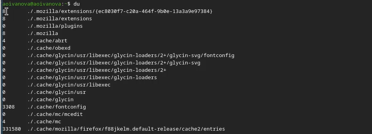
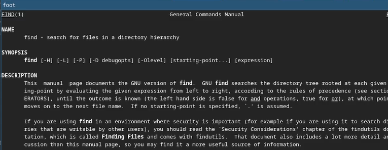
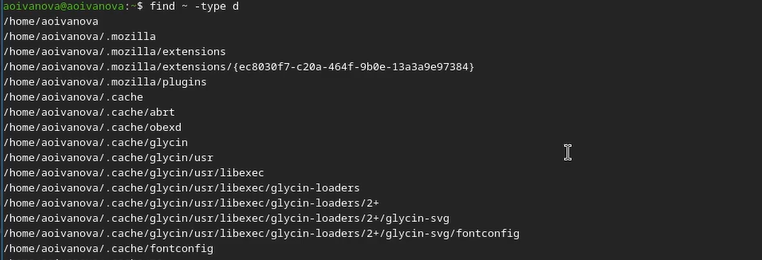

---
## Author
author:
  name: Иванова Ангелина Олеговна
  degrees: DSc
  orcid: 0000-0002-0877-7063
  email: 1032252598@rudn.ru
  affiliation:
    - name: Российский университет дружбы народов
      country: Российская Федерация
      postal-code: 117198
      city: Москва
      address: ул. Миклухо-Маклая, д. 6

## Title
title: "Лабораторная работа 8"
subtitle: "Поиск файлов. Перенаправление ввода-вывода. Просмотр запущенных процессов"
license: "CC BY"
---

# Цель работы

Целью данной лабораторной работы является ознакомление с инструментами поиска файлов и фильтрации текстовых данных, а также приобретение практических навыков: по управлению процессами (и заданиями), по проверке использования диска и обслуживанию файловых систем

# Задание

- Научиться находить и фильтровать файлы

- Научится записывать необходимую информацию в файлы

- Научится работать с процессами

# Выполнение лабораторной работы

Осуществили вход в систему, используя соответствующее имя пользователя, то есть переключись на суперпользователя ([рис. @fig-001]).

{#fig-001 width=70%}

Записали в файл file.txt названия файлов, содержащихся в каталоге /etc ([рис. @fig-002]).

{#fig-002 width=70%}

Дописали в этот же файл названия файлов, содержащихся в домашнем каталоге ([рис. @fig-003]).

{#fig-003 width=70%}

Вывели имена всех файлов из file.txt, имеющих расширение .conf, ([рис. @fig-004]).

{#fig-004 width=70%}

После чего записали их в новый текстовой файл conf.txt ([рис. @fig-005]).

{#fig-005 width=70%}

Определили несколькими способами, какие файлы в домашнем каталоге имеют имена, начинавшиеся с символа c ([рис. @fig-006]), ([рис. @fig-007]).

{#fig-006 width=70%}

{#fig-007 width=70%}

Вывели на экран (по странично) имена файлов из каталога /etc, начинающиеся
с символа h ([рис. @fig-008]).

{#fig-008 width=70%}

Запустили в фоновом режиме процесс, который будет записывать в файл ~/logfile файлы, имена которых начинаются с log ([рис. @fig-009]).

{#fig-009 width=70%}

Удалили файл ~/logfile ([рис. @fig-010]).

{#fig-010 width=70%}

Запустили из консоли в фоновом режиме редактор gedit ([рис. @fig-011]).

{#fig-011 width=70%}

Определили идентификатор процесса gedit несколькоми способами ([рис. @fig-012]).

{#fig-012 width=70%}

Прочли справку (man) команды kill ([рис. @fig-013]).

{#fig-013 width=70%}

После чего использовали её для завершения процесса gedit ([рис. @fig-014]).

{#fig-014 width=70%}

Выполнили команды df и du, предварительно получив более подробную информацию
об этих командах, с помощью команды man. Команда df показывает размер каждого смонтированного раздела диска, вторая du показывает число килобайт, используемое каждым файлом или каталогом ([рис. @fig-015]), ([рис. @fig-016]), ([рис. @fig-017]), ([рис. @fig-018]).

{#fig-015 width=70%}

{#fig-016 width=70%}

{#fig-017 width=70%}

{#fig-018 width=70%}

Воспользовались справкой команды find ([рис. @fig-019]).

{#fig-019 width=70%}

Вывели имена всех директорий, имеющихся в вашем домашнем каталоге ([рис. @fig-020]).

{#fig-020 width=70%}

# Ответы на контрольные вопросы

1. Какие потоки ввода вывода вы знаете?

В системе по умолчанию открыто три специальных потока: 
- stdin стандартный поток ввода (по умолчанию: клавиатура), файловый дескриптор 0; 
- stdout стандартный поток вывода (по умолчанию: консоль), файловый дескриптор 1; 
- stderr стандартный поток вывод сообщений об ошибках (по умолчанию: консоль), файловый дескриптор 2.

2. Объясните разницу между операцией > и >>.

- Символ > используется для перенаправления вывода команды в файл. Если файл уже существует, его содержимое будет полностью перезаписано.
- Символ >> также используется для перенаправления вывода команды в файл, но с дополнением данных в конец файла, не перезаписывая существующее содержимое.

3. Что такое конвейер?

Конвейер (pipe) служит для объединения простых команд или утилит в цепочки, в которых результат работы предыдущей команды передаётся последующей.

4. Что такое процесс? Чем это понятие отличается от программы?

Главное отличие между программой и процессом заключается в том, что программа - это набор инструкций, который позволяет ЦПУ выполнять определенную задачу, в то время как процесс - это исполняемая программа.

5. Что такое PID и GID?

PPID - (parent process ID) идентификатор родительского процесса. Процесс может порождать и другие процессы. UID, GID - реальные идентификаторы пользователя и его группы, запустившего данный процесс.

6. Что такое задачи и какая команда позволяет ими управлять?

Запущенные фоном программы называются задачами (jobs). Ими можно управлять с помощью команды jobs, которая выводит список запущенных в данный момент задач.

7. Найдите информацию об утилитах top и htop. Каковы их функции?

Команда htop похожа на команду top по выполняемой функции: они обе показывают информацию о процессах в реальном времени, выводят данные о потреблении системных ресурсов и позволяют искать, останавливать и управлять процессами.
У обеих команд есть свои преимущества. Например, в программе htop реализован очень удобный поиск по процессам, а также их фильтрация. В команде top это не так удобно — нужно знать кнопку для вывода функции поиска.
Зато в top можно разделять область окна и выводить информацию о процессах в соответствии с разными настройками. В целом top намного более гибкая в настройке отображения процессов.

8. Назовите и дайте характеристику команде поиска файлов. Приведите примеры использования этой команды.

Команда find - это одна из наиболее важных и часто используемых утилит системы Linux. Это команда для поиска файлов и каталогов на основе специальных условий. Ее можно использовать в различных обстоятельствах, например, для поиска файлов по разрешениям, владельцам, группам, типу, размеру и другим подобным критериям.
Утилита find предустановлена по умолчанию во всех Linux дистрибутивах, поэтому вам не нужно будет устанавливать никаких дополнительных пакетов. Это очень важная находка для тех, кто хочет использовать командную строку наиболее эффективно.
Команда find имеет такой синтаксис: find [папка] [параметры] критерий шаблон [действие] 
Пример: find /etc -name "h*" -print

9. Можно ли по контексту (содержанию) найти файл? Если да, то как?

Да, можно.
Синтаксис команды: find ~ -type f -exec grep -H ‘текстДляПоиска’ {} ;

10. Как определить объем свободной памяти на жёстком диске?

С помощью команды df -h.

11. Как определить объем вашего домашнего каталога?

С помощью команды du -s.

12. Как удалить зависший процесс?

С помощью команды kill% номер задачи

# Выводы

В ходе выполнения лабораторной работы мы ознакомились с инструментами поиска файлов и фильтрации текстовых данных. А иакже приобрели практические навыки: по управлению процессами (и заданиями), по проверке использования диска и обслуживанию файловых систем.

