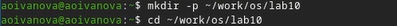
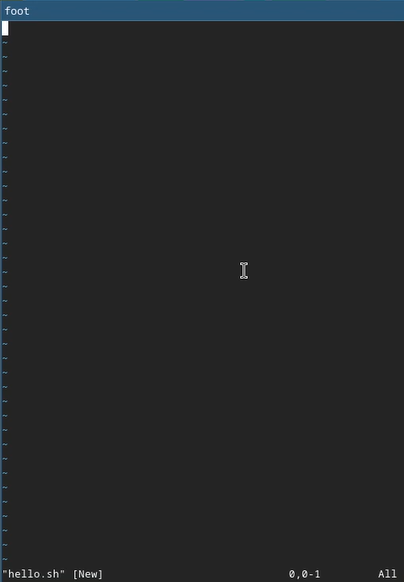
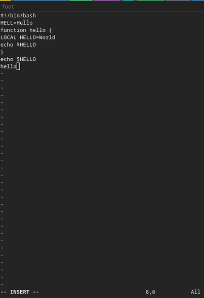
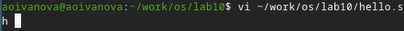
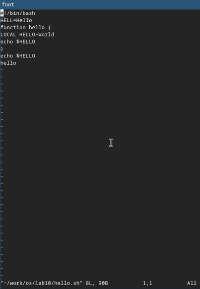
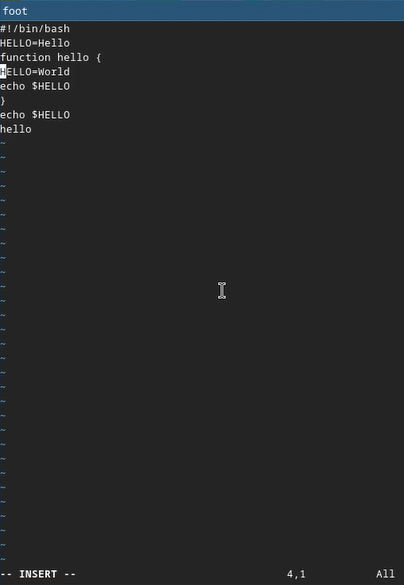
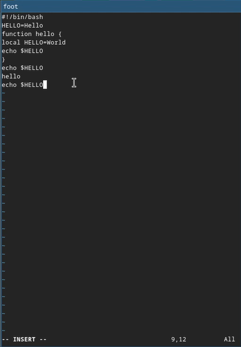
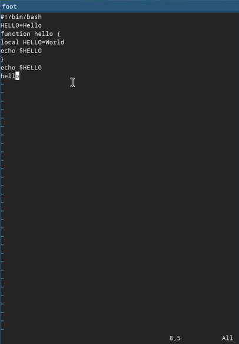
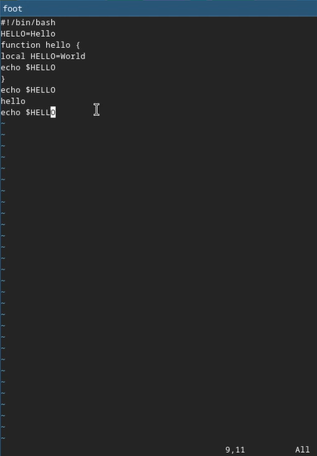

---
## Author
author:
  name: Иванова Ангелина Олеговна
  degrees: DSc
  orcid: 0000-0002-0877-7063
  email: 1032252598@rudn.ru
  affiliation:
    - name: Российский университет дружбы народов
      country: Российская Федерация
      postal-code: 117198
      city: Москва
      address: ул. Миклухо-Маклая, д. 6
## Title
title: Лабораторная работа № 10
subtitle: Текстовой редактор vi
license: CC BY
date: today
date-format: "YYYY-MM-DD" # Example: 2025-09-06
---

# Вводная часть

## Цель работы

Целью данной лабораторной работы является оознакомление с операционной системой Linux, а также получение практических навыков работы с редактором vi, установленным по умолчанию практически во всех дистрибутивах.

## Задание

1. Ознакомиться с теоретическим материалом.

2. Ознакомиться с редактором vi.

3. Выполнить упражнения, используя команды vi

# Выполнение лабораторной работы

## Задание 1. Создание нового файла с использованием vi

{#fig-001 width=70%}

## Задание 1. Создание нового файла с использованием vi

{#fig-002 width=40%}

## Задание 1. Создание нового файла с использованием vi

{#fig-003 width=50%}

## Задание 1. Создание нового файла с использованием vi

{#fig-004 width=50%}

## Задание 1. Создание нового файла с использованием vi

{#fig-005 width=50%}

## Задание 1. Создание нового файла с использованием vi

{#fig-006 width=70%}

## Задание 2. Редактирование существующего файла

{#fig-007 width=70%}

## Задание 2. Редактирование существующего файла

{#fig-008 width=50%}

## Задание 2. Редактирование существующего файла

{#fig-009 width=50%}

## Задание 2. Редактирование существующего файла

{#fig-010 width=50%}

## Задание 2. Редактирование существующего файла

{#fig-011 width=50%}

## Задание 2. Редактирование существующего файла

{#fig-012 width=50%}

## Задание 2. Редактирование существующего файла

{#fig-013 width=50%}

## Задание 2. Редактирование существующего файла

{#fig-014 width=70%}

## Задание 2. Редактирование существующего файла

{#fig-015 width=50%}

## Задание 2. Редактирование существующего файла

{#fig-016 width=50%}

# Результаты

## Выводы

В ходе выполнения лабораторной работы мы ознакомились с операционной системой Linux а также получили практические навыки работы с редактором vi, установленным по умолчанию практически во всех дистрибутивах.
