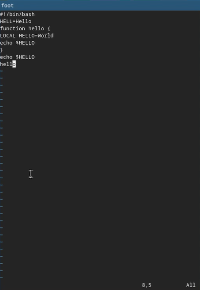
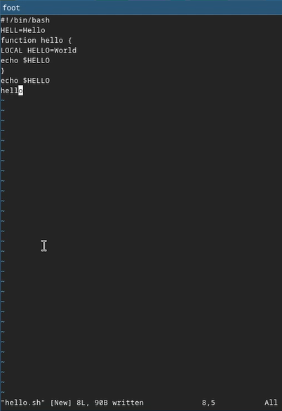
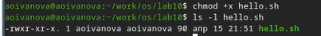
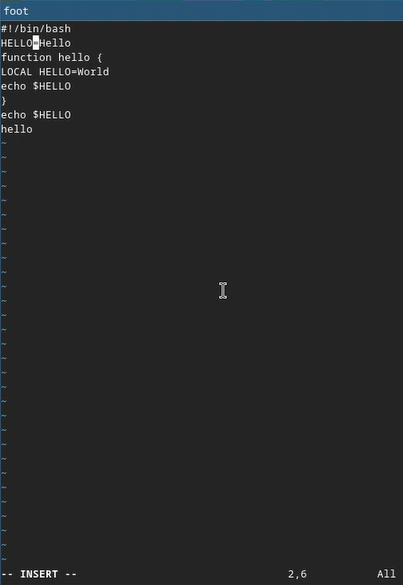
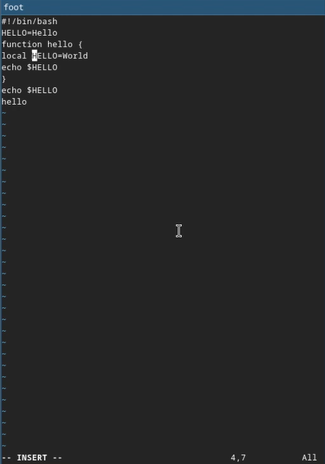
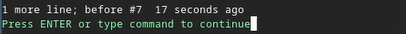
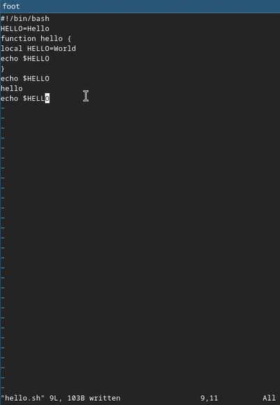
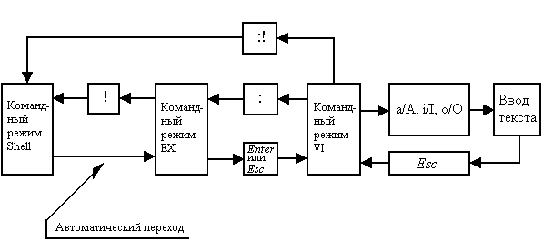

---
## Author
author:
  name: Иванова Ангелина Олеговна
  degrees: DSc
  orcid: 0000-0002-0877-7063
  email: 1032252598@rudn.ru
  affiliation:
    - name: Российский университет дружбы народов
      country: Российская Федерация
      postal-code: 117198
      city: Москва
      address: ул. Миклухо-Маклая, д. 6

## Title
title: "Лабораторная работа № 8"
subtitle: "Текстовой редактор vi"
license: "CC BY"
---

# Цель работы

Целью данной лабораторной работы является оознакомление с операционной системой Linux, а также получение практических навыков работы с редактором vi, установленным по умолчанию практически во всех дистрибутивах.

# Задание

1. Ознакомиться с теоретическим материалом.

2. Ознакомиться с редактором vi.

3. Выполнить упражнения, используя команды vi

# Выполнение лабораторной работы

## Задание 1. Создание нового файла с использованием vi

Создали каталог с именем ~/work/os/lab10 и перешли в него ([рис. @fig-001]).

{#fig-001 width=70%}

Вызовали vi и создали файл hello.sh с помощью команды vi hello.sh ([рис. @fig-002]).

{#fig-002 width=70%}

Нажали клавишу i и ввели предоставленный нам текст ([рис. @fig-003]).

{#fig-003 width=70%}

Нажали клавишу Esc для перехода в командный режим после завершения ввода
текста ([рис. @fig-004]).

{#fig-004 width=70%}

Нажали : для перехода в режим последней строки и внизу экрана появилось приглашение в виде двоеточия. Нажали w (записать) и q (выйти), а затем клавишу Enter для сохранения текста и завершения работы ([рис. @fig-005]).

{#fig-005 width=70%}

Сделали файл исполняемым ([рис. @fig-006]).

{#fig-006 width=70%}

## Задание 2. Редактирование существующего файла

Вызвали vi на редактирование файла ([рис. @fig-007]).

{#fig-007 width=70%}

{#fig-008 width=70%}

Установили курсор в конец слова HELL второй строки. Перешли в режим вставки и заменили на HELLO. Нажали Esc для возврата в командный режим ([рис. @fig-009]).

{#fig-009 width=70%}

Установили курсор на четвертую строку и сотерли слово LOCAL ([рис. @fig-010]).

{#fig-010 width=70%}

Перешли в режим вставки наберали следующий текст: local, нажали Esc для возврата в командный режим ([рис. @fig-011]).

{#fig-011 width=70%}

Установили курсор на последней строке файла. Вставили после неё строку, содержащую
следующий текст: echo $HELLO. Нажали Esc для перехода в командный режим ([рис. @fig-012]).

{#fig-012 width=70%}

Удалили последнюю строку ([рис. @fig-013]).

{#fig-013 width=70%}

Ввели команду отмены изменений u для отмены последней команды ([рис. @fig-014]), ([рис. @fig-015]).

{#fig-014 width=70%}

{#fig-015 width=70%}

Ввели символ : для перехода в режим последней строки. Записали произведённые
изменения и вышли из vi ([рис. @fig-016]).

{#fig-016 width=70%}

# Ответы на контрольные вопросы

1. Дайте краткую характеристику режимам работы редактора vi.

- командный режим — предназначен для ввода команд редактирования и навигации по редактируемому файлу;
- режим вставки — предназначен для ввода содержания редактируемого файла;
- режим последней (или командной) строки — используется для записи изменений в файл и выхода из редактора.

2. Как выйти из редактора, не сохраняя произведённые изменения?

Можно нажимать символ q (или q!), если требуется выйти из редактора без сохранения.

3. Назовите и дайте краткую характеристику командам позиционирования.

- 0 (ноль) — переход в начало строки;
- $ — переход в конец строки;
- G — переход в конец файла;
- n G — переход на строку с номером n.

4. Что для редактора vi является словом?

Редактор vi предполагает, что слово - это строка символов, которая может включать в себя буквы, цифры и символы подчеркивания.

5. Каким образом из любого места редактируемого файла перейти в начало (конец)
файла?

С помощью G — переход в конец файла.

6. Назовите и дайте краткую характеристику основным группам команд редактирования.

- Вставка текста: а — вставить текст после курсора; А — вставить текст в конец строки; i — вставить текст перед курсором; n i — вставить текст n раз; I — вставить текст в начало строки.
- Вставка строки: о — вставить строку под курсором; О — вставить строку над курсором.
- Удаление текста: x — удалить один символ в буфер; d w — удалить одно слово в буфер; d $ — удалить в буфер текст от курсора до конца строки; d 0 — удалить в буфер текст от начала строки до позиции курсора; d d — удалить в буфер одну строку; n d d — удалить в буфер n строк.
- Отмена и повтор произведённых изменений: u — отменить последнее изменение; . — повторить последнее изменение.
- Копирование текста в буфер: Y — скопировать строку в буфер; n Y — скопировать n строк в буфер; y w — скопировать слово в буфер.
- Вставка текста из буфера: p — вставить текст из буфера после курсора; P — вставить текст из буфера перед курсором.
- Замена текста: c w — заменить слово; n c w — заменить n слов; c $ — заменить текст от курсора до конца строки; r — заменить слово; R — заменить текст.
- Поиск текста: / текст — произвести поиск вперёд по тексту указанной строки символов текст; ? текст — произвести поиск назад по тексту указанной строки символов текст.

7. Необходимо заполнить строку символами $. Каковы ваши действия?

Перейти в режим вставки.

8. Как отменить некорректное действие, связанное с процессом редактирования?

С помощью u — отменить последнее изменение.

9. Назовите и дайте характеристику основным группам команд режима последней строки.

Режим последней строки — используется для записи изменений в файл и выхода из редактора.

10. Как определить, не перемещая курсора, позицию, в которой заканчивается строка?

$ — переход в конец строки.

11. Выполните анализ опций редактора vi (сколько их, как узнать их назначение и т.д.).

Опции редактора vi позволяют настроить рабочую среду. Для задания опций используется команда set (в режиме последней строки): 
- : set all — вывести полный список опций;
- : set nu — вывести номера строк;
- : set list — вывести невидимые символы;
- : set ic — не учитывать при поиске, является ли символ прописным или строчным.

12. Как определить режим работы редактора vi?

В редакторе vi есть два основных режима: командный режим и режим вставки. По умолчанию работа начинается в командном режиме. В режиме вставки клавиатура используется для набора текста. Для выхода в командный режим используется клавиша Esc или комбинация Ctrl + c. 

13. Постройте граф взаимосвязи режимов работы редактора vi ([рис. @fig-017]).

{#fig-017 width=70%}

# Выводы

В ходе выполнения лабораторной работы мы ознакомились с операционной системой Linux а также получили практические навыки работы с редактором vi, установленным по умолчанию практически во всех дистрибутивах.
