---
## Author
author:
  name: Иванова Ангелина Олеговна
  degrees: DSc
  orcid: 0000-0002-0877-5063
  email: 1032252598@rudn.ru
  affiliation:
    - name: Российский университет дружбы народов
      country: Российская Федерация
      postal-code: 117198
      city: Москва
      address: ул. Миклухо-Маклая, д. 6
## Title
title: Лабораторная работа 11
subtitle: Текстовой редактор emacs
license: CC BY
date: today
date-format: "YYYY-MM-DD" # Example: 2025-09-06
---

# Вводная часть

## Цель работы

Познакомиться с операционной системой Linux. Получить практические навыки работы с редактором Emacs.

## Задание

1. Ознакомиться с теоретическим материалом.   

2. Ознакомиться с редактором emacs.   

3. Выполнить упражнения.   

#  Выполнение лабораторной работы

## Выполнение работы

{#fig-001 width=50%}

## Выполнение работы

{#fig-002 width=50%}

## Выполнение работы

{#fig-003 width=50%}

## Выполнение работы

{#fig-004 width=50%}

## Выполнение работы

{#fig-005 width=50%}

## Выполнение работы

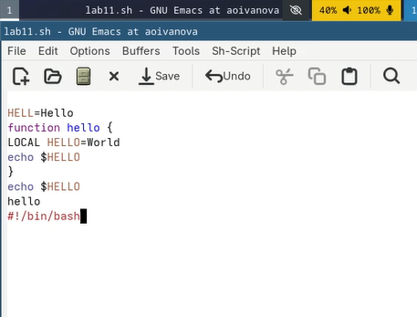{#fig-006 width=50%}

## Выполнение работы

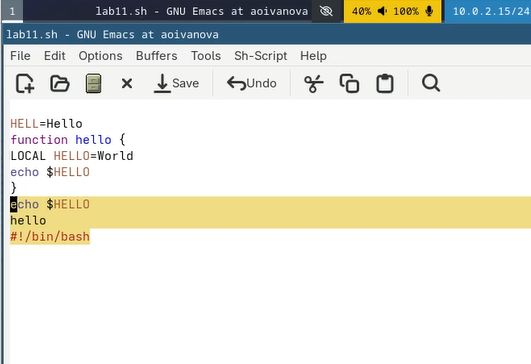{#fig-007 width=50%}

## Выполнение работы

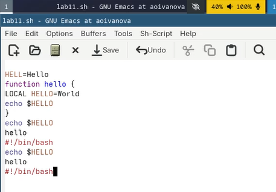{#fig-008 width=50%}

## Выполнение работы

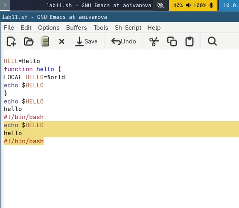{#fig-009 width=50%}

## Выполнение работы

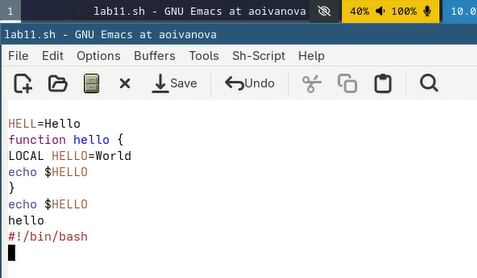{#fig-010 width=50%}

## Выполнение работы

{#fig-011 width=50%}

## Выполнение работы

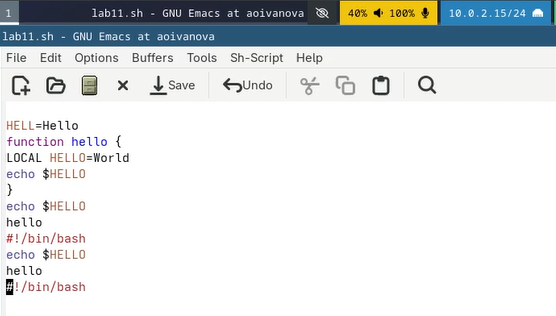{#fig-012 width=50%}

## Выполнение работы

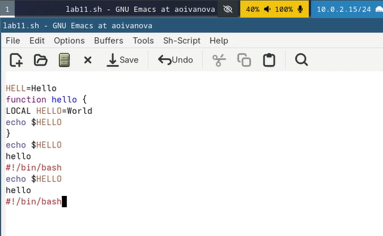{#fig-013 width=50%}

## Выполнение работы

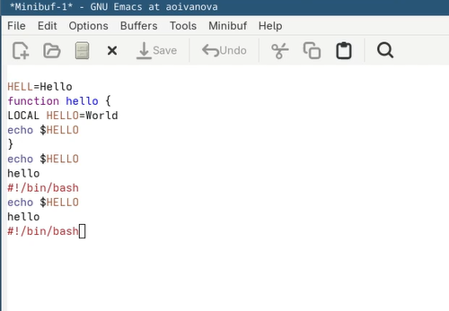{#fig-014 width=50%}

## Выполнение работы

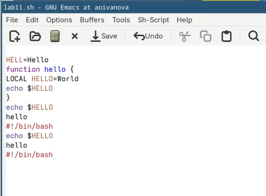{#fig-015 width=50%}

## Выполнение работы

{#fig-016 width=50%}

## Выполнение работы

{#fig-017 width=50%}

## Выполнение работы

{#fig-018 width=50%}

## Выполнение работы

{#fig-019 width=50%}

## Выполнение работы

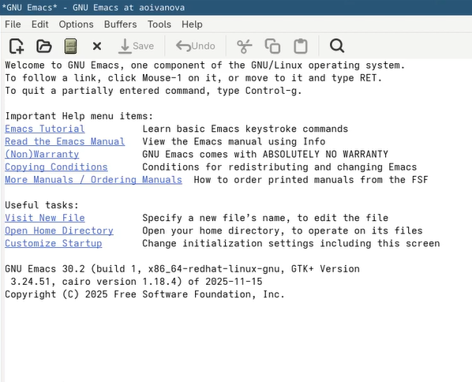{#fig-020 width=50%}

## Выполнение работы

{#fig-021 width=50%}

## Выполнение работы

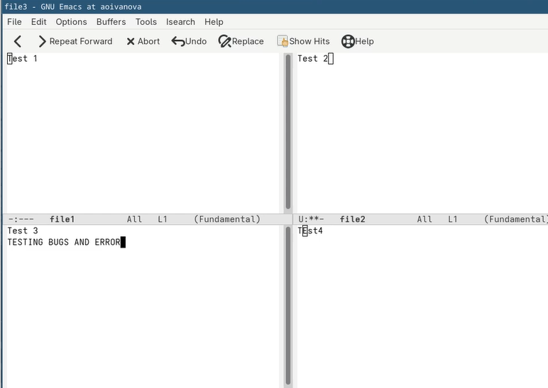{#fig-022 width=50%}

## Выполнение работы

{#fig-023 width=50%}

## Выполнение работы

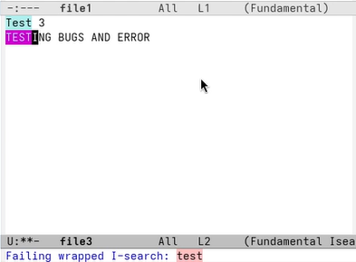{#fig-024 width=50%}

## Выполнение работы

{#fig-025 width=50%}

## Выполнение работы

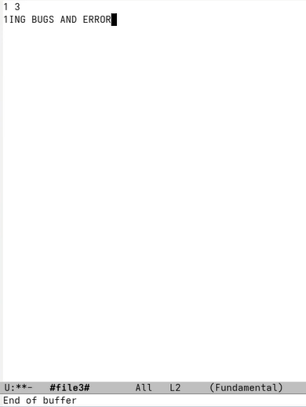{#fig-026 width=50%}

## Выполнение работы

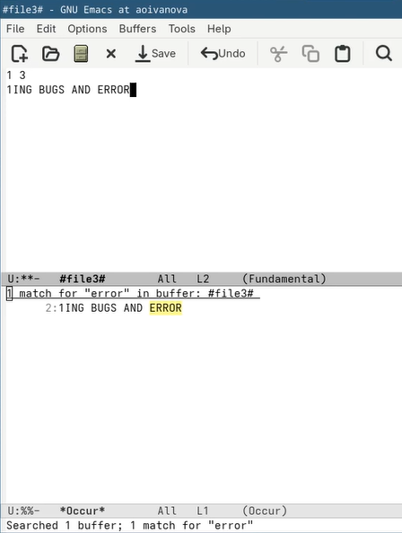{#fig-027 width=50%}

# Результаты

## Выводы

В ходе выполнения лабораторной работы мы ознакомились с операционной системой Linux а также получили практические навыки работы с редактором Emacs.

