---
## Author
author:
  name: ИВанова Ангелина ОЛеговна
  degrees: DSc
  orcid: 0000-0002-0877-7063
  email: 1032252598@rudn.ru
  affiliation:
    - name: Российский университет дружбы народов
      country: Российская Федерация
      postal-code: 117198
      city: Москва
      address: ул. Миклухо-Маклая, д. 6

## Title
title: "Лабораторная работа 11"
subtitle: "Текстовой редактор emacs"
license: "CC BY"
---

# Цель работы

Познакомиться с операционной системой Linux. Получить практические навыки работы с редактором Emacs.

# Задание

1. Ознакомиться с теоретическим материалом.   
2. Ознакомиться с редактором emacs.   
3. Выполнить упражнения.   
4. Ответить на контрольные вопросы.  
  
# Выполнение лабораторной работы

Открыли emacs ([рис. @fig-001]).

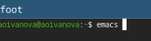{#fig-001 width=70%}

Создали файл lab11.sh с помощью комбинации Ctrl-x Ctrl-f (C-x C-f)([рис. @fig-002]).

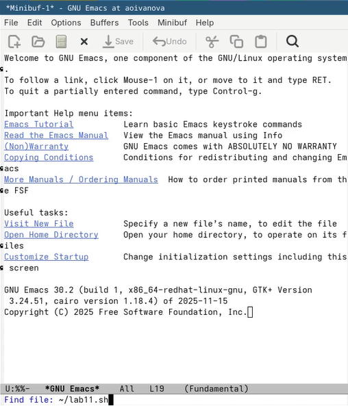{#fig-002 width=70%}

Набрали необходимый текст ([рис. @fig-003]).

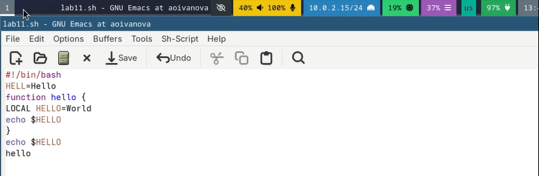{#fig-003 width=70%}

Сохранили файл с помощью комбинации Ctrl-x Ctrl-s (C-x C-s) ([рис. @fig-004]).

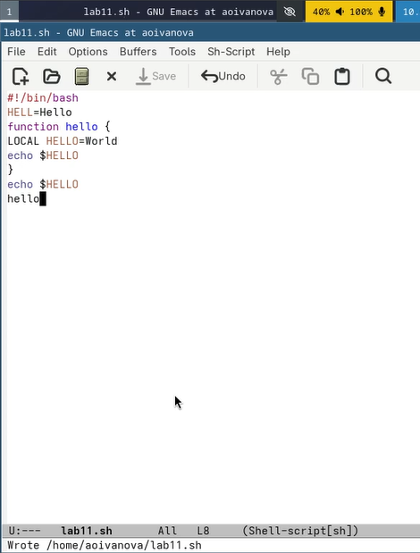{#fig-004 width=70%}

Проделали с текстом стандартные процедуры редактирования. Вырезали одной командой целую строку (С-k) ([рис. @fig-005]).

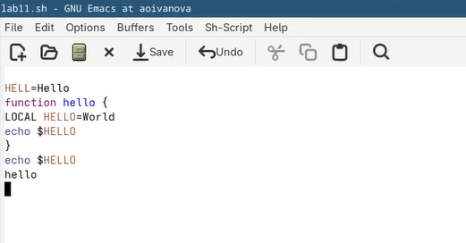{#fig-005 width=70%}

Вставили эту строку в конец файла (C-y) ([рис. @fig-006]).

{#fig-006 width=70%}

Выделили область текста (C-space) ([рис. @fig-007]).

{#fig-007 width=70%}

Скопировали область в буфер обмена (M-w) ([рис. @fig-008]).

{#fig-008 width=70%}

Вставили область в конец файла ([рис. @fig-009]).

{#fig-009 width=70%}

Вновь выделили эту область и на этот раз вырезали её (C-w) ([рис. @fig-010]).

{#fig-010 width=70%}

Отменили последнее действие (C-/) ([рис. @fig-011]).

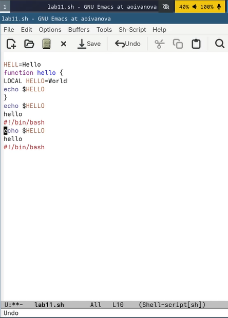{#fig-011 width=70%}

Научились использовать команды по перемещению курсора. Переместили курсор в начало строки (C-a) ([рис. @fig-012]).

{#fig-012 width=70%}

Переместили курсор в конец строки (C-e) ([рис. @fig-013]).

{#fig-013 width=70%}

Переместили курсор в конец буфера (M->) ([рис. @fig-014]).

{#fig-014 width=70%}

Переместили курсор в начало буфера (M-<) ([рис. @fig-015]).

{#fig-015 width=70%}

Вывели список активных буферов на экран (C-x C-b) ([рис. @fig-016]).

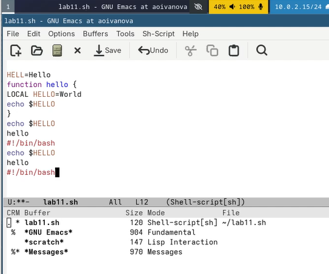{#fig-016 width=70%}

Переместились во вновь открытое окно (C-x o) со списком открытых буферов ([рис. @fig-017]).

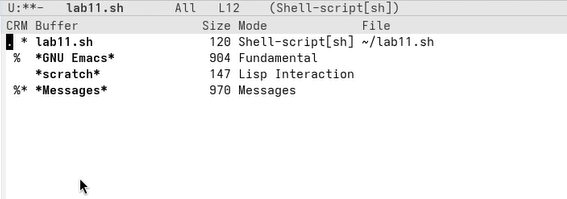{#fig-017 width=70%}

Переключились на другой буфер ([рис. @fig-018]).

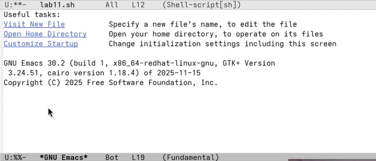{#fig-018 width=70%}

Закрыли это окно (C-x 0) ([рис. @fig-019]).

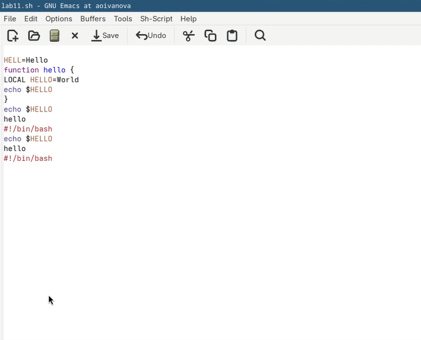{#fig-019 width=70%}

Теперь переключились между буферами, но уже без вывода их списка на
экран (C-x b) ([рис. @fig-020]).

{#fig-020 width=70%}

Поделили фрейм на 4 части: разделили фрейм на два окна по вертикали (C-x 3), а затем каждое из этих окон на две части по горизонтали (C-x 2) ([рис. @fig-021]).

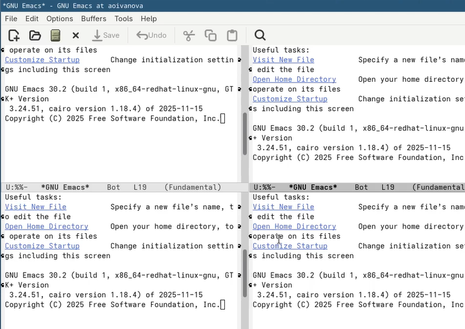{#fig-021 width=70%}

В каждом из четырёх созданных окон открыли новый буфер (файл) и ввели несколько строк текста ([рис. @fig-022]).

{#fig-022 width=70%}

Переключились в режим поиска (C-s) и нашли несколько слов, присутствующих
в тексте ([рис. @fig-023]).

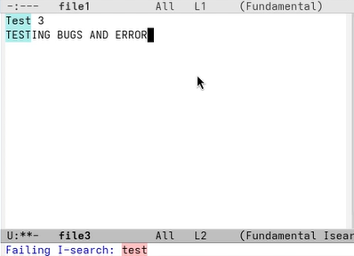{#fig-023 width=70%}

Переключились между результатами поиска, нажимая C-s ([рис. @fig-024]).

{#fig-024 width=70%}

Вышли из режима поиска, нажав C-g и перешли в режим поиска и замены (M-%), ввели текст, который следует найти и заменить, нажали Enter , затем ввели текст для замены. После нажали ! для подтверждения замены ([рис. @fig-025]), ([рис. @fig-026]).

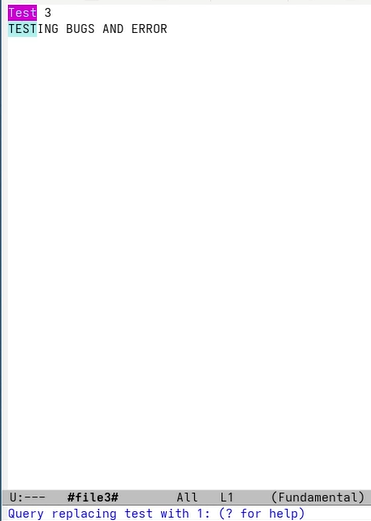{#fig-025 width=70%}

{#fig-026 width=70%}

Пробуем другой режим поиска, нажав M-s. Он отличается от предыдущего тем, что выводит результат в отдельном окне ([рис. @fig-027]).

{#fig-027 width=70%}

# Ответы на контрольные вопросы

1. Кратко охарактеризуйте редактор emacs.

Emacs — один из наиболее мощных и широко распространённых редакторов, используемых в мире UNIX. Написан на языке высокого уровня Lisp.

2. Какие особенности данного редактора могут сделать его сложным для освоения новичком?

Большое разнообразие сложных комбинаций клавиш, которые необходимы для редактирования файла и в принципе для работа с Emacs.

3. Своими словами опишите, что такое буфер и окно в терминологии emacs’а.

Буфер - это объект в виде текста. Окно - это прямоугольная область, в которой отображен буфер.

4. Можно ли открыть больше 10 буферов в одном окне?

Да, можно.

5. Какие буферы создаются по умолчанию при запуске emacs?

Emacs использует буферы с именами, начинающимися с пробела, для внутренних целей. Отчасти он обращается с буферами с такими именами особенным образом — например, по умолчанию в них не записывается информация для отмены изменений.

6. Какие клавиши вы нажмёте, чтобы ввести следующую комбинацию C-c | и C-c C-|?

Ctrl + c, а потом | и Ctrl + c Ctrl + |

7. Как поделить текущее окно на две части?

С помощью команды Ctrl + x 3 (по вертикали) и Ctrl + x 2 (по горизонтали)

8. В каком файле хранятся настройки редактора emacs?

Настройки emacs хранятся в файле . emacs, который хранится в домашней дирректории пользователя. Кроме этого файла есть ещё папка . emacs.

9. Какую функцию выполняет клавиша и можно ли её переназначить?

Выполняет функцию стереть, думаю можно переназначить.

10. Какой редактор вам показался удобнее в работе vi или emacs? Поясните почему.

Для меня удобнее был редактор Emacs, так как у него есть командая оболочка. А vi открывается в терминале, и выглядит своеобразно.

# Выводы

В ходе выполнения лабораторной работы мы ознакомились с операционной системой Linux а также получили практические навыки работы с редактором Emacs.

# Список литературы

Не пользовалась сайтами.
