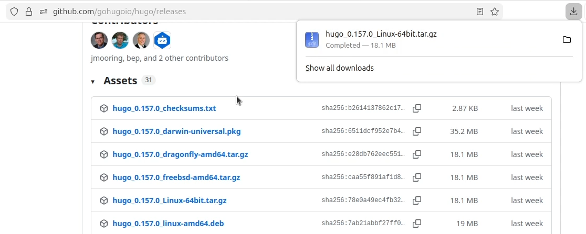
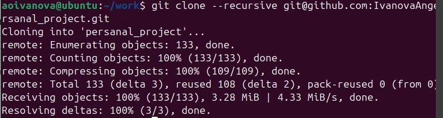
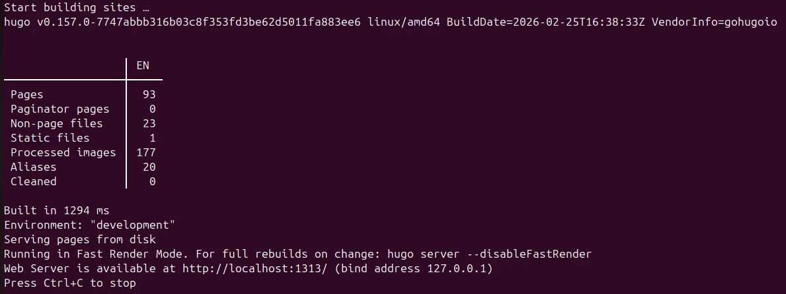
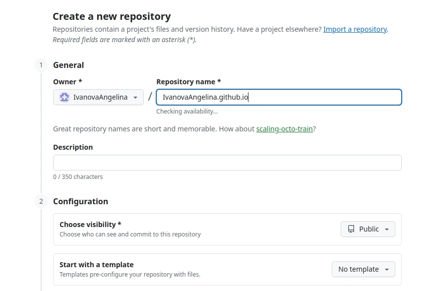
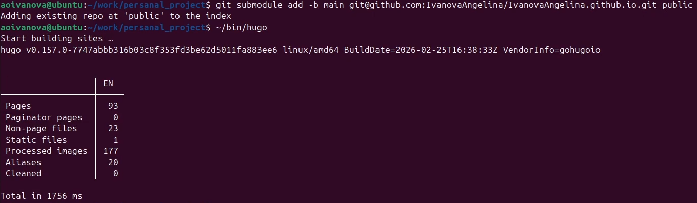
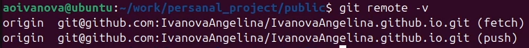
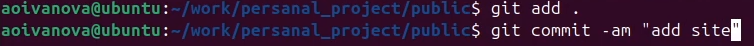
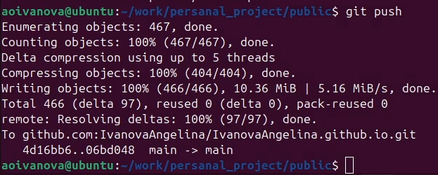
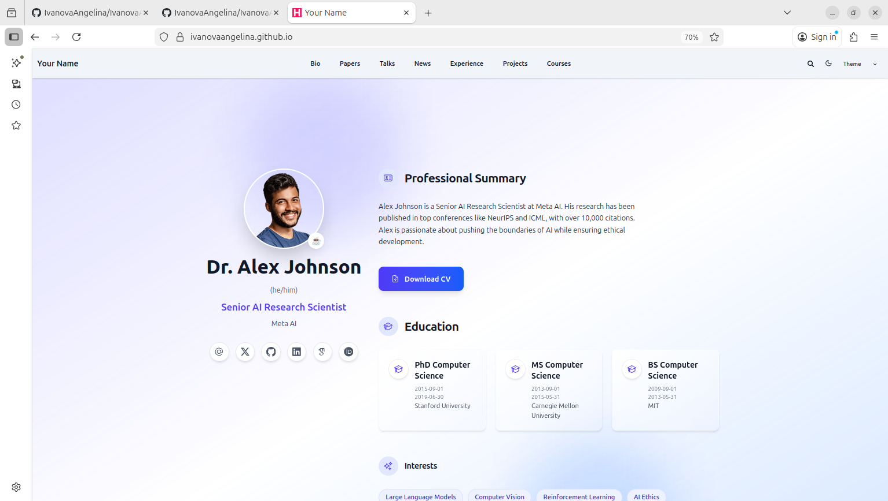

---
## Author
author:
  name: Иванова Ангелина Олеговна
  degrees: DSc
  orcid: 0000-0002-0877-7063
  email: 1032252598@rudn.ru
  affiliation:
    - name: Российский университет дружбы народов
      country: Российская Федерация
      postal-code: 117198
      city: Москва
      address: ул. Миклухо-Маклая, д. 6
## Title
title: Отчёт по первому этапу выполнения индивидуального проекта
subtitle: Заготовка для персонального сайта
license: CC BY
date: today
date-format: "YYYY-MM-DD" # Example: 2025-09-06
---

# Вводная часть

## Цель работы

Целью данной работы является размещение на Github pages заготовки для персонального сайта.

## Задание

1. Установить необходимое программное обеспечение.

2. Скачать шаблон темы сайта.

3. Разместить его на хостинге git.

4. Установить параметр для URLs сайта.

5. Разместить заготовку сайта на Github pages.

# Выполнение лабораторной работы

## Скачивание ПО

{#fig-001 width=70%}

## Скачивание ПО

{#fig-002 width=70%}

## Скачивание ПО

{#fig-003 width=70%}

## Скачать шаблон темы сайта.

{#fig-004 width=70%}

## Скачать шаблон темы сайта.

{#fig-005 width=70%}

## Скачать шаблон темы сайта.

{#fig-006 width=70%}

## Скачать шаблон темы сайта.

{#fig-007 width=70%}

## Скачать шаблон темы сайта.

{#fig-008 width=70%}

## Скачать шаблон темы сайта.

{#fig-008_1 width=70%}

## Скачать шаблон темы сайта.

{#fig-009 width=70%}

## Установить параметр для URLs сайта.

{#fig-010 width=70%}

## Установить параметр для URLs сайта.

{#fig-011 width=70%}

## Установить параметр для URLs сайта.

{#fig-012 width=70%}

## Установить параметр для URLs сайта.

{#fig-013 width=70%}

## Установить параметр для URLs сайта.

{#fig-014 width=70%}

## Установить параметр для URLs сайта.

{#fig-015 width=70%}

## Разместить заготовку сайта на Github pages.

{#fig-016 width=70%}

## Разместить заготовку сайта на Github pages.

{#fig-016 width=70%}

## Разместить заготовку сайта на Github pages.

{#fig-016 width=70%}

## Разместить заготовку сайта на Github pages.

{#fig-016 width=70%}

## Разместить заготовку сайта на Github pages.

{#fig-017 width=70%}

## Разместить заготовку сайта на Github pages.

{#fig-018 width=70%}

## Наш сайт

{#fig-019 width=70%}

# Результаты

## Выводы

В ходе выполнения 1-ого этапа индивидуального проекта мы научились размещать на Github pages заготовки для персонального сайта

## Список литературы

1. Исполняемый файл hugo [Электронный ресурс] URL: https://github.com/gohugoio/hugo/releases

2. Репозиторий с шаблоном темы сайта [Электронный ресурс] URL: https://github.com/HugoBlox/theme-academic-cv

