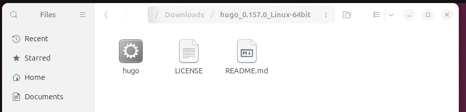
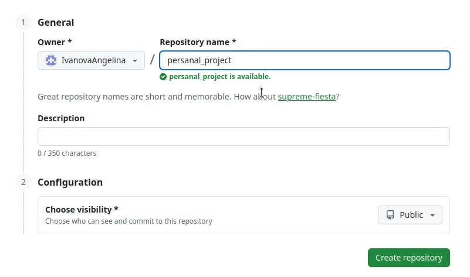
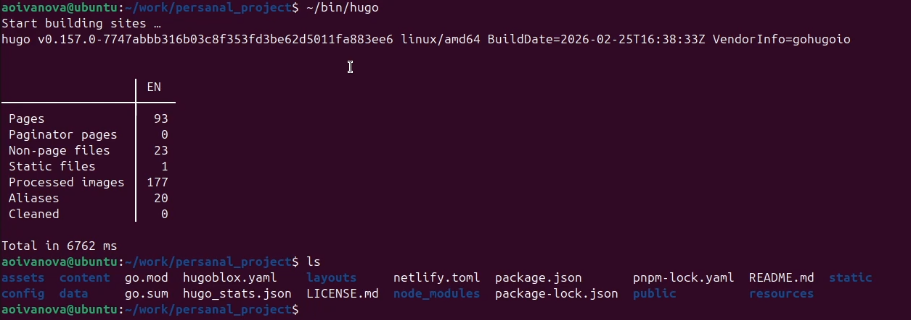
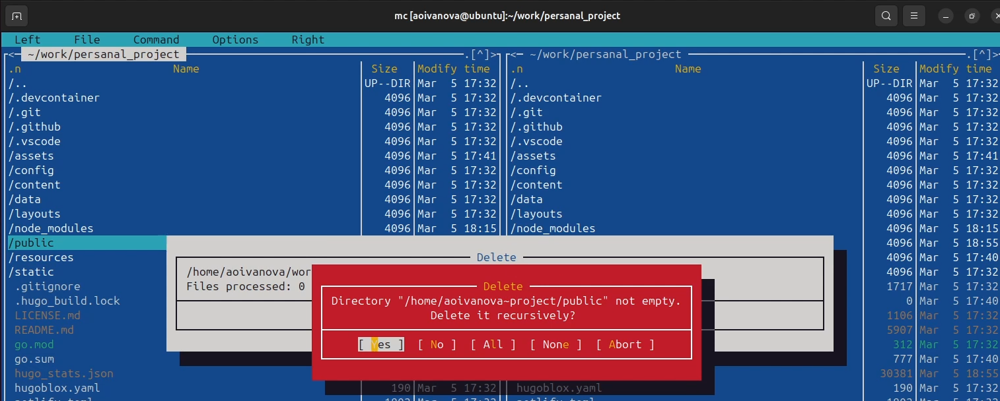
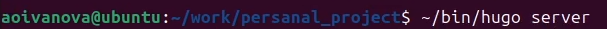
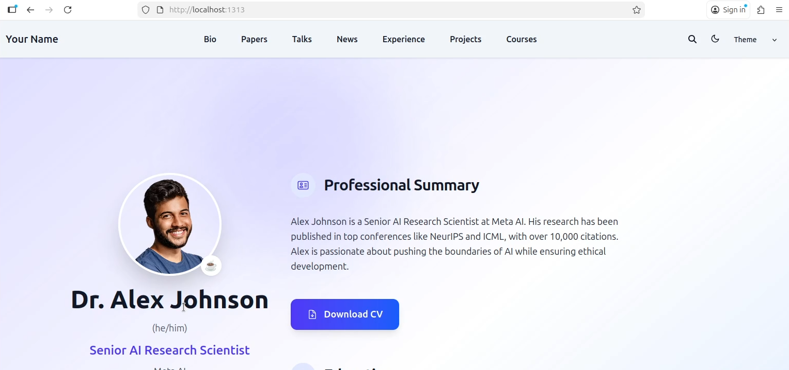
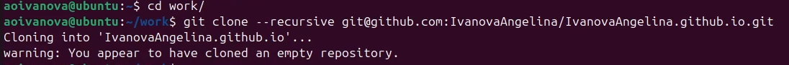
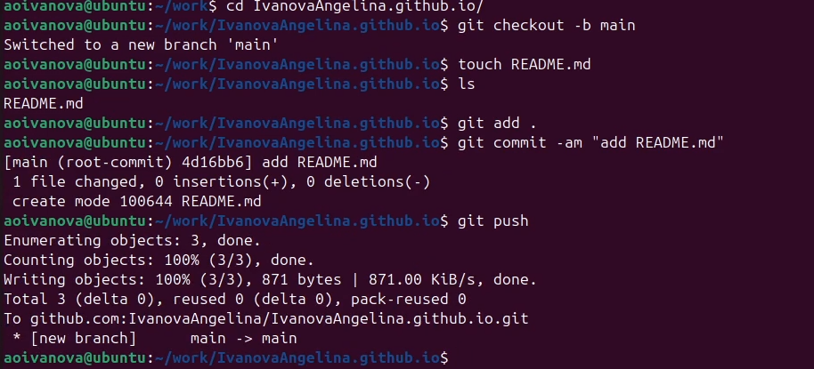
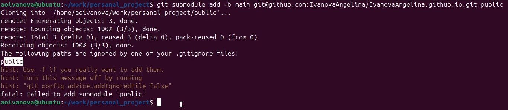
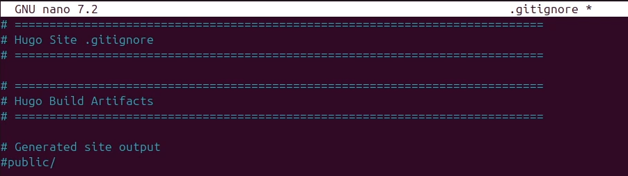

---
## Author
author:
  name: Иванова Ангелина Олеговна
  degrees: DSc
  orcid: 0000-0002-0877-7063
  email: 1032252598@rudn.ru
  affiliation:
    - name: Российский университет дружбы народов
      country: Российская Федерация
      postal-code: 117198
      city: Москва
      address: ул. Миклухо-Маклая, д. 6

## Title
title: "Отчёт по первому этапу выполнения индивидуального проекта"
subtitle: "Заготовка для персонального сайта"
license: "CC BY"
---

# Цель работы

Целью данной работы является размещение на Github pages заготовки для персонального сайта.

# Задание

1. Установить необходимое программное обеспечение.

2. Скачать шаблон темы сайта.

3. Разместить его на хостинге git.

4. Установить параметр для URLs сайта.

5. Разместить заготовку сайта на Github pages.

# Выполнение лабораторной работы

Скачали необходимое програмное обеспечение, а именно генератор статических сайтов Hugo

{#fig-001 width=70%}

После установки распокавали скаченный архив([рис. @fig-002]).

{#fig-002 width=70%}

Далее переходим в домашний каталог и создаём папку *bin* и переносим в неё исполняемый файл *hugo* ([рис. @fig-003]).

{#fig-003 width=70%}

Далее создаём свой репозиторий на основе репозитория с шаблоном темы сайта ([рис. @fig-004]).

{#fig-004 width=70%}

Переходим в каталог *~/work* и клонируем созданный репозиторий к себе в локальный репозиторий ([рис. @fig-005]).

{#fig-005 width=70%}

Переходим в созданныё каталог *blog* и запускаем исполняемый файл ([рис. @fig-006]).

{#fig-006 width=70%}

Проверяем содержимое каталога, и замечаем что создался каталог *public*, который сейчас нам не нужен, поэтому удаляем его ([рис. @fig-007]).

{#fig-007 width=70%}

Снова запускаем исполняемый файл, введя *~/bin/hugo server* ([рис. @fig-008]),([рис. @fig-008_1]).

{#fig-008 width=70%}

{#fig-008_1 width=70%}

Копируем созданную ссылку и переходим на страничку сайта на локальном сервере ([рис. @fig-009]).

{#fig-009 width=70%}

Создаём новый пустой репозиторий с именем *IvanovaAngelina.github.io* (имя репозитория будет адресом сайта) ([рис. @fig-010]).

{#fig-010 width=70%}

В каталоге *work* клонируем созданный репозиторий, чтобы создать локальный репозиторий у себя на компьютере ([рис. @fig-011]).

{#fig-011 width=70%}

Далее переходим в созданный новый каталог и создаём главную ветку с именем *main*, с помощью команды *git checkout -b main*. Создаём пустой файл README.md c помощью *touch README.md* и отправляем изменения на глобальный репозиторий, чтобы активировать его ([рис. @fig-012]).

{#fig-012 width=70%}

Пытаемся подключить созданный репозиторий к каталогу *public* из репозитория *blog*. Нам выводит, что *public* игнорируется ([рис. @fig-013]).

{#fig-013 width=70%}

Далее в файле *.gitignore* комментируем public ([рис. @fig-014]).

{#fig-014 width=70%}

Подключаем репозиторий к каталогу *public*. Далее запускаем исполняемый файл, с помощью *~/bin/hugo*, чтобы заполнить создавшийся public ([рис. @fig-015]).

{#fig-015 width=70%}

Проверяем есть ли подключение между *public* и репозиторием *IvanovaAngelina.github.io* ([рис. @fig-016]).

{#fig-016 width=70%}

Отправляем изменения на глобальный репозиторий ([рис. @fig-017]), ([рис. @fig-018]).

{#fig-017 width=70%}

{#fig-018 width=70%}

Копируем ссылку на наш новый сайт (имя репозитория, в нашем случаем *ivanovaangelina.github.io*) и переходим на него ([рис. @fig-019]).

{#fig-019 width=70%}

# Выводы
 
В ходе выполнения 1-ого этапа индивидуального проекта мы научились размещать на Github pages заготовки для персонального сайта

# Список литературы

1. Исполняемый файл hugo [Электронный ресурс] URL: https://github.com/gohugoio/hugo/releases

2. Репозиторий с шаблоном темы сайта [Электронный ресурс] URL: https://github.com/HugoBlox/theme-academic-cv

::: {#refs}
:::
