---
## Author
author:
  name: Иванова Ангелина Олеговна
  degrees: DSc
  orcid: 0000-0002-0877-7063
  email: 1032252598@rudn.ru
  affiliation:
    - name: Российский университет дружбы народов
      country: Российская Федерация
      postal-code: 117198
      city: Москва
      address: ул. Миклухо-Маклая, д. 6

## Title
title: "Отчёт по выполнению 3 этапа индивидуального проекта"
subtitle: "Добавление постов и информации"
license: "CC BY"
---

# Цель работы

Целью данной работы является добавление новой информации о себе на сайт и создание новых публикаций

# Задание

1. Добавить информацию о навыках (Skills), об опыте (Experience) и достижениях (Accomplishments).

2. Сделать пост по прошедшей неделе.

3. Добавить пост на тему "Язык разметки Markdown"

# Выполнение лабораторной работы

Перешли к файлу me.yaml, расположенному по адресу /home/aoivanova/work/blog/data/authors ([рис. @fig-001]).

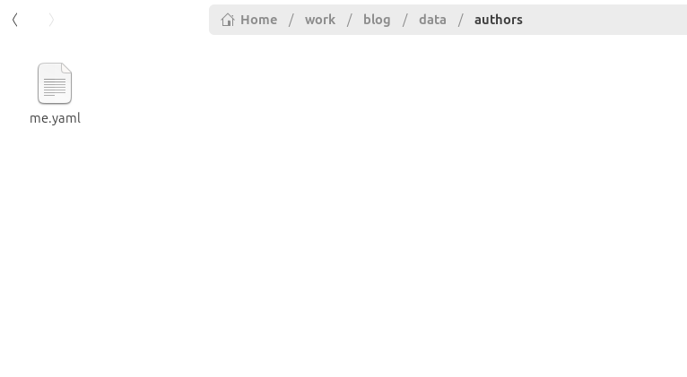{#fig-001 width=70%}

Редактируем необходимые поля ([рис. @fig-002]).

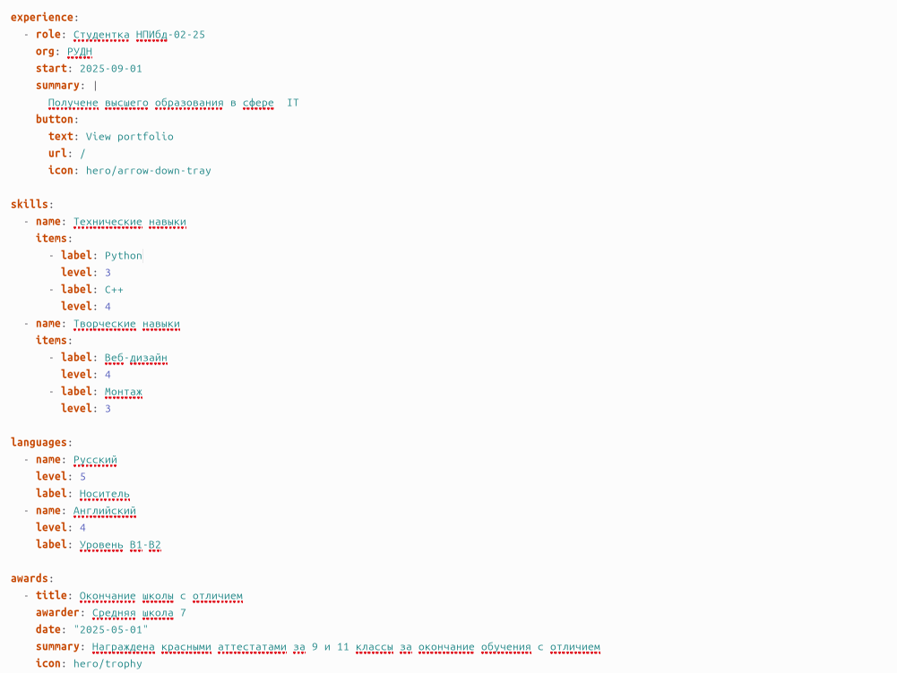{#fig-002 width=70%}

Переходим к созданию постов. Создаем новую папку, которая будет новым постом о прошедшей неделе ([рис. @fig-003]).

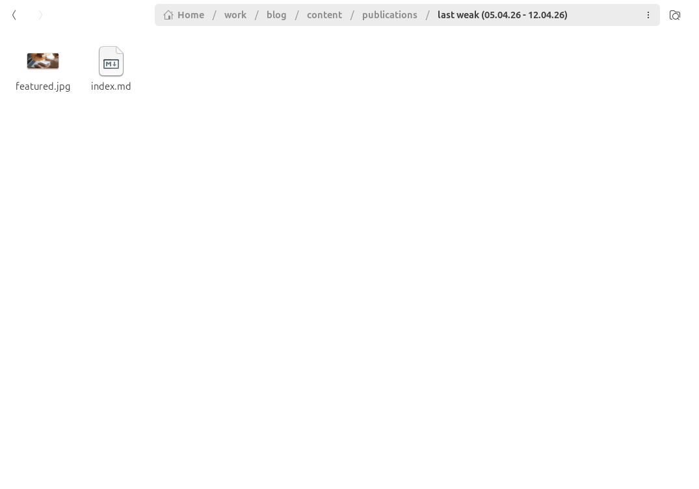{#fig-003 width=70%}

Редоктируем его, создавая пост ([рис. @fig-004]).

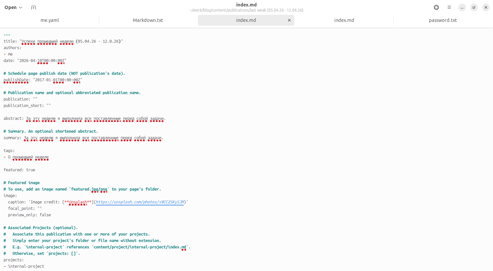{#fig-004 width=70%}

Аналогично создаем папку для поста о языке разметки Markdown ([рис. @fig-005]).

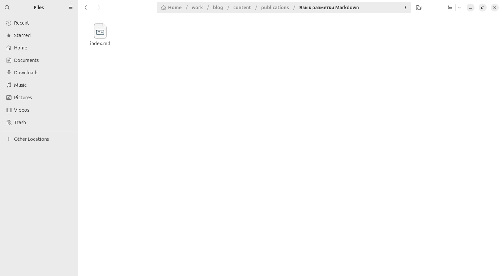{#fig-005 width=70%}

Редоктируем его, создавая пост  ([рис. @fig-006]).

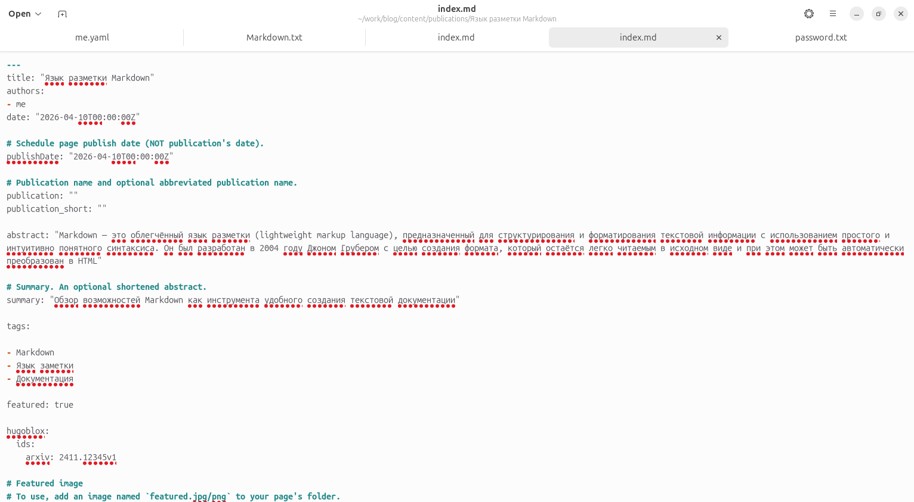{#fig-006 width=70%}

Закоммитили сначала общую папку проекта, а потом закоммитили pulic ([рис. @fig-007]), ([рис. @fig-008]).

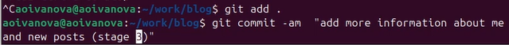{#fig-007 width=70%}

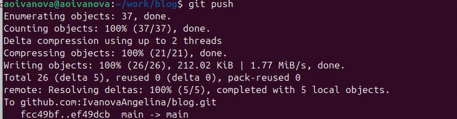{#fig-008 width=70%}

Видим изменения на нашем сайте ([рис. @fig-009]), ([рис. @fig-010]), ([рис. @fig-011]), ([рис. @fig-012]).

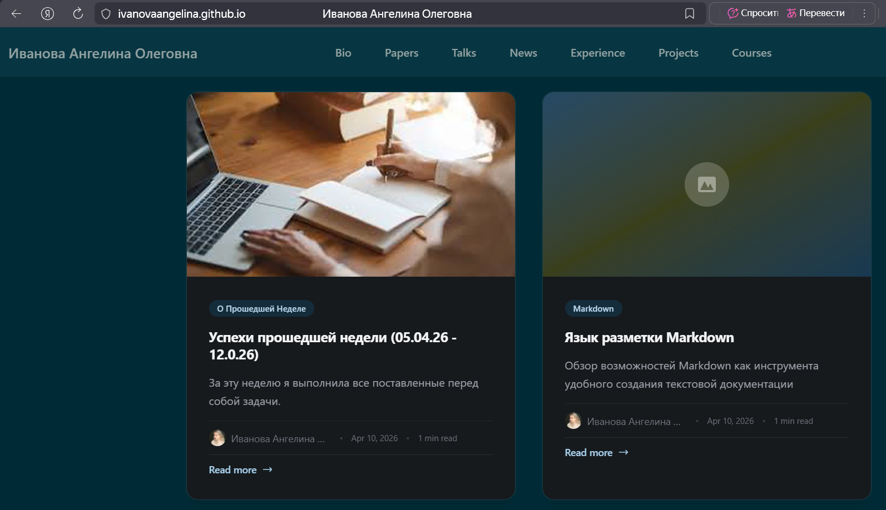{#fig-009 width=70%}

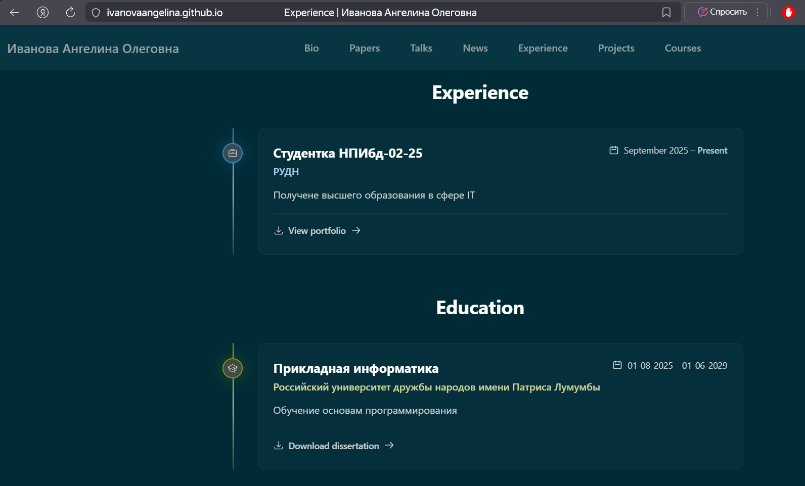{#fig-010 width=70%}

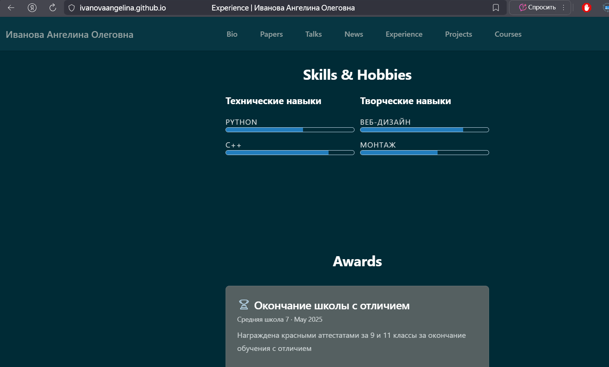{#fig-011 width=70%}

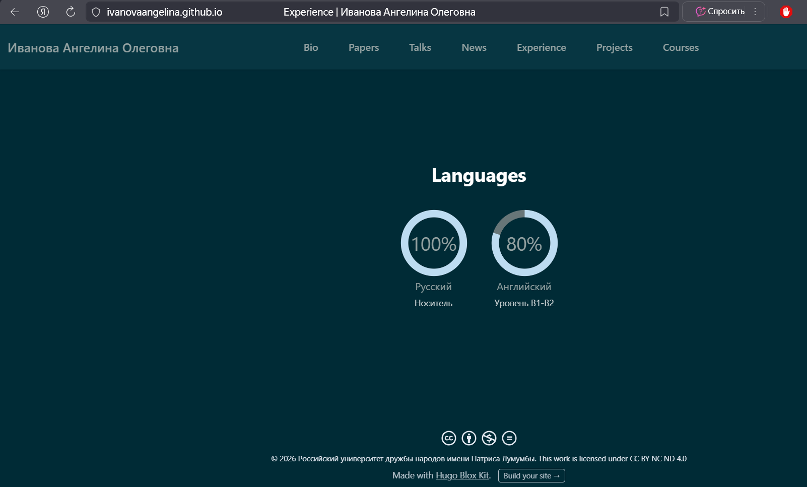{#fig-012 width=70%}

# Выводы

Добавили новую информацию о себе на сайт и создали новые публикации

