---
## Author
author:
  name: Иванова Ангелина Олеговна
  degrees: DSc
  orcid: 0000-0002-0877-5563
  email: 1032252598@rudn.ru
  affiliation:
    - name: Российский университет дружбы народов
      country: Российская Федерация
      postal-code: 117198
      city: Москва
      address: ул. Миклухо-Маклая, д. 6
## Title
title: Отчёт по первому этапу внешнего курса Stepik
subtitle: Введение
license: CC BY
date: today
date-format: "YYYY-MM-DD" # Example: 2025-09-06
---

# Вводная часть

## Цель работы

Целью данной работы является выполнение внешнего курса под названием "Введение в Linux".

## Задание

1. Ознакомиться с теоретическим материалом
2. Ответить на вопросы и выполнить задания для закрепления теоретического материала

# Выполнение лабораторной работы

## Выполнение 1.1. Общая информация о курсе

{#fig-001 width=55%}

## Выполнение 1.1. Общая информация о курсе

{#fig-002 width=55%}

## Выполнение 1.2. Как установить Linux

{#fig-003 width=55%}

## Выполнение 1.2. Как установить Linux

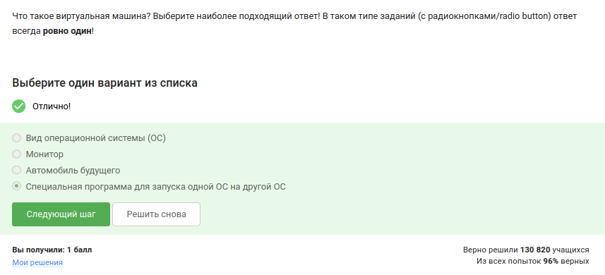{#fig-004 width=55%}

## Выполнение 1.2. Как установить Linux

{#fig-005 width=55%}

## Выполнение 1.3. Осваиваем Linux

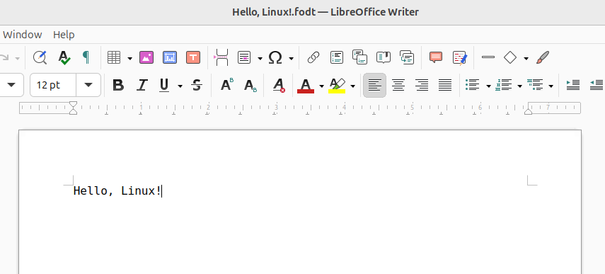{#fig-006 width=55%}

## Выполнение 1.3. Осваиваем Linux

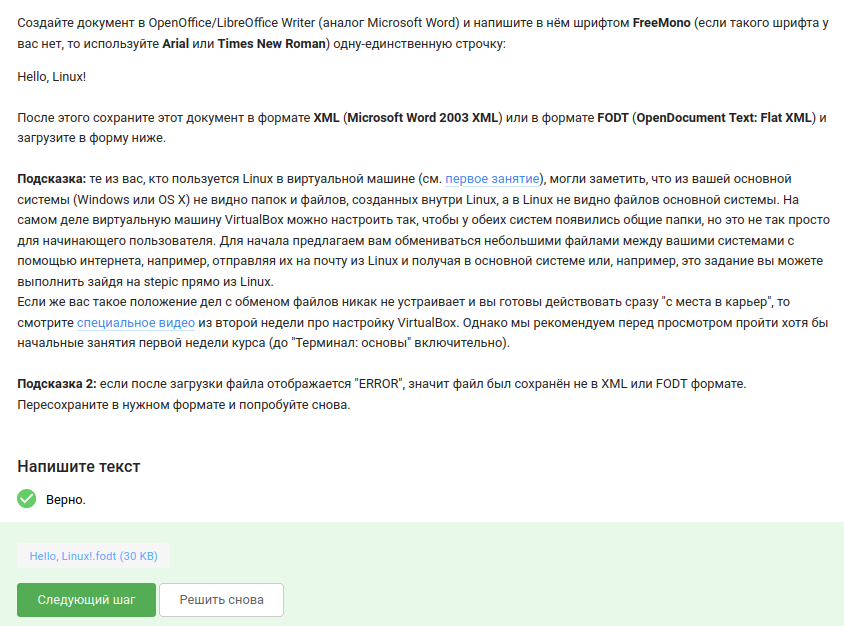{#fig-007 width=55%}

## Выполнение 1.3. Осваиваем Linux

{#fig-008 width=55%}

## Выполнение 1.3. Осваиваем Linux

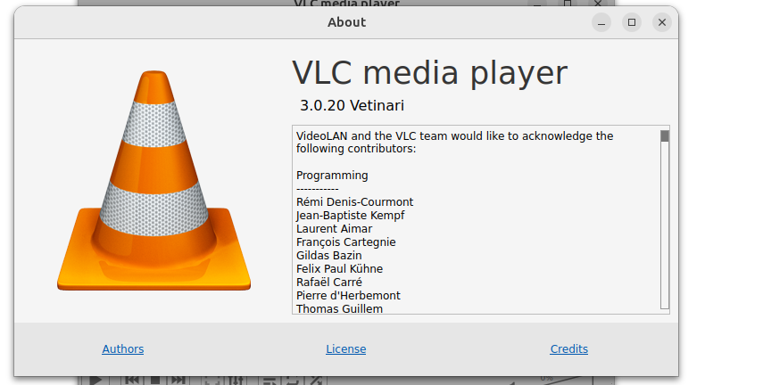{#fig-009 width=55%}

## Выполнение 1.3. Осваиваем Linux

{#fig-010 width=55%}

## Выполнение 1.3. Осваиваем Linux

{#fig-011 width=55%}

## Выполнение 1.4. Командная строка: основные понятия и простые команды

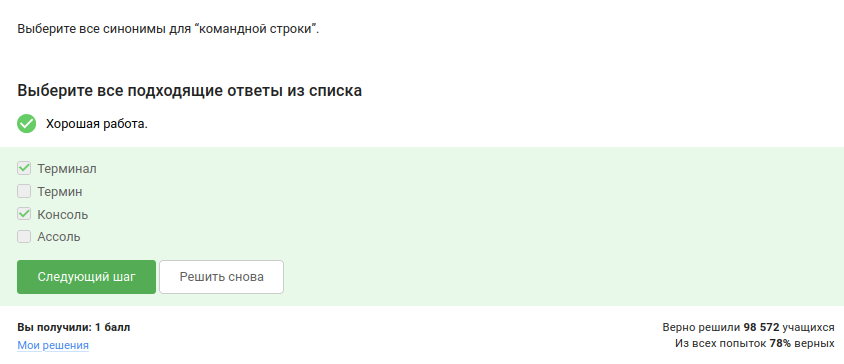{#fig-012 width=55%}

## Выполнение 1.4. Командная строка: основные понятия и простые команды

{#fig-013 width=55%}

## Выполнение 1.4. Командная строка: основные понятия и простые команды

{#fig-014 width=55%}

## Выполнение 1.4. Командная строка: основные понятия и простые команды

{#fig-015 width=55%}  

## Выполнение 1.4. Командная строка: основные понятия и простые команды

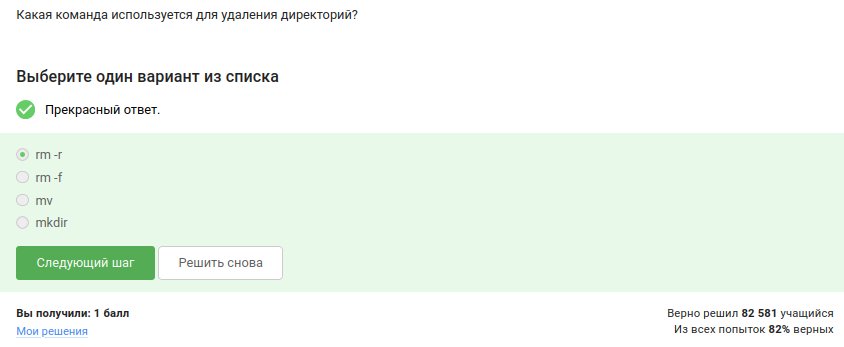{#fig-016 width=55%}

## Выполнение 1.5. Запуск исполняемых файлов

{#fig-017 width=55%}

## Выполнение 1.5. Запуск исполняемых файлов
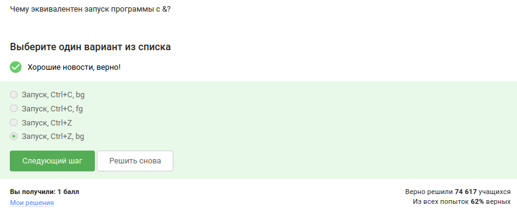{#fig-018 width=55%}

## Выполнение 1.5. Запуск исполняемых файлов

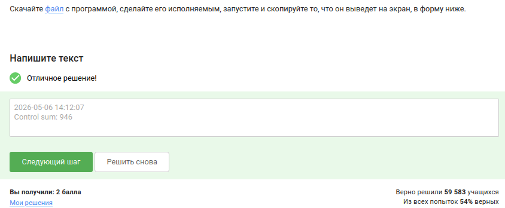{#fig-019 width=55%}

## Выполнение 1.5. Запуск исполняемых файлов

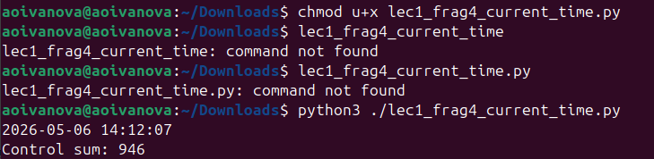{#fig-020 width=55%}

## Выполнение 1.6. Ввод / вывод

{#fig-021 width=55%}

## Выполнение 1.6. Ввод / вывод

{#fig-022 width=55%}

## Выполнение 1.6. Ввод / вывод

{#fig-023 width=55%}

## Выполнение 1.7. Скачивание файлов из интернета

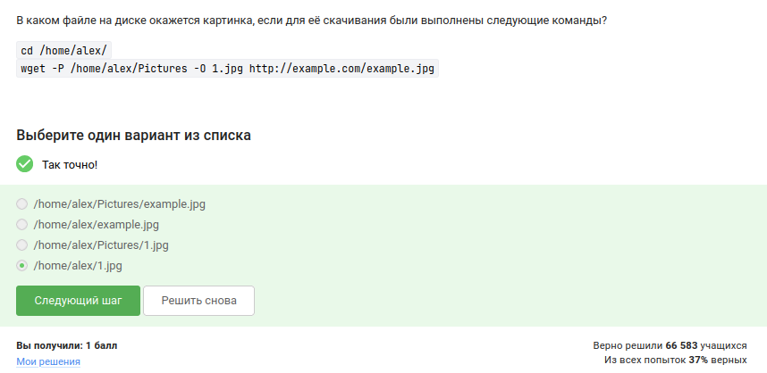{#fig-024 width=55%}

## Выполнение 1.7. Скачивание файлов из интернета

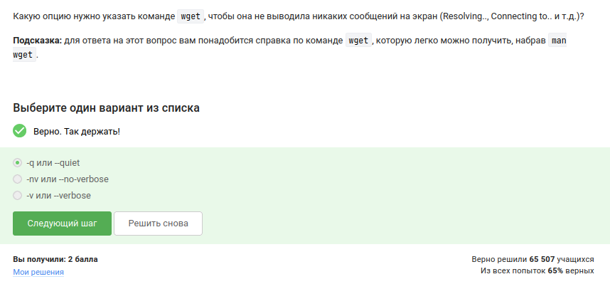{#fig-025 width=55%}

## Выполнение 1.7. Скачивание файлов из интернета

{#fig-026 width=55%}

## Выполнение 1.8. Работа с архивами 

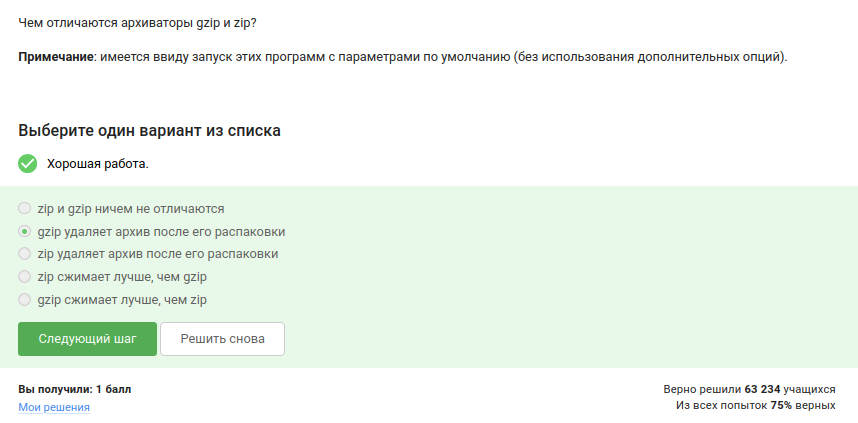{#fig-027 width=55%}

## Выполнение 1.8. Работа с архивами 

{#fig-028 width=55%}

## Выполнение 1.8. Работа с архивами 

{#fig-029 width=55%}

## Выполнение 1.9. Поиск файлов и слов в файлах

{#fig-030 width=55%}

## Выполнение 1.9. Поиск файлов и слов в файлах

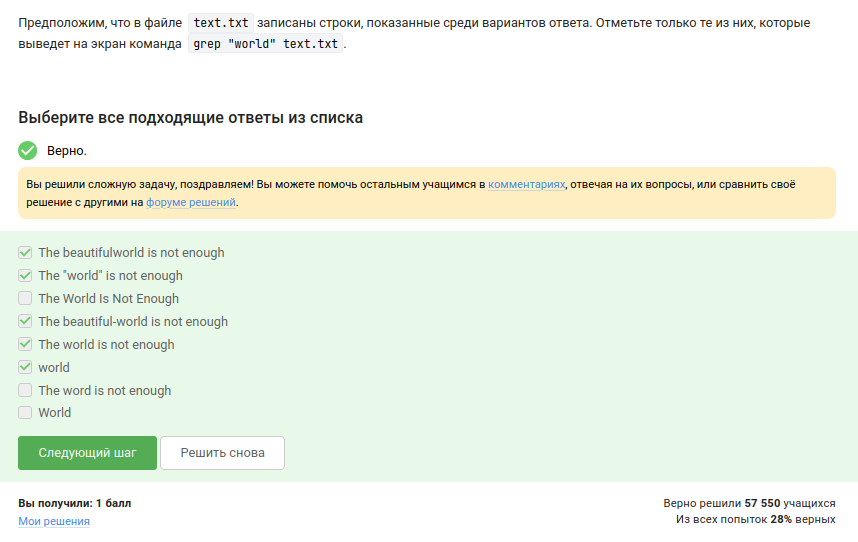{#fig-031 width=55%}

## Выполнение 1.9. Поиск файлов и слов в файлах

{#fig-032 width=55%}

## Выполнение 1.9. Поиск файлов и слов в файлах

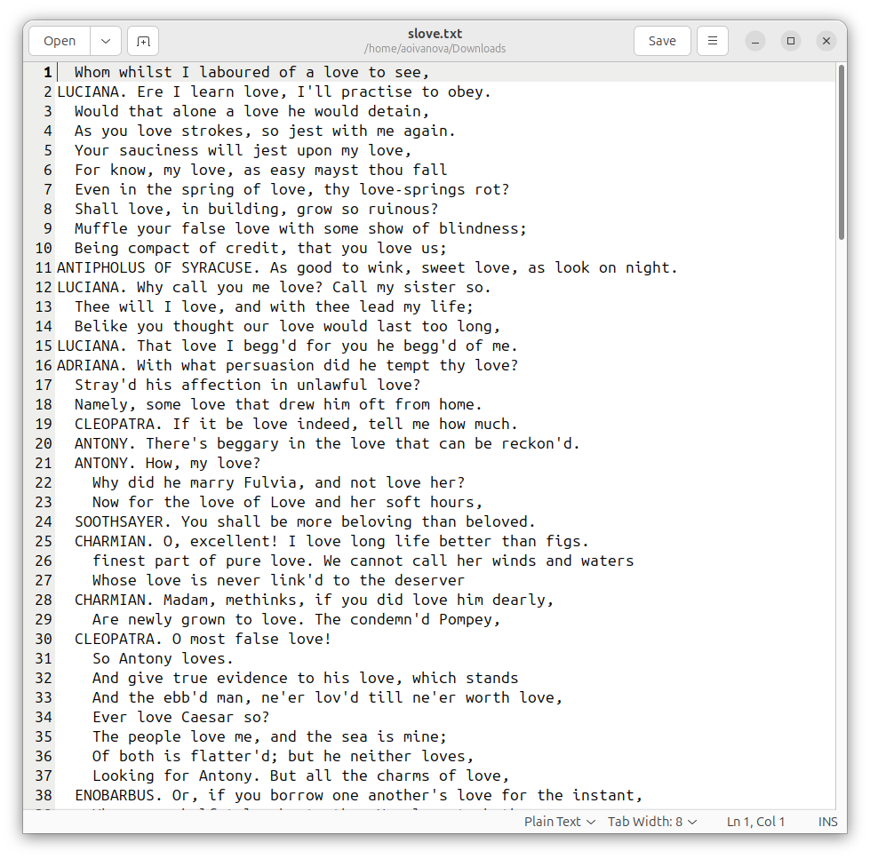{#fig-033 width=45%}

## Выполнение 1.9. Поиск файлов и слов в файлах

{#fig-034 width=55%}

# Результаты

## Выводы

В ходе выполнения первого этапа внешнего курса «Введение в Linux» были получены базовые знания об операционной системе Linux, виртуальных машинах, пакетных менеджерах, работе с командной строкой, управлении процессами, потоками ввода-вывода, сетевых утилитах, архивации, поиске файлов и фильтрации текста

## Список литературы

- Курс «Введение в Linux» на платформе Stepik [Электронный ресурс] URL: https://stepik.org/course/73/

