---
## Author
author:
  name: Иванова Ангелина Олеговна
  degrees: DSc
  orcid: 0000-0002-0877-7063
  email: 1032252598@rudn.ru
  affiliation:
    - name: Российский университет дружбы народов
      country: Российская Федерация
      postal-code: 117198
      city: Москва
      address: ул. Миклухо-Маклая, д. 6

## Title
title: "Отчёт по первому этапу внешнего курса Stepik"
subtitle: "Введение"
license: "CC BY"
---

# Цель работы

Целью данной работы является выполнение внешнего курса под названием "Введение в Linux".

# Задание

1. Ознакомиться с теоретическим материалом
2. Ответить на вопросы и выполнить задания для закрепления теоретического материала

# Выполнение лабораторной работы

## Выполнение 1.1. Общая информация о курсе

В первом подблоке этого этапа представленны наипростейшие задания, которые не требуют пояснений и служат только ради того, чтобы ознакомить нас со структурой курса ([рис. @fig-001]), ([рис. @fig-002]).

{#fig-001 width=70%}

{#fig-002 width=70%}

## Выполнение 1.2. Как установить Linux

Аналогично с первым подблоком, во  втором представленны наипростейшие задания, которые не требуют пояснений

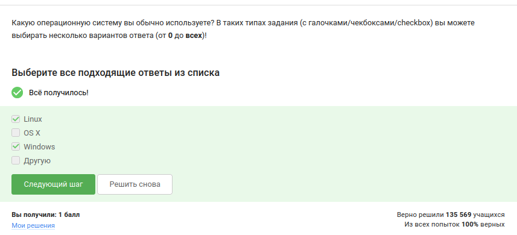{#fig-003 width=70%}

{#fig-004 width=70%}

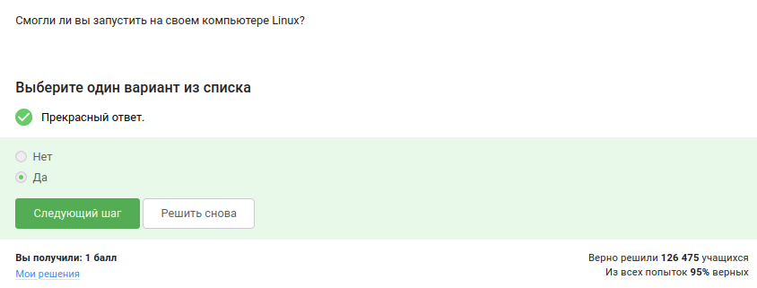{#fig-005 width=70%}

## Выполнение 1.3. Осваиваем Linux

Создали документ в LibreOffice Writer и написали в нём шрифтом FreeMono строчку: Hello, Linux! ([рис. @fig-006]).

{#fig-006 width=70%}

После этого сохранили этот документ в формате FODT и загрузили в форму ([рис. @fig-007]). 

{#fig-007 width=70%}

Установочные пакеты в Linux (Ubuntu) имеют расширение .deb ([рис. @fig-008]).

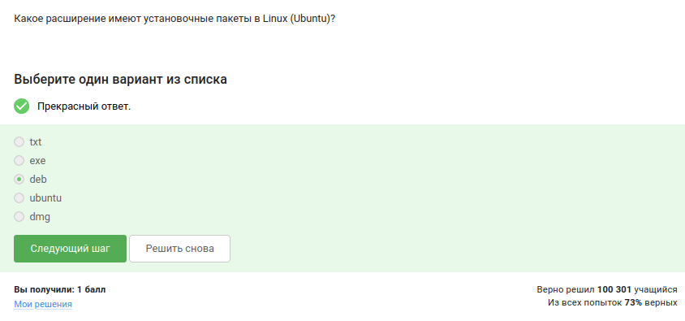{#fig-008 width=70%}

Запустили плеер VLC, открыли Help → About, зашли во вкладку Authors ([рис. @fig-009]).

{#fig-009 width=70%}

Первая фамилия - Denis-Courmont. Ввели её на сайте ([рис. @fig-010]).

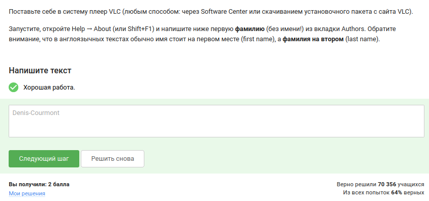{#fig-010 width=70%}

Update Manager отвечает именно за обновление пакетов до актуальных версий, обновление всей системы до новой версии и ссылок в Software Center, но не устанавливает новые программы и не удаляет существующие ([рис. @fig-011]).

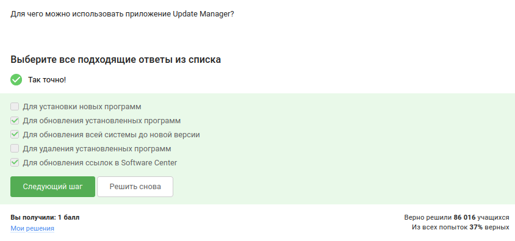{#fig-011 width=70%}

## Выполнение 1.4. Командная строка: основные понятия и простые команды

Синонимами «командной строки» являются «терминал» и «консоль». Слово «термин» означает научное понятие, а «Ассоль» — имя литературного персонажа, поэтому они не подходят ([рис. @fig-012]).

{#fig-012 width=70%}

Linux чувствителен к регистру, поэтому варианты "Pwd" или "PWD" некорректны. Правильный ответ: «Только pwd» ([рис. @fig-013]).

{#fig-013 width=70%}

Следующая задача требовала найти команды, эквивалентные "ls -A --human-readable -l /some/directory". Были отмечены варианты, где "-A" (или "--almost-all"), "-h" (или "--human-readable"), "-l" комбинируются в любом порядке ([рис. @fig-014]).

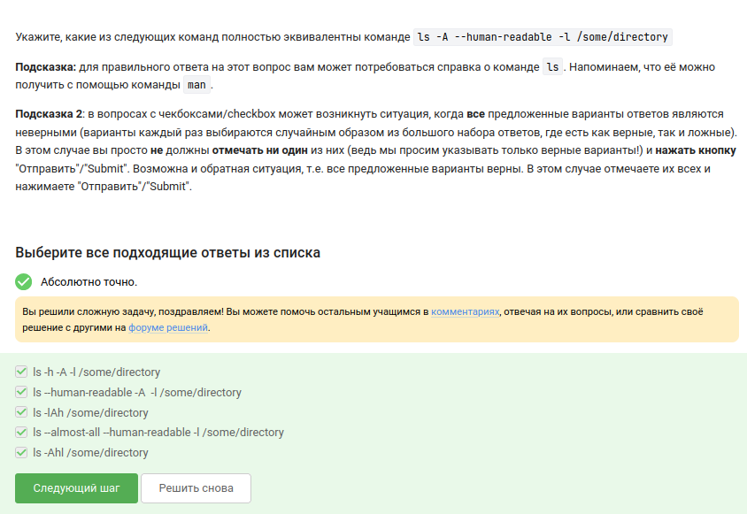{#fig-014 width=70%}

При нахождении в "/home/bi/Documents" команда "ls ~/Downloads" показывает содержимое папки Downloads домашнего каталога, так как "~" раскрывается в "/home/bi". Команда "ls ../Downloads" (подняться на уровень выше и зайти в Downloads) также корректна, а абсолютный путь "ls /home/bi/Downloads" работает из любой директории. Все варианты дают одинаковый результат, поэтому отмечены все ([рис. @fig-015]).

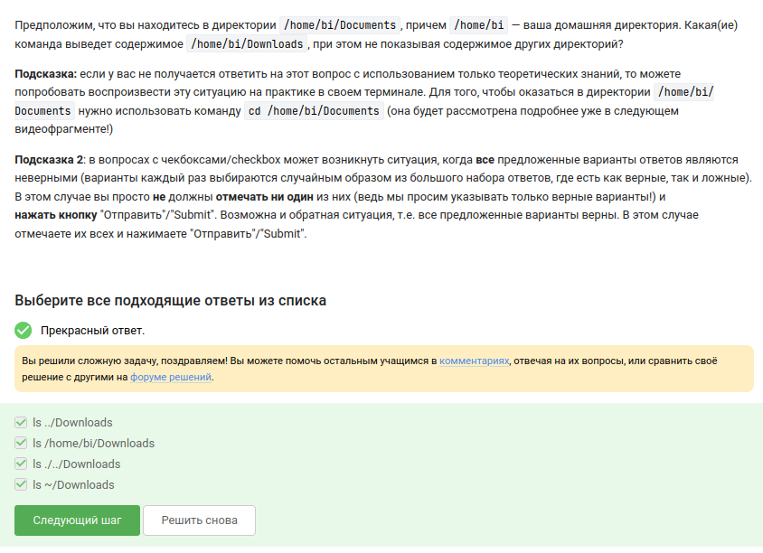{#fig-015 width=70%}  

Для удаления директорий используется "rm -r", где операнд "-r" (recursive) указывает на рекурсивное удаление содержимого. Команда "rm -f" только принудительно удаляет файлы без запроса, но не каталоги; "mv" перемещает, "mkdir" создаёт директории ([рис. @fig-016]).

{#fig-016 width=70%}

## Выполнение 1.5. Запуск исполняемых файлов

Если ввести в терминал команду firefox (для запуска одноименного браузера), а затем ввести туда же команду exit, то ни одна из программ не закроется ([рис. @fig-017]).

{#fig-017 width=70%}

Запуск программы с символом "&" эквивалентен комбинации: запуск в фоне с помощью "Ctrl+Z" и последующей команды "bg". "Ctrl+Z" приостанавливает процесс, а "bg" возобновляет его в фоновом режиме. Остальные варианты либо оставляют процесс на переднем плане, либо завершают его ([рис. @fig-018]).

{#fig-018 width=70%}

Далее требовалось скачать файл с программой, сделать его исполняемым ("chmod u+x"), запустить и скопировать вывод. После явного вызова интерпретатора "python3 ./lec1_frag4_current_time.py" скрипт выдал текущую дату и контрольную сумму. Полученный результат ввели в ответ ([рис. @fig-019], [рис. @fig-020]).

{#fig-019 width=70%}

{#fig-020 width=70%}

## Выполнение 1.6. Ввод / вывод

Поток ошибок (stderr) по умолчанию выводится на экран, смешиваясь с обычным выводом. Это позволяет сразу видеть сообщения об ошибках ([рис. @fig-021]).

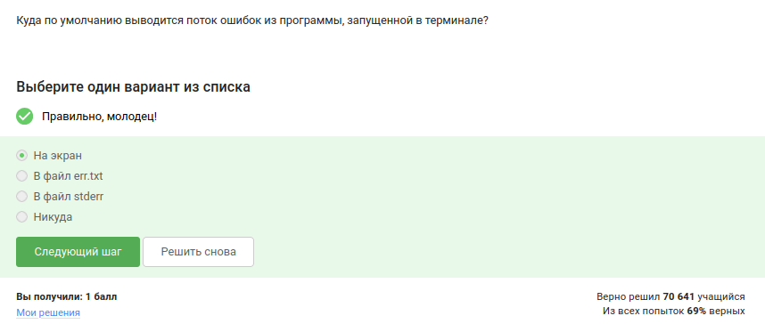{#fig-021 width=70%}

Чтобы создать файл "file.txt" и записать в него поток ошибок программы "program", нужно использовать "program 2> file.txt" (перезапись файла) или "program 2>> file.txt" (дозапись). Остальные варианты либо перенаправляют стандартный вывод, либо используют неверный синтаксис ([рис. @fig-022]).

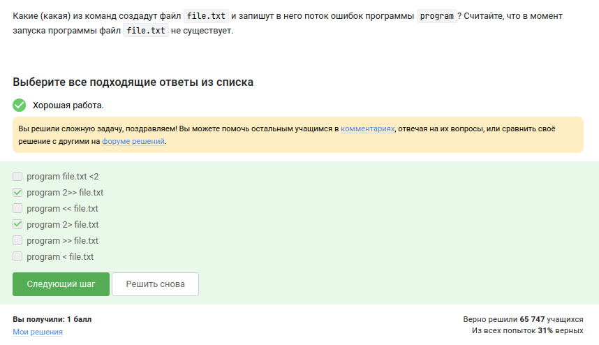{#fig-022 width=70%}

При объединении программ в конвейер (pipe) сообщения об ошибках всё равно выводятся на экран ([рис. @fig-023]).

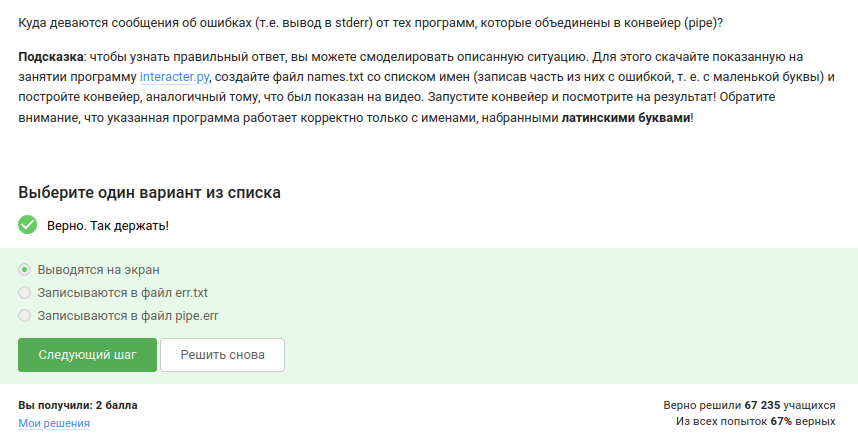{#fig-023 width=70%}

## Выполнение 1.7. Скачивание файлов из интернета

В команде "wget -P /home/alex/Pictures -O 1.jpg http://example.com/example.jpg" операнд "-P" задаёт каталог для сохранения, а "-O" переопределяет имя файла. Несмотря на исходное имя "example.jpg", файл будет сохранён как 1.jpg. Поэтому правильный ответ – /home/alex/1.jpg ([рис. @fig-024]).

{#fig-024 width=70%}

Опция "-q" (или "--quiet") заставляет "wget" работать в тихом режиме, убирая все информационные сообщения ([рис. @fig-025]).

{#fig-025 width=70%}

Команда "wget -r -l 1 -A jpg" рекурсивно скачивает страницу и файлы по шаблону "*.jpg", но при этом также загружает html-страницы. Однако после завершения все файлы, не соответствующие маске "-A", удаляются. Поэтому остаются только jpg, а html удаляются ([рис. @fig-026]).

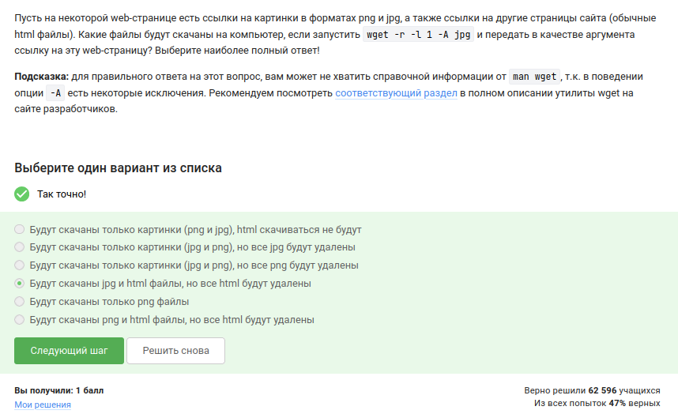{#fig-026 width=70%}

## Выполнение 1.8. Работа с архивами 

При распаковке "gzip" по умолчанию удаляет исходный архив, оставляя только распакованный файл, тогда как "zip" сохраняет и архив, и извлечённые файлы ([рис. @fig-027]).

{#fig-027 width=70%}

Создать архив из директории могут "tar" и "zip". "gzip" сжимает только отдельные файлы, не умея работать с директориями ([рис. @fig-028]).

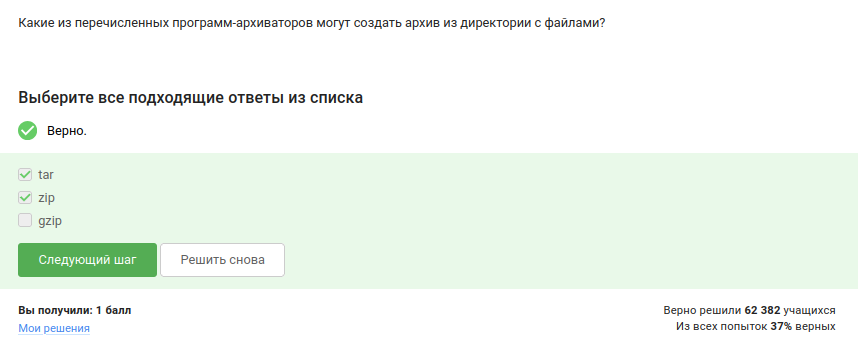{#fig-028 width=70%}

Для запаковки файлов в "my_archive.tar.bz2" программе "tar" требуется комбинация флагов "-cjf": "c" – создать архив, "j" – использовать bzip2, "f" – указать имя файла ([рис. @fig-029]).

{#fig-029 width=70%}

## Выполнение 1.9. Поиск файлов и слов в файлах

В задании нужно было отметить те шаблоны, которые не найдут файл "Alexey.jpeg". Правильные ответы: "*.jpg" (ищет расширение ".jpg", а не ".jpeg"), "alexey.*" (имя начинается с маленькой буквы), "Alex" (без расширения) и другие, не соответствующие точному имени ([рис. @fig-030]).

{#fig-030 width=70%}

Команда "grep "world" text.txt" выводит строки, содержащие подстроку «world» с учётом регистра. Поэтому строки с «World», «WORLD» не попадают. Попадают: «The beautiful world is not enough», «The beautiful-world is not enough» (дефис не мешает), «The world is not enough», «world» (отдельно) и т.д. Строки с кавычками или словом «word» не содержат искомой подстроки ([рис. @fig-031]).

{#fig-031 width=70%}

Скачали архив произведений Шекспира, извлекли его ("tar -xf shakespeare.tar.gz") и собрать все строки, содержащие «love», в файл "slove.txt". Использовали команда "grep -rh "love" ~/Shakespeare > ~/slove.txt", где "-r" рекурсивно ищет, "-h" подавляет имена файлов. Полученный файл загружен в форму ([рис. @fig-032], [рис. @fig-033], [рис. @fig-034]).

{#fig-032 width=70%}

{#fig-033 width=70%}

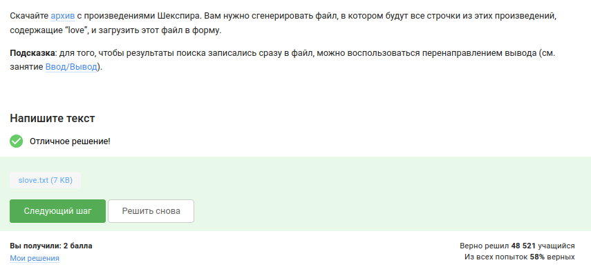{#fig-034 width=70%}

# Выводы

В ходе выполнения первого этапа внешнего курса «Введение в Linux» были получены базовые знания об операционной системе Linux, виртуальных машинах, пакетных менеджерах, работе с командной строкой, управлении процессами, потоками ввода-вывода, сетевых утилитах, архивации, поиске файлов и фильтрации текста

# Список литературы

1. Курс «Введение в Linux» на платформе Stepik [Электронный ресурс] URL: https://stepik.org/course/73/

