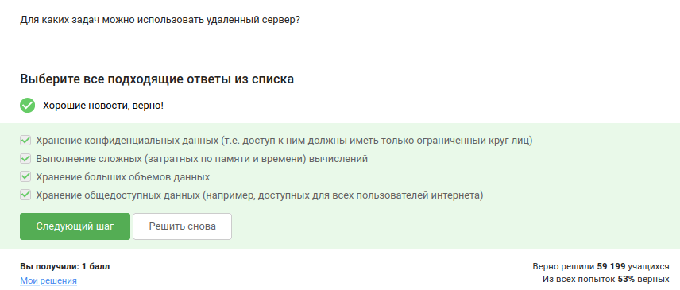
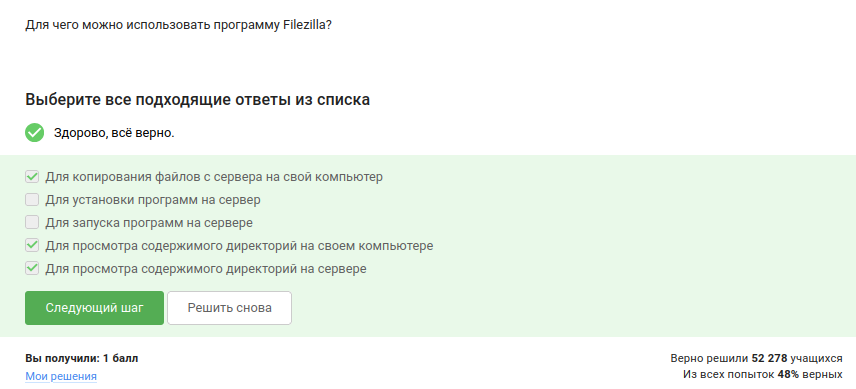
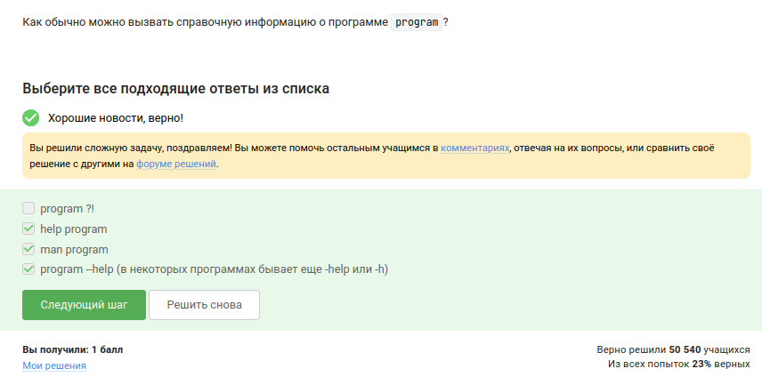
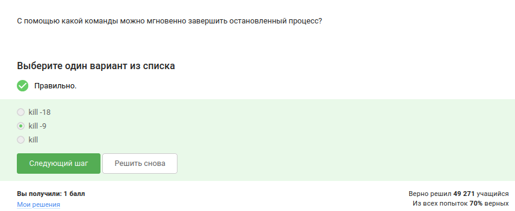
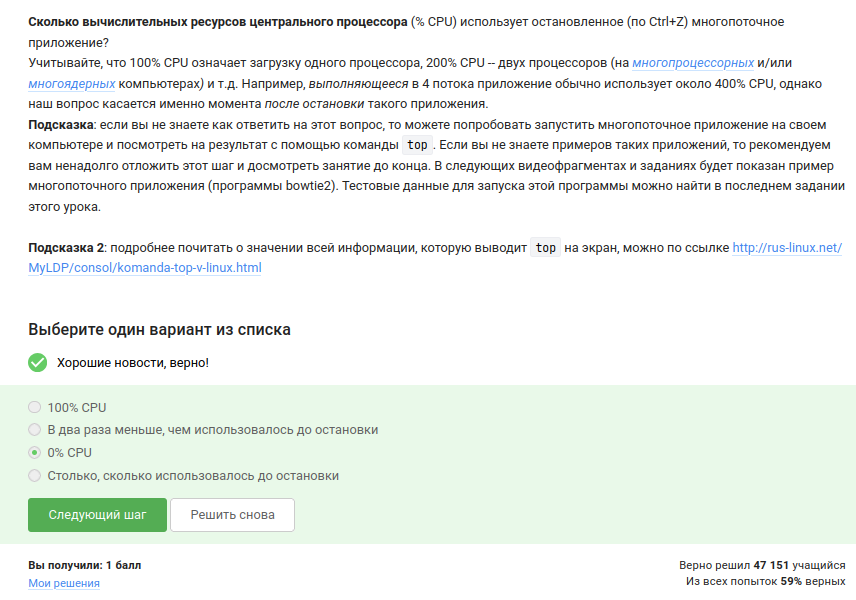
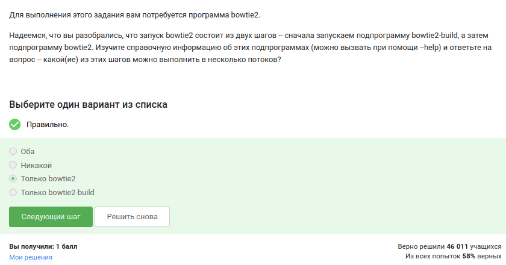
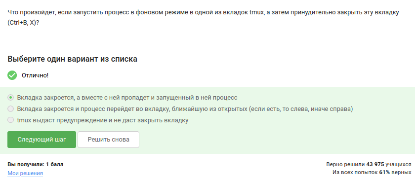

---
## Author
author:
  name: Иванова Ангелина Олеговна
  degrees: DSc
  orcid: 0000-0002-0877-5563
  email: 1032252598@rudn.ru
  affiliation:
    - name: Российский университет дружбы народов
      country: Российская Федерация
      postal-code: 117198
      city: Москва
      address: ул. Миклухо-Маклая, д. 6
## Title
title: Отчёт по второму этапу внешнего курса Stepik
subtitle: Работа на сервере
license: CC BY
date: today
date-format: "YYYY-MM-DD" # Example: 2025-09-06
---

# Вводная часть

## Цель работы

Целью данной работы является выполнение внешнего курса под названием "Введение в Linux". Во втором этапе мы подробно изучим работу на сервере, установку программ и работу с процессами.

## Задание

## Выполнение 2.1. Знакомство с сервером

{#fig-001 width=60%}

## Выполнение 2.1. Знакомство с сервером

{#fig-002 width=60%}

## Выполнение 2.1. Знакомство с сервером

{#fig-003 width=60%}

## Выполнение 2.2. Обмен файлами

{#fig-004 width=60%}

## Выполнение 2.2. Обмен файлами

{#fig-005 width=60%}

## Выполнение 2.2. Обмен файлами

{#fig-006 width=60%}

## Выполнение 2.3. Запуск приложений

{#fig-007 width=60%}

## Выполнение 2.3. Запуск приложений

{#fig-008 width=40%}

## Выполнение 2.3. Запуск приложений

{#fig-009 width=40%}

## Выполнение 2.4. Контроль запускаемых программ

{#fig-010 width=60%}

## Выполнение 2.4. Контроль запускаемых программ

{#fig-011 width=60%}

## Выполнение 2.4. Контроль запускаемых программ

{#fig-012 width=60%}

## Выполнение 2.4. Контроль запускаемых программ

{#fig-013 width=60%}

## Выполнение 2.5.  Многопоточные приложения

{#fig-014 width=60%}

## Выполнение 2.5.  Многопоточные приложения

{#fig-015 width=60%}

## Выполнение 2.5.  Многопоточные приложения

{#fig-016 width=60%}

## Выполнение 2.5.  Многопоточные приложения

{#fig-017 width=60%}

## Выполнение 2.5.  Многопоточные приложения

{#fig-018 width=60%}

## Выполнение 2.6. Менеджер терминалов tmux

{#fig-019 width=60%}

## Выполнение 2.6. Менеджер терминалов tmux

{#fig-020 width=60%}

## Выполнение 2.6. Менеджер терминалов tmux

{#fig-021 width=60%}

## Выполнение 2.6. Менеджер терминалов tmux

{#fig-021 width=60%}

## Выполнение 2.6. Менеджер терминалов tmux

{#fig-023 width=60%}

## Выполнение 2.6. Менеджер терминалов tmux

{#fig-023 width=60%}

# Результаты

## Выводы

В ходе выполнения второго этапа внешнего курса «Введение в Linux» были получены практические навыки работы с удалёнными серверами, установкой программного обеспечения, запуском и контролем процессов

## Список литературы

- Курс «Введение в Linux» на платформе Stepik [Электронный ресурс] URL: https://stepik.org/course/73/

