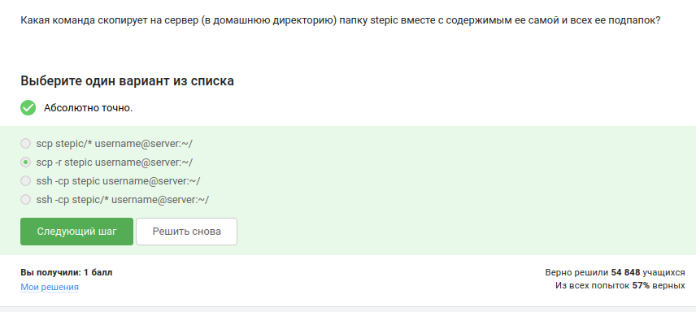
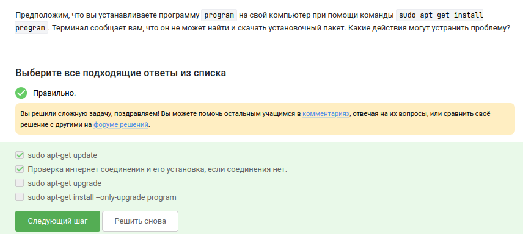
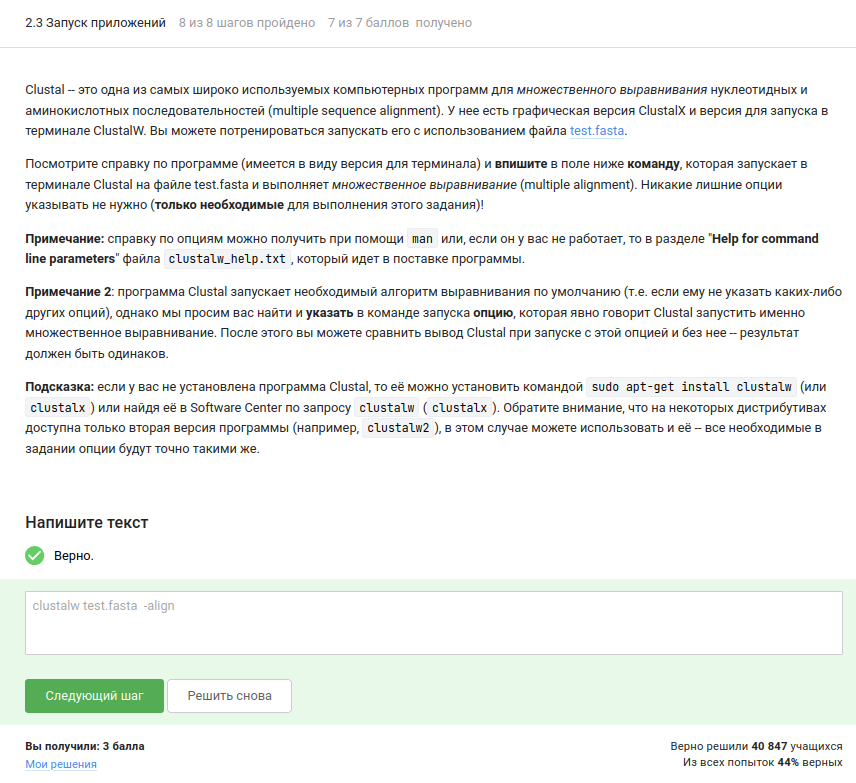
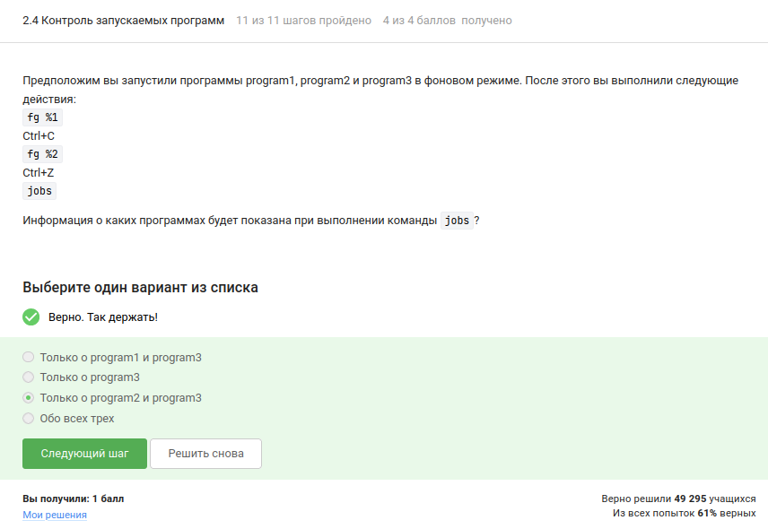
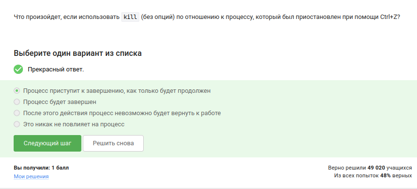
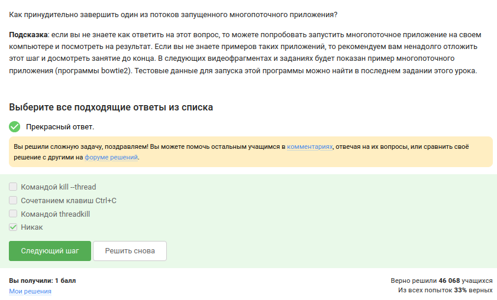
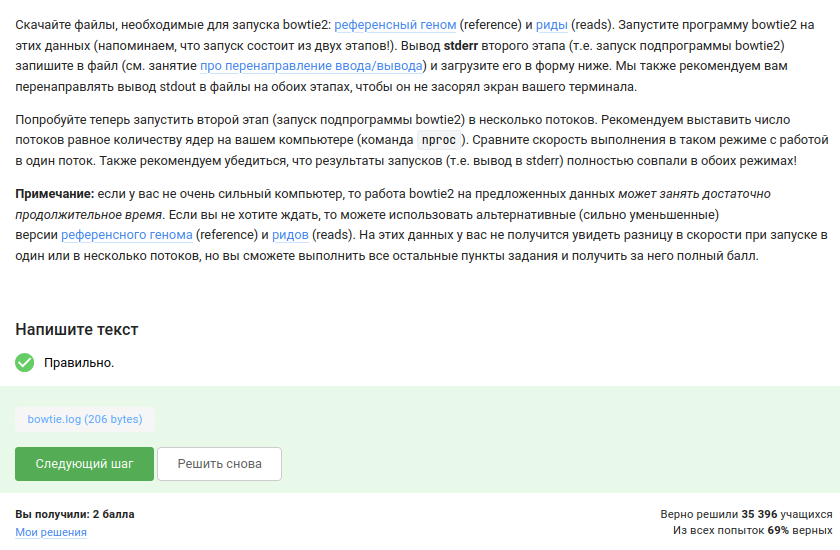
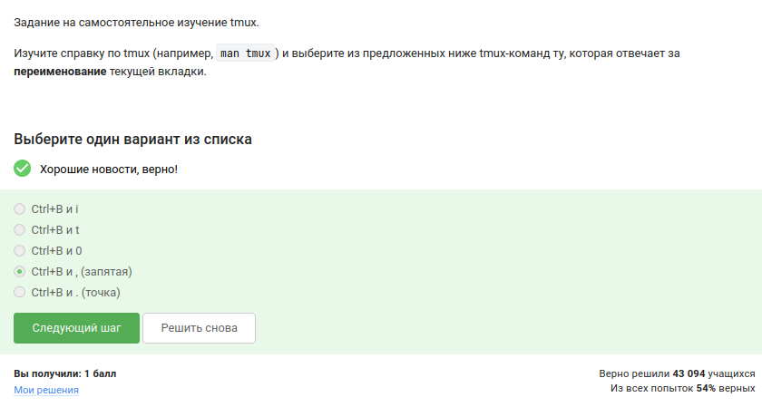

---
## Author
author:
  name: Иванова Ангелина Олеговна
  degrees: DSc
  orcid: 0000-0002-0877-7063
  email: 1032252598@rudn.ru
  affiliation:
    - name: Российский университет дружбы народов
      country: Российская Федерация
      postal-code: 117198
      city: Москва
      address: ул. Миклухо-Маклая, д. 6

## Title
title: "Отчёт по второму этапу внешнего курса Stepik"
subtitle: "Работа на сервере"
license: "CC BY"
---

# Цель работы

Целью данной работы является выполнение внешнего курса под названием "Введение в Linux". Во втором этапе мы подробно изучим работу на сервере, установку программ и работу с процессами.

# Задание

1. Ознакомиться с теоретическим материалом
2. Ответить на вопросы и выполнить задания для закрепления теоретического материала

# Выполнение лабораторной работы

## Выполнение 2.1. Знакомство с сервером

Сервер может служить для выполнения многих задач: xранение конфиденциальных или общедоступных данных, выполнение сложных вычислений, хранение больших объемов данных
ранение, поэтому все ответы верны ([рис. @fig-001])

{#fig-001 width=70%}

Распространять можно только публичный ключ (id_rsa.pub), конфеданциальный ключ (id_rsa) никаким образом нельзя распространять. 

{#fig-002 width=70%}

Для рекурсивного копирования папки "stepic" со всем содержимым на сервер в домашнюю директорию необходимо использовать ключ "-r". Поэтому верный ответ: "scp -r stepic username@server:~/" ([рис. @fig-003]).

{#fig-003 width=70%}

## Выполнение 2.2. Обмен файлами

Если "sudo apt-get install program" не находит пакет может помочь выполнить "sudo apt-get update" для обновления индексов репозиториев и проверить (восстановить) интернет-соединение. Команда "sudo apt-get upgrade" обновляет уже установленные пакеты, но не решает проблему поиска нового пакета, а "--only-upgrade" лишь обновляет существующую программу ([рис. @fig-038]).

{#fig-004 width=70%}

Filezilla позволяет просматривать и копировать содержимое каталогов как на локальном компьютере, так и на сервере, однако не предназначен для установки или запуска программ.  ([рис. @fig-005]).

{#fig-005 width=70%}

Если на сервере необходимо запустить программу, рассчитанную на графический интерфейс, можно либо поискать её терминальную версию, либо настроить проброс графического вывода ([рис. @fig-006]).

{#fig-006 width=70%}

## Выполнение 2.3. Запуск приложений

Утилиты "help", "man" и вызов "program --help" (или "-h"/"-help") являются стандартными способами получения документации в Linux. Конструкция "program ?!" синтаксически неверна и никогда не используется([рис. @fig-007]).

{#fig-007 width=70%}

Программа FastQC принимает на вход форматы fasta и fastq. Это было выяснено после изучения справки ("fastqc --help"), где явно перечислены поддерживаемые типы файлов ([рис. @fig-008]).

{#fig-008 width=70%}

Для выполнения множественного выравнивания программой ClustalW необходимо явно указать опцию "-align". Полная команда: "clustalw test.fasta -align" ([рис. @fig-009]).

{#fig-009 width=70%}

## Выполнение 2.4. Контроль запускаемых программ

После выполнения последовательности действий с фоновыми процессами ("fg %1", "Ctrl+C", "fg %2", "Ctrl+Z") команда "jobs" покажет только процессы, которые остались в фоне или остановлены. "program1" была снята с паузы и затем завершена, "program2" остановлена комбинацией "Ctrl+Z", а "program3" по-прежнему работает в фоне. Следовательно, "jobs" отобразит информацию о "program2" и "program3" ([рис. @fig-010]).

{#fig-010 width=70%}

Утилиты "jobs", "top" и "ps" используют разные идентификаторы: "jobs" оперирует номерами заданий текущего сеанса оболочки, "ps" – системными PID (Process ID), а "top" также показывает PID. Поэтому ни в одной паре они не совпадают. Верный ответ – «У всех разные» ([рис. @fig-011]).

{#fig-011 width=70%}

Мгновенно завершить остановленный процесс можно командой "kill -9", посылающей сигнал SIGKILL ([рис. @fig-012]).

{#fig-012 width=70%}

Сигнал "kill" (без опций) лишь просит процесс завершиться, но не действует на процесс, пока тот не будет продолжен[рис. @fig-013]).

{#fig-013 width=70%}

## Выполнение 2.5.  Многопоточные приложения

В остановленном состоянии процессорное время не потребляется, поэтому "%CPU" равен нулю ([рис. @fig-014]).

{#fig-014 width=70%}

Занятая память сохраняется в том же объёме, что и в момент остановки ([рис. @fig-015]).

{#fig-015 width=70%}

Невозможно принудительно завершить отдельный поток многопоточного приложения – в Linux сигналы посылаются всему процессу целиком, поэтому «никак» является единственно верным ответом ([рис. @fig-016]).

{#fig-016 width=70%}

Многопоточность поддерживается только на этапе собственно выравнивания (подпрограмма "bowtie2"). Этап индексации референсного генома ("bowtie2-build") выполняется строго в один поток([рис. @fig-017]). 

{#fig-017 width=70%}

Вывод stderr второго этапа был перенаправлен в файл "bowtie.log" и загружен в форму ([рис. @fig-018]).

{#fig-018 width=70%}

## Выполнение 2.6. Менеджер терминалов tmux

Каждая вкладка представляет собой независимую сессию оболочки. Если процесс был приостановлен в другой вкладке, набрав "fg" в текущей, терминал сообщит, что нет подходящей задачи, так как "fg" видит только задания своей сессии ([рис. @fig-019]).

{#fig-019 width=70%}

Если в tmux осталась одна последняя вкладка и в ней введена команда "exit", то tmux завершает свою работу, поскольку закрывается последняя активная сессия ([рис. @fig-020]).

{#fig-020 width=70%}

В описанной ситуации соединение с сервером прервётся, однако tmux продолжит работу. Tmux является серверным процессом, не привязанным к конкретной SSH-сессии; при разрыве соединения его сессия остаётся активной, и к ней можно снова подключиться позже([рис.@fig-021]).

{#fig-021 width=70%}

При принудительном закрытии вкладки tmux ("Ctrl+B, X") все процессы, запущенные в этой вкладке, уничтожаются ([рис. @fig-022]).

{#fig-021 width=70%}

Для переименования текущей вкладки в tmux используется комбинация "Ctrl+B" и запятая (",") ([рис. @fig-023]).

{#fig-023 width=70%}

Изучили возможности разделения вкладок на панели. Из предложенных утверждений верными являются два: "По половинкам "разделенной" вкладки можно перемещаться при помощи (Ctrl+B и стрелочек)", "Команды-"разделения" действуют только в текущей вкладке tmux, а не во всех вкладках одновременно", "Можно закрыть одну из "частей" вкладки выполнив (Ctrl+B и x)". Остальные утверждения неверны ([рис. @fig-024]).

{#fig-023 width=70%}

# Выводы

В ходе выполнения второго этапа внешнего курса «Введение в Linux» были получены практические навыки работы с удалёнными серверами, установкой программного обеспечения, запуском и контролем процессов

# Список литературы

1. Курс «Введение в Linux» на платформе Stepik [Электронный ресурс] URL: https://stepik.org/course/73/

::: {#refs}
:::
