---
## Author
author:
  name: Иванова Ангелина Олеговна
  degrees: DSc
  orcid: 0000-0002-0877-4563
  email: 1032252598@rudn.ru
  affiliation:
    - name: Российский университет дружбы народов
      country: Российская Федерация
      postal-code: 117198
      city: Москва
      address: ул. Миклухо-Маклая, д. 6
## Title
title: Отчёт по третьему этапу внешнего курса Stepik
subtitle: Продвинутые темы
license: CC BY
date: today
date-format: "YYYY-MM-DD" # Example: 2025-09-06
---

# Вводная часть

## Цель работы

Целью данной работы является выполнение внешнего курса под названием "Введение в Linux". В третьем этапе мы подробно редактор vim, скрипты bash и различные возможности Linux.

## Задание

1. Ознакомиться с теоретическим материалом

2. Ответить на вопросы и выполнить задания для закрепления теоретического материала

# Выполнение лабораторной работы

## Выполнение 3.1. Текстовый редактор vim

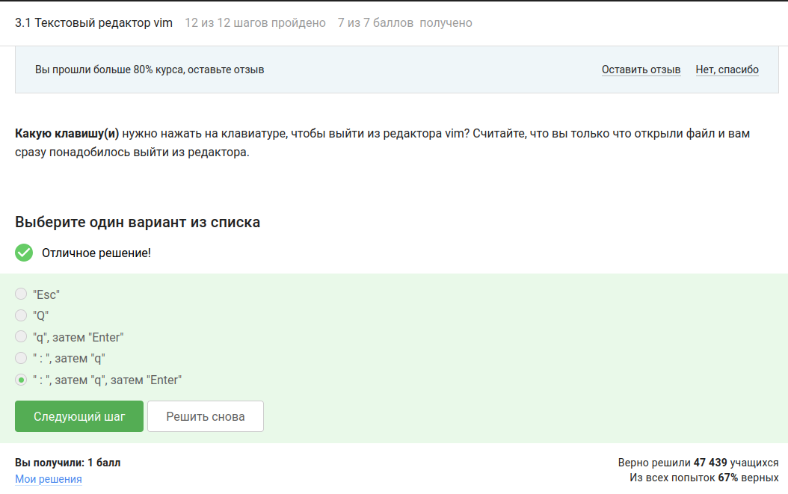{#fig-001 width=45%}

## Выполнение 3.1. Текстовый редактор vim

{#fig-002 width=45%}

## Выполнение 3.1. Текстовый редактор vim

{#fig-003 width=45%}

## Выполнение 3.1. Текстовый редактор vim

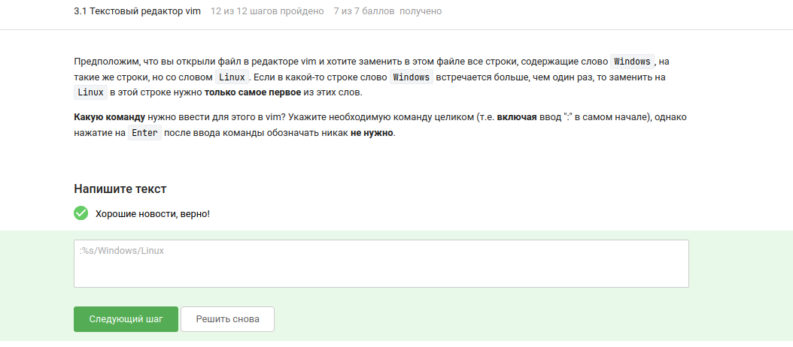{#fig-004 width=45%}

## Выполнение 3.1. Текстовый редактор vim

{#fig-005 width=45%}

## Выполнение 3.2. Скрипты на bash: основы

{#fig-006 width=45%}

## Выполнение 3.2. Скрипты на bash: основы

{#fig-007 width=45%}

## Выполнение 3.2. Скрипты на bash: основы

{#fig-008 width=45%}

## Выполнение 3.2. Скрипты на bash: основы

{#fig-009 width=45%}

## Выполнение 3.3. Скрипты на bash: ветвления и циклы

{#fig-010 width=45%}

## Выполнение 3.3. Скрипты на bash: ветвления и циклы

{#fig-011 width=45%}

## Выполнение 3.3. Скрипты на bash: ветвления и циклы

{#fig-012 width=45%}

## Выполнение 3.3. Скрипты на bash: ветвления и циклы

{#fig-013 width=45%}

## Выполнение 3.3. Скрипты на bash: ветвления и циклы

{#fig-014 width=45%}

## Выполнение 3.3. Скрипты на bash: ветвления и циклы

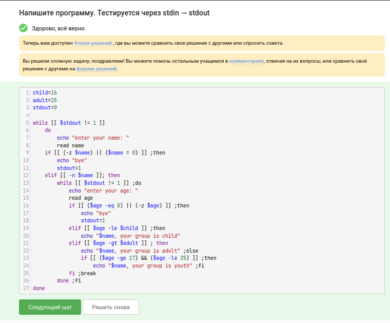{#fig-015 width=45%}

## Выполнение 3.4. Скрипты на bash: разное

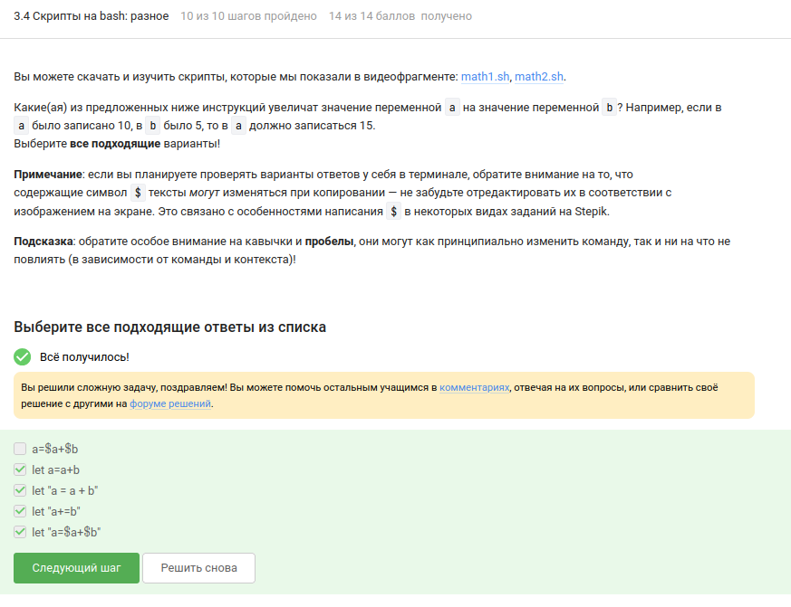{#fig-016 width=45%}

## Выполнение 3.4. Скрипты на bash: разное

{#fig-017 width=45%}

## Выполнение 3.4. Скрипты на bash: разное

{#fig-018 width=45%}

## Выполнение 3.4. Скрипты на bash: разное

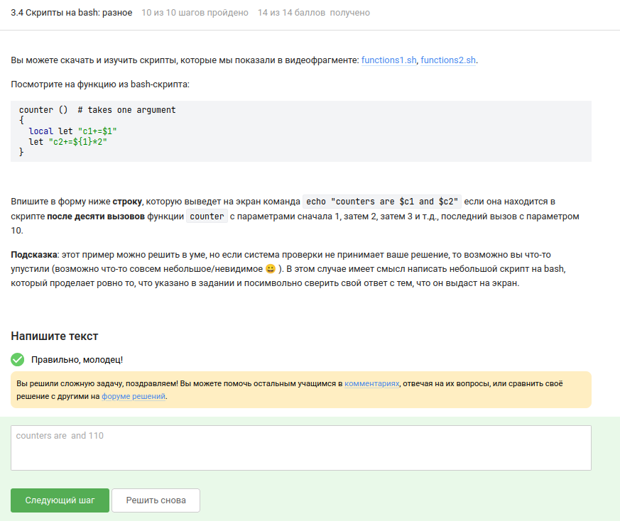{#fig-019 width=45%}

## Выполнение 3.4. Скрипты на bash: разное

{#fig-020 width=45%}

## Выполнение 3.4. Скрипты на bash: разное

{#fig-021 width=45%}

## Выполнение 3.4. Скрипты на bash: разное

{#fig-022 width=45%}

## Выполнение 3.4. Скрипты на bash: разное

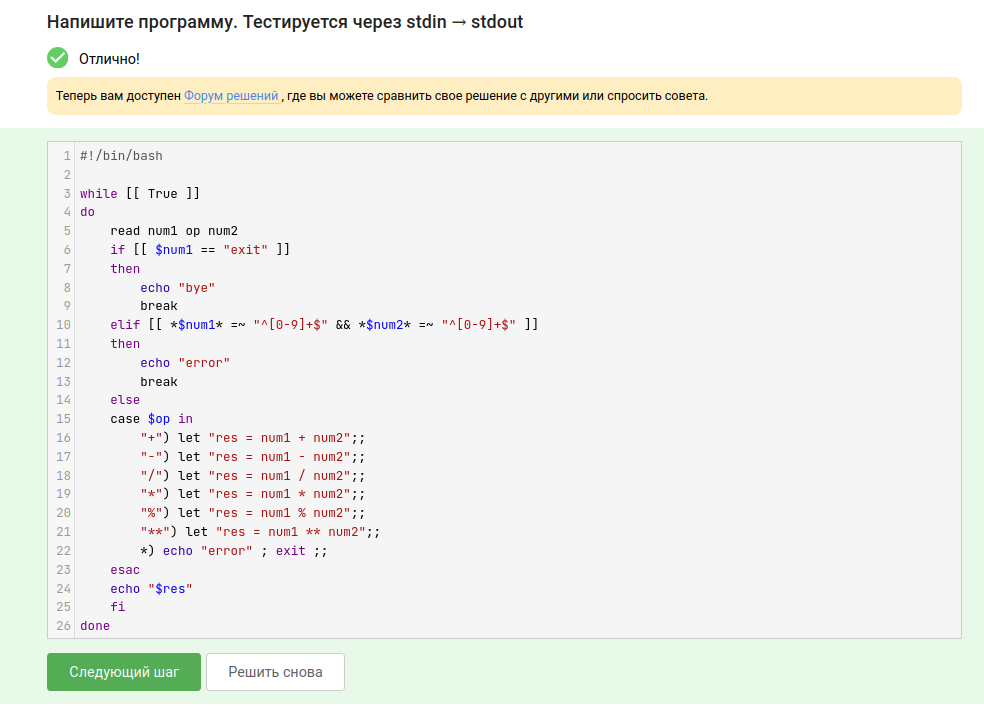{#fig-023 width=45%}

## Выполнение 3.5. Продвинутый поиск и редактирование

{#fig-024 width=45%}

## Выполнение 3.5. Продвинутый поиск и редактирование

{#fig-025 width=45%}

## Выполнение 3.5. Продвинутый поиск и редактирование

{#fig-026 width=45%}

## Выполнение 3.5. Продвинутый поиск и редактирование

{#fig-027 width=45%}

## Выполнение 3.5. Продвинутый поиск и редактирование

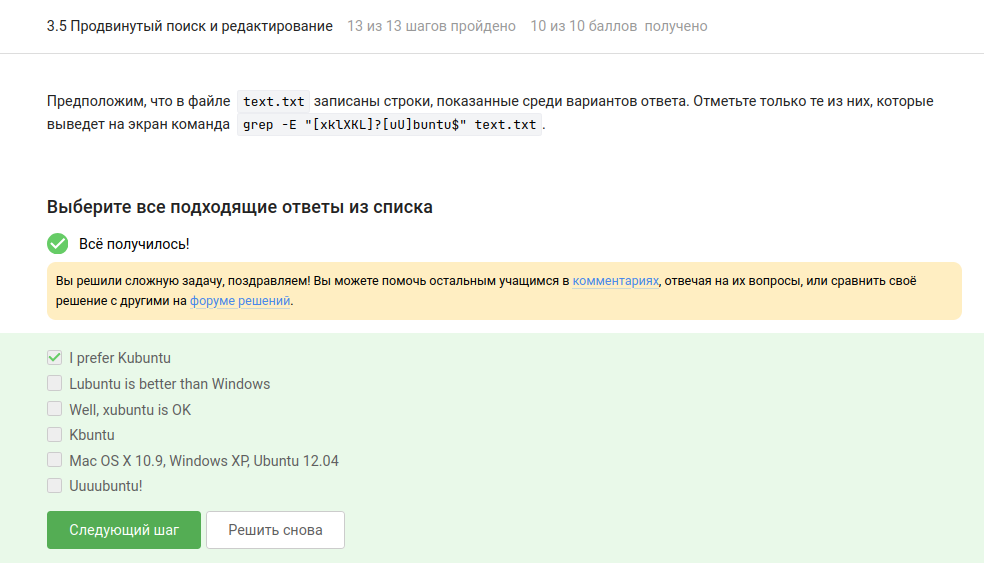{#fig-028 width=45%}

## Выполнение 3.5. Продвинутый поиск и редактирование

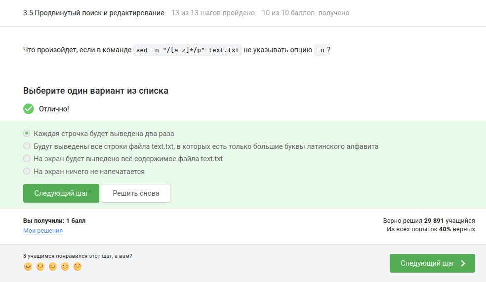{#fig-029 width=45%}

## Выполнение 3.5. Продвинутый поиск и редактирование

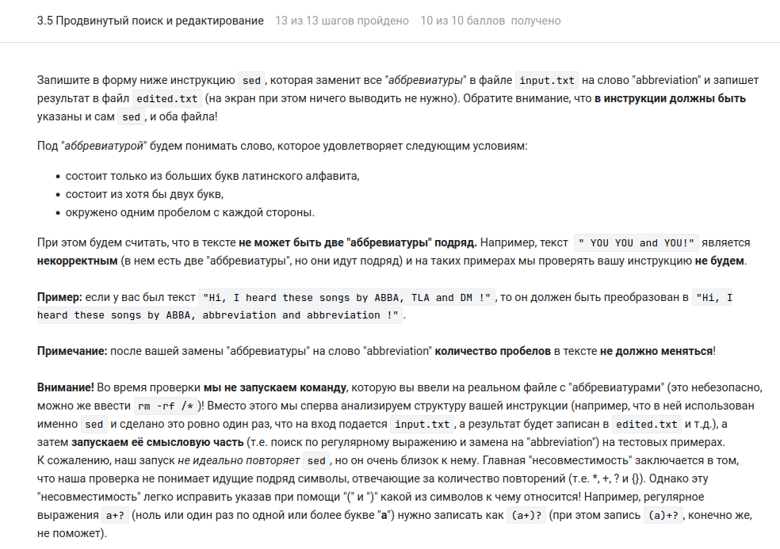{#fig-030 width=45%}

## Выполнение 3.5. Продвинутый поиск и редактирование

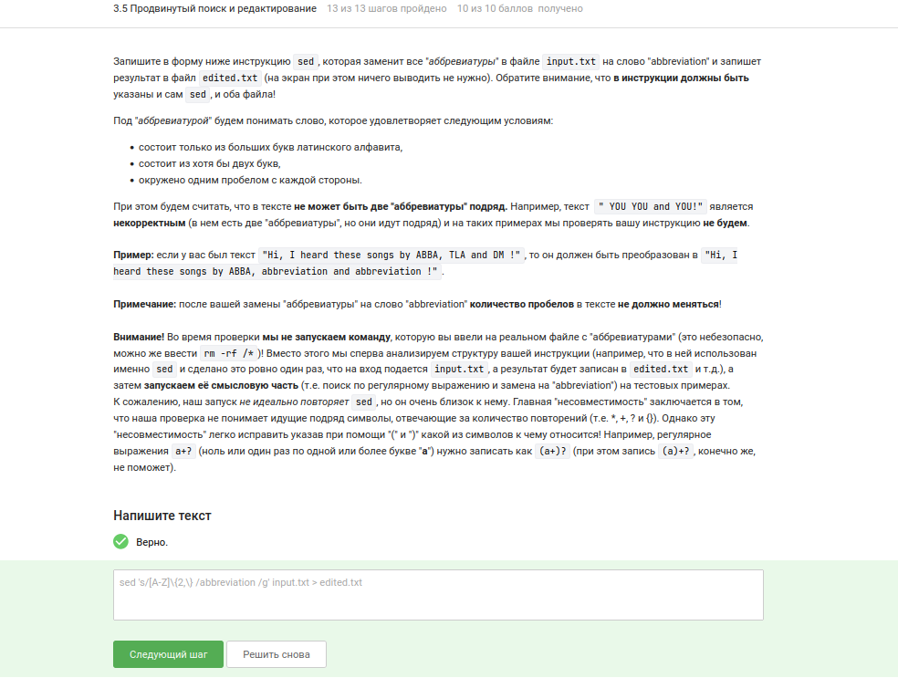{#fig-031 width=45%}

## Выполнение 3.6. Строим графики в gnuplot

{#fig-032 width=45%}

## Выполнение 3.6. Строим графики в gnuplot

{#fig-033 width=45%}

## Выполнение 3.6. Строим графики в gnuplot

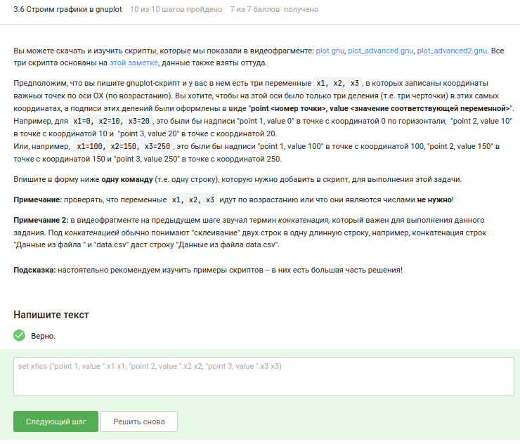{#fig-034 width=45%}

## Выполнение 3.6. Строим графики в gnuplot

{#fig-035 width=45%}

## Выполнение 3.7. Разное

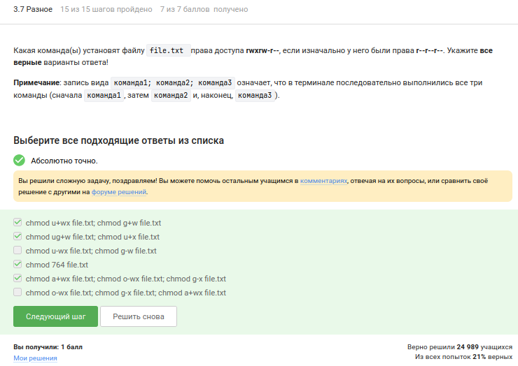{#fig-036 width=45%}

## Выполнение 3.7. Разное

{#fig-037 width=45%}

## Выполнение 3.7. Разное

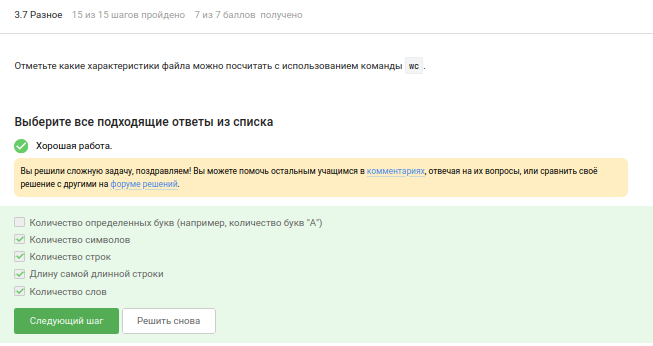{#fig-038 width=45%}

## Выполнение 3.7. Разное

{#fig-039 width=45%}

## Выполнение 3.7. Разное

{#fig-040 width=45%}

# Результаты

## Выводы

В ходе выполнения третьего этапа курса «Введение в Linux» были освоены продвинутые приёмы работы в vim, написание сценариев на bash с условными переходами и циклами, использование функций, регулярные выражения в grep и sed, построение и анимация графиков в gnuplot, а также ряд полезных утилит (wc, du, chmod)

## Список литературы

- Курс «Введение в Linux» на платформе Stepik [Электронный ресурс] URL: https://stepik.org/course/73/

