---
## Author
author:
  name: Иванова Ангелина Олеговна
  degrees: DSc
  orcid: 0000-0002-0877-7063
  email: 1032252598@rudn.ru
  affiliation:
    - name: Российский университет дружбы народов
      country: Российская Федерация
      postal-code: 117198
      city: Москва
      address: ул. Миклухо-Маклая, д. 6

## Title
title: "Отчёт по второму этапу внешнего курса Stepik"
subtitle: "Работа на сервере"
license: "CC BY"
---

# Цель работы

Целью данной работы является выполнение внешнего курса под названием "Введение в Linux". В третьем этапе мы подробно редактор vim, скрипты bash и различные возможности Linux.

# Задание

1. Ознакомиться с теоретическим материалом
2. Ответить на вопросы и выполнить задания для закрепления теоретического материала

# Выполнение лабораторной работы

## Выполнение 2.1. Текстовый редактор vim

Чтобы выйти из редактора vim необходимо нажать  " : ", затем "q", затем "Еnter". Именно так осуществляется выход из нормального режима vim ([рис. @fig-001])

{#fig-001 width=70%}

Далее необходимо было изучить разнице между использованием "W" и "w" в редакторе vim. W служит перемещению между условно называемых больших слов - слова раделенные исключительно пробелом. Использование w служит для перемещению между условно называемых маленьких слов - слова делятся всеми символами, кроме нижнего подчеркивания, при этом сомволы тоже считаются маленькими словами. На примере строки "Strange_  TEXT  is_here. 2=2 YES!" мы можем увидеть, что больших слов здесь всего 5 ("Strange_", "TEXT", "is_here.", "2=2", "YES!"), а маленьких 9 ("Strange_", "TEXT", "is_here", ".", "2", "=", "2", "YES", "!"). Логически выбрали правильные ответы: "Нажимая только на W, нельзя переместить курсор на "."", "После 10 нажатий на W курсор окажется там же, где бы он был после 10 нажатий на w", "Чтобы попасть в конец строки, нужно совершить меньше нажатий на W, чем на w" ([рис. @fig-002]).

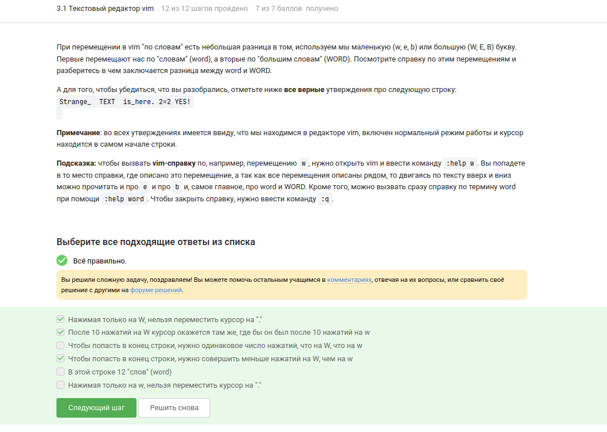{#fig-002 width=70%}

В текстовом файле записана одна единственная строка: "one two three four five" и нужно преобразовать её в строку "three four four four five". Для этого подходят команды:  "ddithree four four four five<<Esc>>" (удаление всей строки и вставка нового текста), "d2wwywPp" (удаление двух первых слов, переход к слову «four», его копирование и вставка перед и после курсора), "d2w$$bifour four <<Esc>>" (удаление двух слов, переход в конец строки и вставка «four four » перед последним словом), "d2wwifour four <<Esc>>" (удаление двух слов, переход к «four» и вставка перед ним) ([рис. @fig-003]).

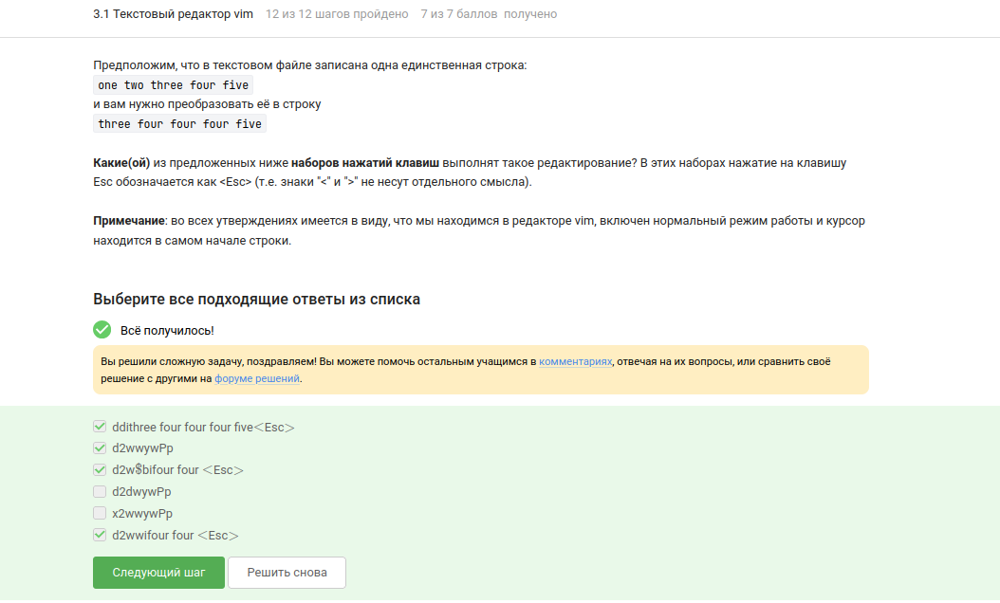{#fig-003 width=70%}

Чтобы в редакторе vim заменить в некотором файле все строки, содержащие слово Windows, на такие же строки, но со словом Linux, при этом если в какой-то строке слово Windows встречается больше, чем один раз, то заменить на Linux в этой строке нужно только самое первое из этих слов нужно выполнить команду ":%s/Windows/Linux". Без дополнительных флагов замена в vim затрагивает только первое совпадение на строке ([рис. @fig-004]).

{#fig-004 width=70%}

При самостоятельном изучении режима выделения были отмечены верные утверждения: "Режим выделения открывается из нормального режима по нажатию "v"", "В режиме выделения можно использовать команды d (удалить) и y (скопировать)", "В режиме выделения можно использовать команды перемещения (например, W, e, $, и др.)", "Выйти из режима выделения можно, нажав клавишу Esc два раза"  ([рис. @fig-005]).

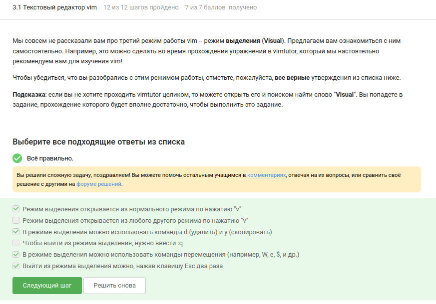{#fig-005 width=70%}

## Выполнение 3.2. Скрипты на bash: основы

Если из bash запущена sh, а из неё снова bash, то стрелки вверх/вниз показывают только команды, набранные в текущей (последней) оболочке. Поэтому доступен только набор C ([рис. @fig-006]).

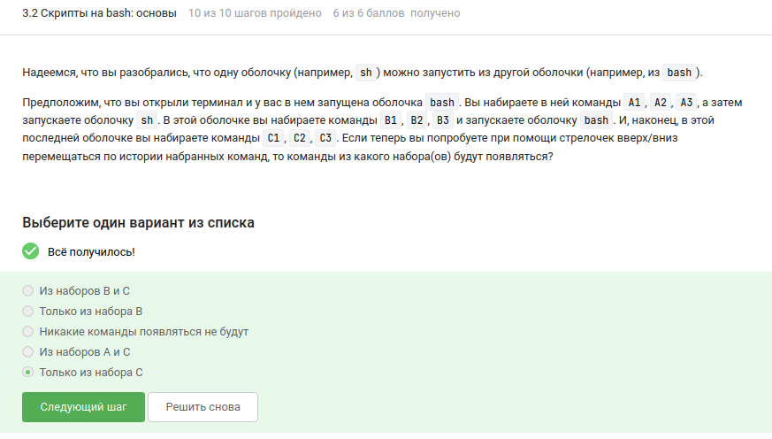{#fig-006 width=70%}

Скрипт создаёт файл в "/home/bi/", поэтому абсолютный путь к "file1.txt" будет "/home/bi/file1.txt" ([рис. @fig-007]).

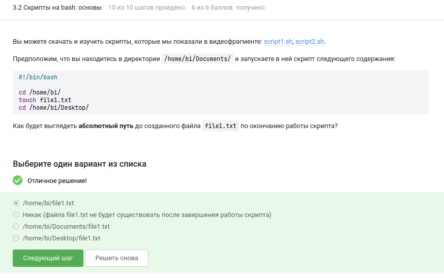{#fig-007 width=70%}

Имена переменных в bash могут содержать буквы (в том числе заглавные), цифры (не на первом месте) и знак подчёркивания. Поэтому из предложенного списка допустимыми являются "VARIable", "variable", "__variable", "variable_123" и "variable123". Строки "var i able" и "123variable" не удовлетворяют синтаксису ([рис. @fig-008]).

{#fig-008 width=70%}

Для вывода аргументов был написан скрипт, использующий "$1" и "$2". При запуске "./script.sh one two" он печатает "Arguments are: $1=one $2=two" ([рис. @fig-009]).

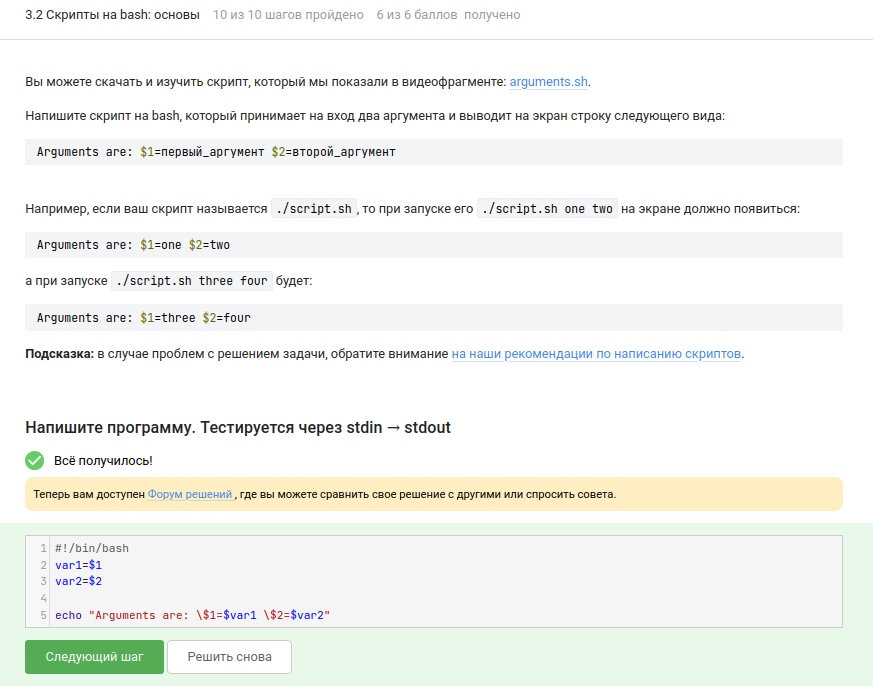{#fig-009 width=70%}

Листинг:

```
#!/bin/bash
var1=$1
var2=$2

echo "Arguments are: \$1=$var1 \$2=$var2"
```

## Выполнение 3.3. Скрипты на bash: ветвления и циклы

Cреди условий, всегда истинных вне зависимости от аргументов, были отмечены: "!(4 -le 3)" (логическое отрицание ложного утверждения), "$# -ge 0" (число аргументов всегда неотрицательно), "-e $0" (файл скрипта существует), "-n $0" (имя скрипта непусто), "-z """ (пустая строка имеет нулевую длину) и "5 -ge 5". Все они гарантированно возвращают истину ([рис. @fig-010]).

{#fig-010 width=70%}

Фрагмент с "if‑elif‑else" при "var=3" и "var=5" оба раза попадает в ветку "else", выводя "four". Таким образом, на экране сначала "four", потом "four" ([рис. @fig-011]).

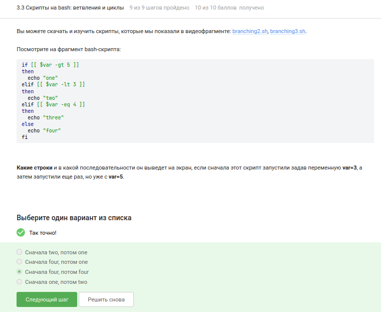{#fig-011 width=70%}

Был реализован скрипт, который по числу студентов выводит правильную форму: 0 → «No students», 1 → «1 student», 2–4 → «N students», от 5 и больше → «A lot of students». Решение использовало цепочку "if‑elif‑else" ([рис. @fig-012]).

{#fig-012 width=70%}

Листинг:

```
#!/bin/bash

if [[ $1 -eq 1 ]]; then
    echo "$1 student"
elif [[ $1 -gt 1 && $1 -le 4 ]]; then
    echo "$1 students"
elif [[ $1 -ge 5 ]]; then
    echo "A lot of students"
else
    echo "No students"
fi
```

В цикле "for str in a, b, c_d" слово "start" выводится пять раз (согласно логике задания), а "finish" - 4 ([рис. @fig-013]).

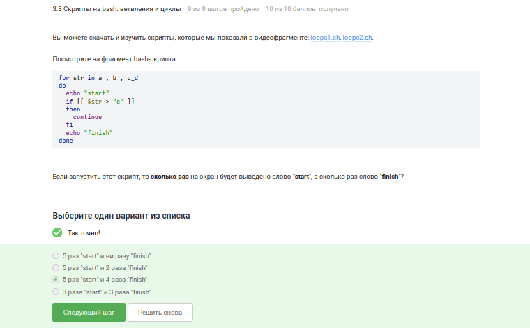{#fig-013 width=70%}

Задача с бесконечным циклом опроса имени и возраста решена при помощи вложенных "while" и проверок на пустой ввод или нулевой возраст. Скрипт корректно обрабатывает граничные условия и выходит по команде «bye» ([рис. @fig-014, @fig-015]).

{#fig-014 width=70%}

{#fig-015 width=70%}

Листинг:

```
child=16
adult=25
stdout=0

while [[ $stdout != 1 ]]
    do
        echo "enter your name: "
        read name
    if [[ (-z $name) || ($name = 0) ]] ;then
        echo "bye"
        stdout=1
    elif [[ -n $name ]]; then
        while [[ $stdout != 1 ]] ;do
            echo "enter your age: "
            read age
            if [[ ($age -eq 0) || (-z $age) ]] ;then
                echo "bye"
                stdout=1
            elif [[ $age -le $child ]] ;then
                echo "$name, your group is child"
            elif [[ $age -gt $adult ]] ; then
                echo "$name, your group is adult" ;else
                if [[ ($age -ge 17) && ($age -le 25) ]] ;then
                    echo "$name, your group is youth" ;fi
            fi ;break
        done ;fi
done
```

## Выполнение 3.4. Скрипты на bash: разное

В этом разделе рассматривались арифметика, функции и специальные приёмы.

Увеличить переменную "a" на значение "b" можно с помощью "let a=a+b", "let "a = a + b"", "let "a+=b"" и "let "a=$a+$b"". Прямое присваивание "a=$a+$b" без "let" лишь соединяет строки ([рис. @fig-016]).

{#fig-016 width=70%}

Скрипт, содержащий "cd /home/bi/" и "echo "\"pwd\""", выводит "/home/bi", так как подстановка команды в обратных кавычках выполняется после смены каталога ([рис. @fig-017]).

{#fig-017 width=70%}

Для проверки кода возврата программы, которая пишет в stdout, нужно сначала выполнить её, затем if [[ $? -eq 0 ]] или же создать условие if "program > some_file.txt"([рис. @fig-018]).

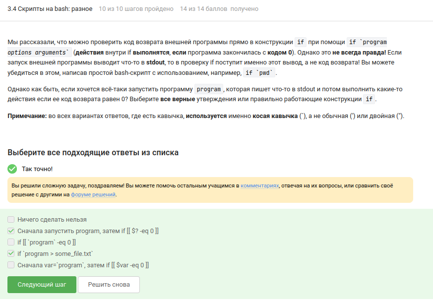{#fig-018 width=70%}

Функция "counter" с локальной переменной "c1" не изменяет глобальную переменную с тем же именем. После десяти вызовов "c2" становится равной 110, а "c1" остаётся пустой, поэтому "echo" выводит "counters are  and 110" ([рис. @fig-019]).

{#fig-019 width=70%}

Написан скрипт для вычисления НОД с помощью рекурсивной функции "gcd", реализующей алгоритм Евклида. Скрипт ожидает ввода двух натуральных чисел, выводит результат и завершается по пустой строке словом «bye» ([рис. @fig-020, @fig-021]).

{#fig-020 width=70%}

{#fig-021 width=70%}

Листинг 

```
#!/bin/bash

while [ true ]
do
    read n1 n2
if [ -z $n1 ]; then
    echo "bye"
    break
else
    gcd () {
    remainder=1
    if [ $n2 -eq 0 ]
    then
    echo "bye"
    fi
    while [ $remainder -ne 0 ]
    do
    remainder=$((n1%n2))
    n1=$n2
    n2=$remainder
    done
    }
    gcd $1 $2
    echo "GCD is $n1"
fi
done
```

Реализован калькулятор на bash, поддерживающий операции "+", "-", "*", "/", "%", "**" и команду "exit". При некорректном вводе выводится "error", и скрипт завершается ([рис. @fig-022, @fig-023]).

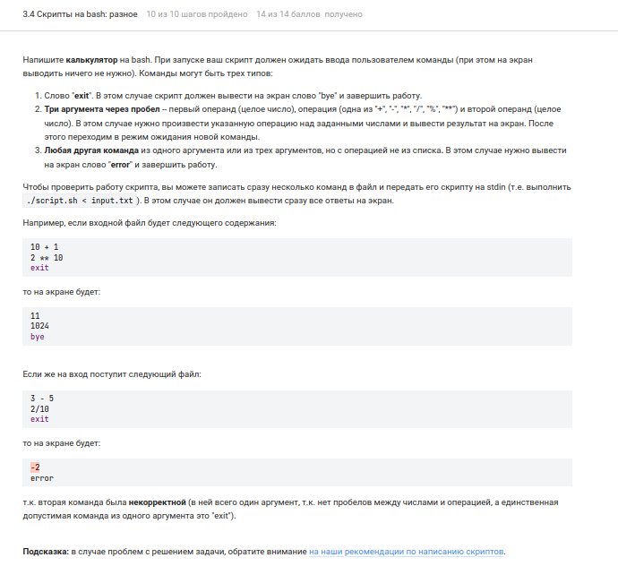{#fig-022 width=70%}

{#fig-023 width=70%}

Листинг:
```
#!/bin/bash

while [[ True ]]
do
    read num1 op num2
    if [[ $num1 == "exit" ]]
    then
        echo "bye"
        break
    elif [[ *$num1* =~ "^[0-9]+$" && *$num2* =~ "^[0-9]+$" ]]
    then
        echo "error"
        break
    else
    case $op in
        "+") let "res = num1 + num2";;
        "-") let "res = num1 - num2";;
        "/") let "res = num1 / num2";;
        "*") let "res = num1 * num2";;
        "%") let "res = num1 % num2";;
        "**") let "res = num1 ** num2";;
        *) echo "error" ; exit ;;
    esac
    echo "$res"
    fi
done
```

## Выполнение 3.5. Продвинутый поиск и редактирование

Рассматривались расширенные возможности "find", "grep" и "sed".

Команда "find -iname "star*"" находит больше файлов, чем "find -name "star*"", так как игнорирует регистр. Из предложенного набора, которые найдет команда find /home/bi -iname "star*", но НЕ найдет команда find /home/bi -name "star*" оказались "Star_Wars.avi" и "STARS.txt" ([рис. @fig-024]).

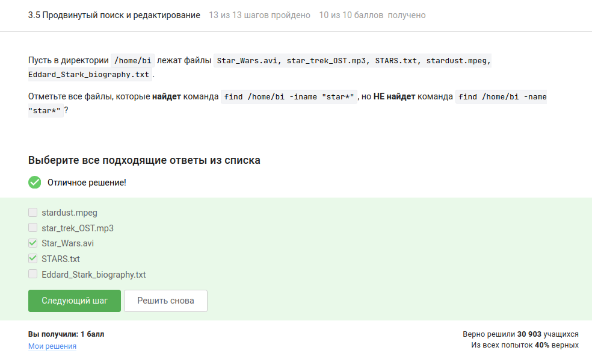{#fig-024 width=70%}

Опции "-path" и "-name" не всегда взаимозаменяемы: в одних случаях "-name" находит меньше файлов, в других — больше, в зависимости от шаблона, поэтому верные утверждения "В некоторых случаях find с -name найдет меньше файлов, чем find с таким же запросом, но с -path", "В некоторых случаях find с -name найдет больше файлов, чем find с таким же запросом, но с -path" ([рис. @fig-025]).

{#fig-025 width=70%}

При структуре "/home/bi/", содержащей вложенные каталоги "dir1", "dir2", "dir3" с файлами "file1", "file2", "file3" соответственно, условие "-mindepth 2 -maxdepth 3" отсекает файлы, лежащие непосредственно в указанной директории (глубина 1). Под критерий попадают только файлы, расположенные на глубине 2 или 3. Таким образом, будут найдены "file1" и "file2", но не "file3" ([рис. @fig-026]).

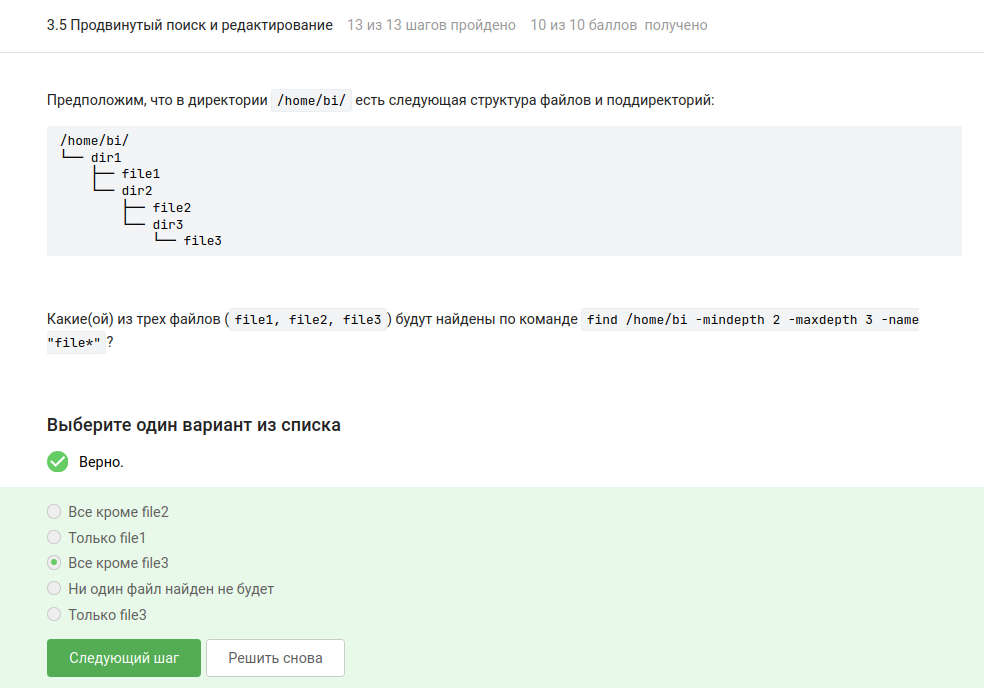{#fig-026 width=70%}

При добавлении контекста ("-A", "-B", "-C") к поиску слова, которое присутствует в каждой строке файла, размер результирующего файла не изменяется. Во всех четырёх случаях "results.txt" будет одинакового размера ([рис. @fig-027]).

{#fig-027 width=70%}

Регулярное выражение "[xklXKL]?[uU]buntu$" описывает строки, оканчивающиеся на "buntu" с возможной предшествующей буквой из набора. Единственная подходящая строка – "I prefer Kubuntu" ([рис. @fig-028]).

{#fig-028 width=70%}

Если в "sed" опустить опцию "-n", каждая строка, попавшая под шаблон, будет напечатана дважды: один раз из‑за автоматического вывода, второй – по команде "p" ([рис. @fig-029]).

{#fig-029 width=70%}

Для замены «аббревиатур» (две и более заглавные латинские буквы) на слово "abbreviation" в файле "input.txt" с записью результата в "edited.txt" использована команда "sed 's/[A-Z]\{2,\}/abbreviation /g' input.txt > edited.txt" ([рис. @fig-030, @fig-031]).

{#fig-030 width=70%}

{#fig-031 width=70%}

## Выполнение 3.6. Строим графики в gnuplot

Для того чтобы графики не закрывались при выходе из gnuplot, используется опция "-p" или "--persist" ([рис. @fig-032]).

{#fig-032 width=70%}

Когда "data.csv" не содержит заголовка, а задано "set key autotitle columnhead", первая строка используется как название кривой (второй столбец) и исключается из данных, поэтому на графике отображается 9 точек ([рис. @fig-033]).

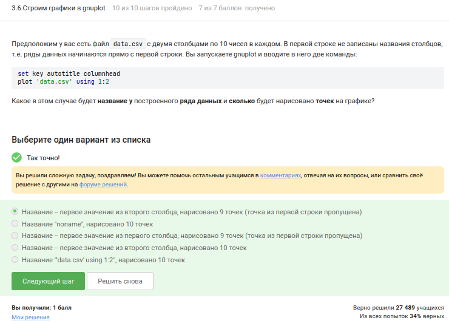{#fig-033 width=70%}

Для размещения на оси OX только трёх заданных делений с текстовыми метками используется команда "set xtics". Строки конкатенируются с помощью оператора ".". Правильный ответ: "set xtics ('point 1, value '.x1 x1, 'point 2, value '.x2 x2, 'point 3, value '.x3 x3)" ([рис. @fig-034]).

{#fig-034 width=70%}

Файл "move.rot" был изменён для зеркального отражения ("splot -x**2-y**2"), вращения в обратную сторону ("zrot=(zrot+350)%360") и удвоения скорости ("pause 0.1"). Это позволило получить требуемую анимацию ([рис. @fig-035]).

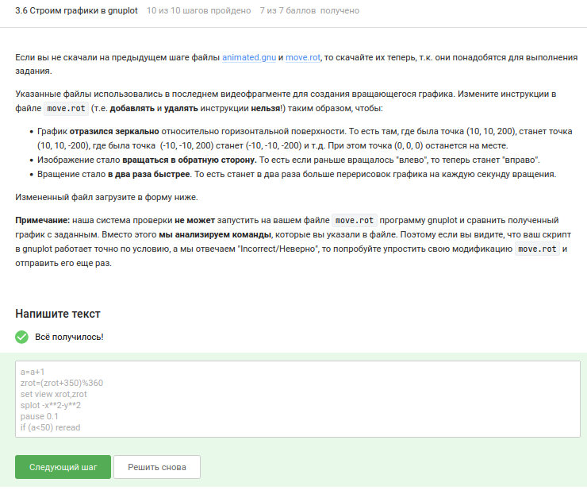{#fig-035 width=70%}

## Выполнение 3.7. Разное

Последний блок объединил несколько независимых тем.

Для превращения прав "r--r--r--" в "rwxrw-r--" подходят последовательности "chmod u+wx file.txt; chmod g+w file.txt", "chmod ug+w file.txt; chmod u+x file.txt", "chmod 764 file.txt", "chmod a+wx file.txt; chmod o-wx file.txt; chmod g-x file.txt" ([рис. @fig-036]).

{#fig-036 width=70%}

Чтобы пользователь из группы "group" мог создавать файлы в каталоге "dir", принадлежащем root, можно использовать: "sudo chmod o+w dir" (добавляет право записи для «остальных» пользователей, к которым относится и user), "sudo chown user:group dir" (меняет владельца и группу каталога на user и group, после чего user получает полный контроль как владелец), "sudo chmod a+w dir" (даёт право записи всем, что разрешает user создавать файлы), "sudo chown user dir" (меняет только владельца на user, после чего user как владелец может записывать файлы в каталог) ([рис. @fig-037]).

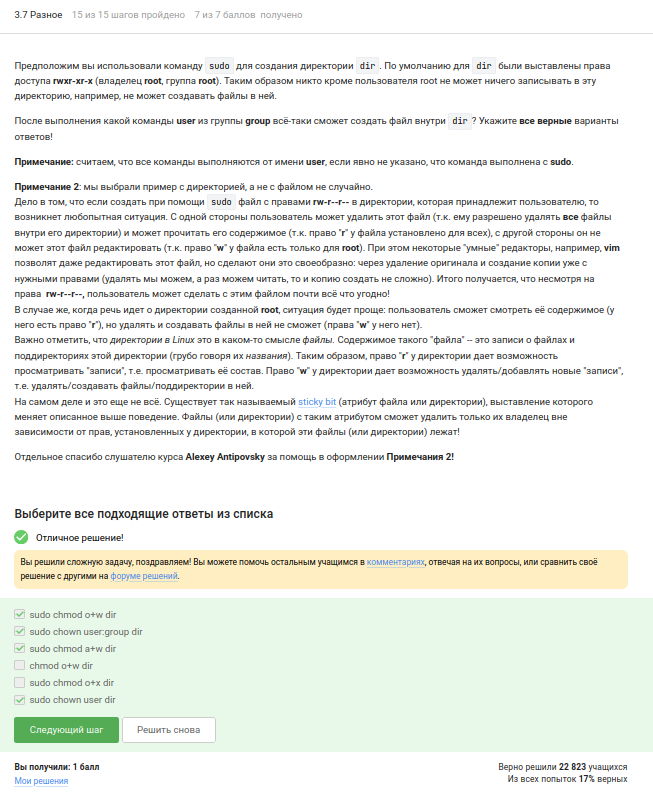{#fig-037 width=70%}

Утилита "wc" способна подсчитывать строки, слова, символы и длину самой длинной строки, но не количество конкретных букв ([рис. @fig-038]).

{#fig-038 width=70%}

Размер текущей директории в человеко‑читаемом формате выводится командой "du -h -s" (или "du -sh"). Ключ "-h" включает удобные единицы измерения, "-s" подводит итог ([рис. @fig-039]).

{#fig-039 width=70%}

Наиболее короткая команда для одновременного создания трёх поддиректорий "dir1", "dir2", "dir3" : "mkdir dir{1..3}" ([рис. @fig-040]).

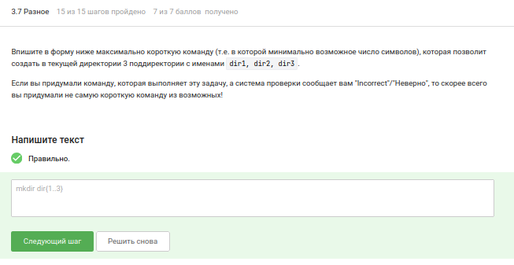{#fig-040 width=70%}

# Выводы

В ходе выполнения третьего этапа курса «Введение в Linux» были освоены продвинутые приёмы работы в vim, написание сценариев на bash с условными переходами и циклами, использование функций, регулярные выражения в grep и sed, построение и анимация графиков в gnuplot, а также ряд полезных утилит (wc, du, chmod). Все поставленные задачи решены успешно, что подтверждается полученными баллами на платформе Stepik.

# Список литературы

1. Курс «Введение в Linux» на платформе Stepik [Электронный ресурс] URL: https://stepik.org/course/73/
